# Rename 重命名

- 版本：V2R2
- 状态：OK
- 日期：2025/01/20
- commit：[xxx](https://github.com/OpenXiangShan/XiangShan/tree/xxx)

Rename 模块接收来自 Decode 模块的指令译码信息，并根据译码信息为指令分配 robIdx 和物理寄存器，通过操作数查询对应的物理寄存器。同时，该模块还会根据指令译码信息、指令提交信息和来自 RenameTable 的寄存器释放信息维护 freeList 的状态，以及根据指令译码信息和指令提交信息向 RenameTable 发送写请求，以更新推测执行时的寄存器映射状态。此外，该模块还会处理来自 ROB 的重定向请求，根据重定向信息重新更新 freeList 的状态。在完成重命名后，Rename 将重命名后的指令信息发送至 Dispatch 模块。

## 基本功能

将逻辑寄存器映射到物理寄存器，为指令中的逻辑寄存器各自分配一个物理寄存器。

寄存器重命名维护重命名相关的表或指针。维护逻辑寄存器到物理寄存器的映射表，记录每一个逻辑寄存器对应的最近分配的物理寄存器号。

对于整型、浮点和向量寄存器分别维护 224 项、192 项和 128 项物理寄存器状态表，记录物理寄存器的状态，记录是否分配，通过空闲物理寄存器分配指针记录未被分配的物理寄存器。

维护一张提交的逻辑寄存器对应物理寄存器的映射表（RenameTable, RAT），记录提交状态的逻辑寄存器和物理寄存器的映射关系。

维护一个提交状态的空闲物理寄存器分配的指针。寄存器重命名技术消除指令之间的寄存器读后写相关（WAR），和写后写相关（WAW），当指令执行发生例外或转移指令猜测错误而取消后面的指令时可以保证现场的精确。

## 重命名输入

- 来自译码阶段输入（途中FusionDecoder会对DecodeStage吐出的指令进行宏操作融合的修改，会根据相邻指令的组合种类改变valid，uop等信息，而且会根据相邻指令的ftqptr与ftqoffset的不同组合修改该融合指令的提交类型CommitType）
- 接受 RAT 的推测重名数据返回
- 指令融合信息，以及根据指令融合情况修改译码输入指令流
- ssit，waittable 信息
- Ctrlblock snapshot 控制信息及出入队指针
- rab 提交信息

## 重命名输出

- 与 rat：写重命名信息。
- 与 dispatch：流水输出 rename 后的 uop 信息：在 dispatch recv 有效时。
- 与 snapshot：enqdata，允许生成快照。

## 分配整数物理寄存器 {#sec:alloc-int-prf}

在接收到来自 Decode 模块的有效整数指令译码信息后，Rename 模块会根据 io\_in\_[0-5]\_bits\_rfWen 信号和 io\_in\_[0-5]\_bits\_ldest 信号来判断是否需要分配新的整数物理寄存器。若 rfWen 为高电平且 ldest 不为 0，则需要分配新的整数物理寄存器。如果需要分配新的整数物理寄存器，则向 intFreeList 发送分配请求，并在当拍获得分配结果，否则，不发送分配请求。另外，Rename 模块支持整数 Move 指令消除。如果检测到译码后的指令为整数 Move 指令，亦不分配新的整数物理寄存器。

## 分配浮点或向量物理寄存器 {#sec:alloc-fp-vec-prf}

在接收到来自 Decode 模块的有效向量浮点指令译码信息后，Rename 模块会根据 io\_in\_[0-5]\_bits\_fpWen 和 io\_in\_[0-5]\_bits\_vecWen 信号来判断是否需要分配新的向量浮点物理寄存器。若 fpWen 或 vecWen 信号为高电平，则需要分配新的浮点或向量物理寄存器。如果需要分配新的浮点或向量物理寄存器，则向 fpFreeList 或 vecFreeList 发送分配请求，并在当拍获得分配结果，否则，不发送分配请求。

## 设置源操作数的物理寄存器（psrc）

如果 Decode 模块传来的指令译码信息中有整数寄存器或向量浮点寄存器型的源操作数，那么在通常情况下，Decode 模块会提前一拍向 RenameTable 查询逻辑寄存器对应的物理寄存器，并在一拍后于 Rename 模块得到读推测重命名表的结果，而后将结果通过 io\_out\_[0-5]\_bits\_psrc\_[0-4] 传给 Dispatch 模块。作为例外情况，如果上条指令的目的操作数和本条指令的源操作数相同，则应将本条指令的 psrc 设置为上条指令的 pdest。

## 设置目的操作数的物理寄存器（pdest）

如果Decode模块传来的指令译码信息中提示存在目的操作数（参见 [@sec:alloc-int-prf] 和 [@sec:alloc-fp-vec-prf] ），那么在通常情况下，Rename 模块通过 io\_out\_[0-5]\_bits\_pdest 将新分配的物理寄存器传给 Dispatch 模块。作为例外情况，如果该指令为整数 Move 指令，则应将本条指令的 pdest 设置为本条指令的 psrc。

## 整数指令提交 {#sec:commit-int-inst}

当整数指令提交后，Rename 会根据 RenameTableWrapper 传来的 io\_int\_need\_free\_[0-5] 和 io\_int\_old\_pdest\_[0-5] 信息向 intFreeList 发送 free 信号，从而将相应的整数物理寄存器释放，以供新指令使用。当 io\_int\_need\_free\_[0-5] 为高电平时，则说明对应通道的 io\_int\_old\_pdest\_[0-5] 整数物理寄存器需要被释放。此外，Rename 也会将 RAB 发来的 commit 信号发给 intFreeList，以供其维护体系结构状态重命名指针。

## 浮点或向量指令提交 {#sec:commit-fp-vec-inst}

当 RAB 传来浮点指令提交信息后，Rename 会结合 RAB 和 RenameTableWrapper 传来的提交信息向 fpFreeList 发送 free 信号，从而释放不再被使用的向量浮点物理寄存器，以供新指令使用。若从 RAB 传来的 io\_rabCommits\_info\_[0-5]\_fp/vecWen 信号在打一拍后，与打一拍后的 io\_rabCommits\_isCommit 和 io\_rabCommits\_commitValid\_[0-5] 信号（这两个信号说明当拍处于提交状态且该通道的提交信号有效，详见 [@sec:w-arch-rat] ）均为高电平，则说明对应通道的 io\_fp/vec\_old\_pdest\_[0-5] 浮点或向量寄存器需要被释放。此外，Rename 也会将 RAB 发来的 commit 信号发给 fpFreeList，以供其维护体系结构状态重命名指针。

## 重定向

当重定向信号从 io\_redirect 端口传入后，freeList 会暂停物理寄存器的分配，并会将 freeList 的物理寄存器分配指针恢复为体系结构状态或某个快照的状态。此外，Rename 模块也不会再向 RenameTable 发送写请求信号。

## 重新重命名 {#sec:rename-re-rename}

重定向信号传入一个周期后，Rename 模块进入重新重命名流程。重新重命名信号由 RAB 从 io\_rabCommits 端口传入。重新重命名时，Rename 模块将不再向 Dispatch 输出有效的指令信号，也将不再向 RenameTable 发送写请求信号。

Rename 模块会向 intFreeList、fpFreeList 和 vecFreeList 通过各自的 io\_walkReq\_[0-5] 端口发送重新重命名信号，这些重新重命名信号是来自 RAB 模块的 io\_rabCommits\_walkValid\_[0-5]，io\_rabCommits\_info\_[0-5]\_isMove，io\_rabCommits\_info\_[0-5]\_ldest 和 io\_rabCommits\_info\_[0-5]\_rf/fp/vecWen 信号。只有当 io\_rabCommits\_isWalk 为高电平时，io\_walkReq\_[0-5] 传入的信号才是有效的。

对于 intFreeList 而言，当 io\_rabCommits\_walkValid\_[0-5] 为高电平，且对应通道的 io\_rabCommits\_info\_[0-5]\_rfWen 为高电平，io\_rabCommits\_info\_[0-5]\_ldest 不为 0，且 io\_rabCommits\_info\_[0-5]\_isMove 为低电平时，对应的 io\_walkReq\_[0-5] 端口会被发送有效信号，意味着需要进行重新重命名。

对于 fpFreeList 和 vecFreeList 而言，当 io\_rabCommits\_walkValid\_[0-5] 为高电平，且对应通道的 io\_rabCommits\_info\_[0-5]\_fp/vecWen 信号为高电平时，对应的 io\_walkReq\_[0-5] 端口会被发送有效信号，意味着需要进行重新重命名。

## robIdx分配

Rename 模块负责为每条微指令分配 robIdx。该模块内部维护了一个 robIdxHead。正常情况下，Rename 模块会为 Decode 传入的译码后的指令依次分配连续的 robIdx，并将 robIdxHead 累加，但如果对应通道的 io\_in\_[0-5]\_bits\_lastUop 为低电平，或 compressUnit 传出的对应通道的 io\_out\_needRobFlags\_[0-5] 为低电平，那么下一个通道的微指令将不会被分配 robIdx。

重定向发生的当周期，该模块会将 robIdxHead 重置为重定向的 robIdx，并在下一周期根据 io\_redirect\_bits\_level 的值决定是否为 robIdxHead 加一。

## 决定重命名快照的生成 {#sec:decide-snpt-gen}

Rename 模块还负责决定是否生成重命名快照。重命名快照旨在发生重定向后缩短重新重命名的时间。重命名快照是分布式的，它分布在 RenameTable、RenameTable_1、RenameTable_2、intFreeList、fpFreeList、vecFreeList、Rob、Rab、CtrlBlock 等诸多模块之中，且快照存储的内容各不相同，因此需要一个模块告诉各个模块何时生成快照，而这个模块便是 Rename。对外，Rename 会将快照生成信号通过 io\_out\_\*\_bits\_snapshot 传递给其他模块；对内，Rename 也会将快照生成信号传递给 intFreeList、fpFreeList 和 vecFreeList。

重命名快照的生成存在诸多限制。首先，Rename 模块内部维护了一个快照计数器 snapshotCtr，只有当这个计数器为 0 时才可以生成快照；其次，如果当前已经存在其他快照，那么本周期重命名的第一条微指令被分配的 robIdx 必须和最近一次生成的快照的 robIdx 相差 6，也就是 ROB 提交宽度以上；最后，本周期重命名的第一条微指令必须是其所属指令的第一条微指令，即 io\_in\_0\_bits\_firstUop 必须为高电平。只有满足了以上三个条件，并且被重命名的六条微指令中存在分支跳转指令时，才会生成快照。此时，那些为分支跳转指令的通道的 io\_out\_\*\_bits\_snapshot 信号会被拉高，Rename 也会将快照生成信号告诉其内部的子模块。

快照计数器 snapshotCtr 是一个控制快照生成间隔的计数器。由于距离过近的快照没有意义且会对快照资源造成浪费，因此实现了这样一个计数器。snapshotCtr 初始值设为 4 倍的 RAB 提交宽度，即 4×8=32。如果当前不存在有效的重命名快照，snapshotCtr 会被置为 0；否则，每重命名 n 条微指令，snapshotCtr 会自减 n，直到 0 为止。当 snapshotCtr 为 0 后，如果某时刻产生了重命名快照，那么 snapshotCtr 会被重置为最大值减去当周期重命名的微指令数，即 32-PopCount(io\_out\_\*\_valid && io\_out\_\*\_ready)。

## 整体框图

## 接口时序

### Decode 输入接口时序示意图

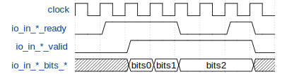{#fig:rename-input}

[@fig:rename-input] 示意了三个来自 decode 的译码结输入例。当 ready 和 valid 信号同时为高时，对应的 bits 被 Rename 模块接收。

### Rename 输出接口时序示意图

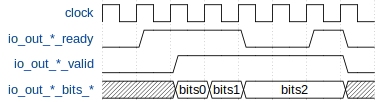{#fig:rename-output}

[@fig:rename-output] 示意了三个重命名结果的示例。当 ready 和 valid 信号同时为高时，对应的 bits 被 Rename 模块发送至 Dispatch。

### 指令提交逻辑时序示意图

{#fig:rename-commit-io}

[@fig:rename-commit-io] 示意了五个来自 ROB 的指令提交输入。当 io\_rabCommits\_isCommit 为高且 io\_rabCommits\_isWalk 为低时， io\_rabCommits\_info\_\*\_\*为指令提交信息。io\_rabCommits\_commitValid\_\* 为高时，对应的 io\_rabCommits\_info\_\*\_\* 将有效的指令提交信息传入 Rename 模块。同时，io\_\*\_old\_pdest\_\* 会在延迟一个周期后将需要释放的旧的物理寄存器号传给 Rename 模块，并在再延迟一个周期后将是否需要释放整数物理寄存器信号通过 io\_int\_need\_free\_\* 端口传入 Rename 模块。

### 重定向和重新重命名时序示意图

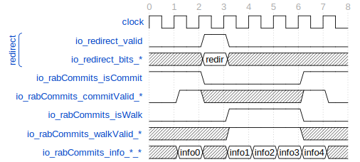{#fig:rename-redirect-io}

[@fig:rename-redirect-io] 示意了重定向发生前后的有关信号。在前两个周期，io\_redirect\_valid 为低电平，Rename 处于正常工作状态，与 [@fig:rename-commit-io] 相同。此后，io\_redirect\_valid 信号被拉高一个周期，重定向到来，重定向的有关信息从 io\_redirect\_bits\_\* 发来，Rename 将从下个周期开始进入重新重命名工作状态。此后的三个周期内，io\_rabCommits\_isCommit 为低电平，io\_rabCommits\_info\_\*\_\* 不再发来提交信息；与此相对的，io\_rabCommits\_isWalk 为高电平，标志着 io\_rabCommits\_info\_\*\_\* 发来重新重命名信息，Rename 需要进行重新重命名工作。io\_rabCommits\_walkValid\_\* 为高时，对应的 io\_rabCommits\_info\_\*\_\* 发来的重新重命名信息有效。

# RenameTableWrapper

RenameTableWrapper 是一个包装模块，其内部包含整数重命名表 RenameTable 模块、浮点重命名表 RenameTable_1 模块和向量重命名表 RenameTable_2 模块。这一包装模块除了简单地将三个重命名表打包以外，还在内部处理了提交和重新重命名相关的逻辑。RenameTableWrapper 起到了沟通内部重命名表与外部模块的桥梁作用。

## 读推测重命名表

RenameTableWrapper 共有 12 个整数寄存器读端口、18 个浮点寄存器读端口和 30 个向量浮点寄存器读端口，其中整数寄存器读端口 2 个为一组、浮点寄存器读端口 3 个为一组、向量寄存器读端口 5 个为一组，各自均有 6 组读端口。整数寄存器读端口用于读取整数逻辑寄存器到整数物理寄存器的推测映射关系，浮点寄存器读端口用于读取浮点逻辑寄存器到向量浮点物理寄存器的推测映射关系，向量寄存器读端口用于读取向量逻辑寄存器到向量浮点物理寄存器的推测映射关系。

RenameTableWrapper 的读是同步的。这意味着第 `T` 个时钟周期通过 io\_(int/fp/vec)ReadPorts\_\*\_\*\_addr发送的读请求，要到第 `T+1` 个时钟周期才能从 io\_(int/fp/vec)ReadPorts\_\*\_\*\_data 得到逻辑寄存器在第 `T` 个时钟周期对应的物理寄存器。

RenameTableWrapper 的读是有前递的。如果第 `T` 个时钟周期向某个地址发送读请求的同时，也向某个地址发送写请求，那么在第 `T+1` 个时钟周期时，读到的是在第 `T` 个时钟周期时向某个地址写入的值。

RenameTableWrapper 的读是有保持功能的。如果第 `T` 个时钟周期，某个读端口的 io\_(int/fp/vec)ReadPorts\_\*\_\*\_hold为高电平，那么在第 `T+1` 个时钟周期时，读到的值和第 `T` 个时钟周期时读到的值相同。

## 重命名阶段写推测重命名表

RenameTableWrapper 共有 6 个整数寄存器写端口、6 个浮点寄存器写端口和 6 个向量寄存器写端口，这些端口用于在重命名阶段写推测重命名表。整数寄存器写端口用于在重命名阶段更新整数逻辑寄存器到整数物理寄存器的推测映射关系，浮点寄存器写端口用于在重命名阶段更新浮点逻辑寄存器到向量浮点物理寄存器的推测映射关系，向量寄存器写端口用于在重命名阶段更新向量逻辑寄存器到向量浮点物理寄存器的推测映射关系。

RenameTableWrapper 的写是同步的。这意味着第 `T` 个时钟周期通过 io\_(int/fp/vec)RenamePorts\_\*\_addr 和 io\_(int/fp/vec)RenamePorts\_\*\_data 发送的写请求，要到第 `T+1` 个时钟周期才能被读出。

RenameTableWrapper 的写是有使能的。只有 io\_(int/fp/vec)RenamePorts\_\*\_wen 为高的写请求才是有效的。

RenameTableWrapper 的写是有优先级的。写通道的编号越大，优先级越大，这意味着如果两个通道向同一个地址写，那么最终写入的结果将是编号大的那个。

## 提交阶段写体系结构重命名表 {#sec:w-arch-rat}

RenameTableWrapper 通过监听来自 RAB 的 commit 信息来更新体系机构重命名表。如果某个周期的 io\_rabCommits\_isCommit 信号为高电平，则说明该周期正在提交。此时，若某个 io\_rabCommits\_commitValid\_\* 信号为高电平，则说明该端口的提交信号有效。此时，需要进一步考察 io\_rabCommits\_info\_\*\_rfWen、io\_rabCommits\_info\_\*\_fpWen 和 io\_rabCommits\_info\_\*\_vecWen。如果 io\_rabCommits\_info\_\*\_rfWen 为高电平，则说明整数寄存器需要更新体系结构重命名表；如果 io\_rabCommits\_info\_\*\_fpWen 为高电平，则说明浮点寄存器需要更新体系结构重命名表；如果 io\_rabCommits\_info\_\*\_vecWen 为高电平，则说明向量寄存器需要更新体系结构重命名表。在以上三种情况下，RenameTableWrapper 将会把整数、浮点或向量体系结构重命名表中地址为 io\_rabCommits\_info\_\*\_ldest 的项修改为 io\_rabCommits\_info\_\*\_pdest。

## 提交阶段提供物理寄存器释放信息

RenameTableWrapper 通过提交阶段写体系结构重命名表的情况来提供物理寄存器的释放信息。这些信息包括要释放的整数物理寄存器号 io\_int\_old\_pdest\_\* 和对应的有效信号 io\_int\_need\_free\_\* ，以及要释放的向量浮点物理寄存器号 io\_(fp/vec)\_old\_pdest\_\*。这些信号直接来自于 RenameTableWrapper 的子模块，并会在 Rename 模块根据结合指令提交的情况进行物理寄存器的释放。

## 重新重命名阶段写推测重命名表

RenameTableWrapper 通过监听来自 RAB 的 commit 信息来进行重新重命名。如果某个周期的 io\_rabCommits\_isWalk 信号为高电平，则说明该周期正在重新重命名。此时，若某个 io\_rabCommits\_walkValid\_\* 信号为高电平，则说明该端口的重新重命名信号有效。此时，需要进一步考察 io\_rabCommits\_info\_\*\_rfWen、io\_rabCommits\_info\_\*\_fpWen 和 io\_rabCommits\_info\_\*\_vecWen。如果 io\_rabCommits\_info\_\*\_rfWen 为高电平，则说明整数寄存器需要重新重命名；如果 io\_rabCommits\_info\_\*\_fpWen 为高电平，则说明浮点寄存器需要重新重命名；如果 io\_rabCommits\_info\_\*\_vecWen 为高电平，则说明向量寄存器需要重新重命名。在以上三种情况下，RenameTableWrapper 将会把整数、浮点或向量推测重命名表中地址为 io\_rabCommits\_info\_\*\_ldest 的项修改为 io\_rabCommits\_info\_\*\_pdest。

## 重命名快照的维护

RenameTableWrapper 会将来自外部的重命名快照信号 io\_snpt\_\* 传给各个子模块，用于重命名快照的生成、释放、冲刷和使用。

## 整体框图

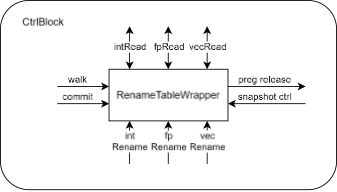

## 接口时序

### 整数读写接口时序示意图（浮点向量同理）

{#fig:rat-wrapper-rw-io}

[@fig:rat-wrapper-rw-io] 示意了整数读写的接口时序。

在时刻 2，io\_intRenamePorts\_0 向地址为 14 处写入了 73。同时，io\_intReadPorts\_0\_0 也向地址为 14 处发起了读请求，因此在时刻 3 读到了时刻 2 写入的 73。

在时刻 4，io\_intRenamePorts\_0 向地址为 4 处写入了 74，io\_intRenamePorts\_1 也向地址为 4 处写入了 75。从而，当 io\_intReadPorts\_0\_0 于时刻 5 向地址为 4 处发出读请求后，时刻 6 读到 io\_intRenamePorts\_1 写入的 75。

在时刻 3 和时刻 7，io\_intReadPorts\_0\_0\_hold 为高电平，因此时刻 4 读出的值与时刻 3 读出的值相同，为 73，而不是地址为 5 处的值；类似的，时刻 8 读出的值与时刻 7 读出的值相同，为 76，而非于时刻 7 新写入的值 77。

### 重新重命名和提交接口时序示意图

{#fig:rat-wrapper-re-rename-io}

[@fig:rat-wrapper-re-rename-io] 示意了两个重新重命名和提交接口的时序。

时刻 1 至时刻 4，io\_rabCommits\_isWalk 信号为高，io\_rabCommits\_ioCommit 信号为低，此时处于重新重命名状态。在时刻 2，io\_rabCommits\_walkValid\_0 为高，io\_rabCommits\_info\_0\_rfWen为低，io\_rabCommits\_info\_0\_fpWen为高，重新重命名接口 0 于是将 37 写入浮点推测重命名表的地址 0 处。在时刻 3，两个重新重命名接口均向 12 号逻辑整数寄存器写入了值。此时，1 号接口比 0 号接口优先级更高，于是 57 将被实际写入整数推测重命名表的地址 12 处。

时刻 5 至时刻 9，io\_rabCommits\_isWalk 信号为低，io\_rabCommits\_ioCommit 信号为高，此时处于提交状态。在时刻 7，io\_rabCommits\_commitValid\_0 为高，io\_rabCommits\_info\_0\_rfWen 为低，io\_rabCommits\_info\_0\_fpWen 为高，提交接口 0 于是将 92 写入浮点体系结构重命名表的地址 18 处。

# 支持 move 消除的 RenameTable {#sec:me-rat}

支持 move 消除的 RenameTable 被用于整数寄存器的重命名表，模块名为 `RenameTable`，其中维护了逻辑整数寄存器与物理整数寄存器的映射关系。其有 12 个读推测重命名表端口、6 个写推测重命名表端口和6个写体系结构重命名表端口，内部则由 32 个宽度为 8 的寄存器来实际维护映射关系。读端口和写端口的行为与 RenameTableWrapper 中所描述的行为完全一致。需要注意的是，为了时序考虑，模块 `T0` 时刻的写推测重命名表请求会实际于 `T1` 时刻处理，而 `T0` 时刻的写推测重命名表数据会被旁路到 `T1` 时刻的读推测重命名表结果。

其次，模块内部还有 4 份推测重命名表快照用于重定向和重新重命名时的快速恢复。这些快照存储在子模块 SnapShotGenerator\_3 中，在 RenameTable 的名字为 \_snapshots\_snapshotGen\_io\_snapshots_0/1/2/3\_[0-31]。快照的生成、释放、使用和冲刷完全由外部信号 io\_redirect 和 io\_snpt\_\* 进行控制。

外部传入的重定向信号 io\_redirect 和快照控制信号 io\_snpt\_\* 在打一拍后成为 t1\_redirect 和 t1\_snap\_\* 信号。重定向信号 t1\_redirect 为高电平时，会检查 t1\_snpt\_useSnpt 信号是否为高电平。如果 t1\_snpt\_useSnpt 信号为低电平，则会将推测重命名表置为体系结构重命名表；如果 t1\_snpt\_useSnpt 为高电平，则会将推测重命名表置为 \_snapshots\_snapshotGen\_io_snapshots\_[t1\_snpt\_snptSelect]\_[0-31]。

此外，模块还会根据写体系结构重命名表端口和内部的体系结构重命名表输出物理寄存器释放信号。如果一个写体系结构重命名表通道的写使能信号 io\_archWritePorts\_n\_wen 为低电平，则下一拍的 io\_old\_pdest\_n 则为 0；如果写使能信号不为零，则下一拍的 io\_old\_pdest\_n 为当拍的 arch_table[io\_archWritePorts\_n\_addr]。需要额外注意的是，io\_old\_pdest\_n 是有旁路的。对于 n>0 的情况，如果存在序号比 n 小的某个通道向体系结构重命名表的同一个逻辑寄存器写入了某个值，则下一拍的 io\_old\_pdest\_n 则应该置为这个值，而非 arch\_table[io\_archWritePorts\_n\_addr]。举例来说，对于 0<j<n，如果 io\_archWritePorts\_n\_wen 和 io\_archWritePorts\_j\_wen 都为高电平，且 io\_archWritePorts\_n\_addr == io\_archWritePorts\_j\_addr，那么下一拍的 io\_old\_pdest\_n 则应该置为 io\_archWritePorts\_j\_data，而非 arch\_table[io\_archWritePorts\_n\_addr]。此外，对于 n>1 的情况，如果存在多个序号比 n 小的某个通道向体系结构重命名表的同一个逻辑寄存器写入了某个值，则下一拍的 io\_old\_pdest\_n 则应该置为这些通道中序号较大者对应的写入值。举例来说，对于 0<j<k<n，如果 io\_archWritePorts\_n\_wen、io\_archWritePorts\_j\_wen 和 io\_archWritePorts\_k\_wen 都为高电平，且 io\_archWritePorts\_n\_addr == io\_archWritePorts\_j\_addr == io\_archWritePorts\_k\_addr，那么下一拍的 io\_old\_pdest\_n 则应该置为 io\_archWritePorts\_k\_data，而非 arch\_table[io\_archWritePorts\_n\_addr] 或 io\_archWritePorts\_j\_data。

物理寄存器释放信号还包括 io\_need\_free\_\* 信号。如果当拍某个通道的 io\_old\_pdest\_n 信号和 arch\_table\_\* 中的任何一项都不同，则将该通道下一拍的 io\_need\_free\_n 信号置高。需要额外注意的是，对于 n>0 的情况，如果存在序号比 n 小的某个通道的 io\_old\_pdest\_j 信号和 io\_old\_pdest\_n 相同，那么下一拍 io\_need\_free\_n 信号不会被置高。

## 整体框图

## 接口时序

### 读写接口时序示意图

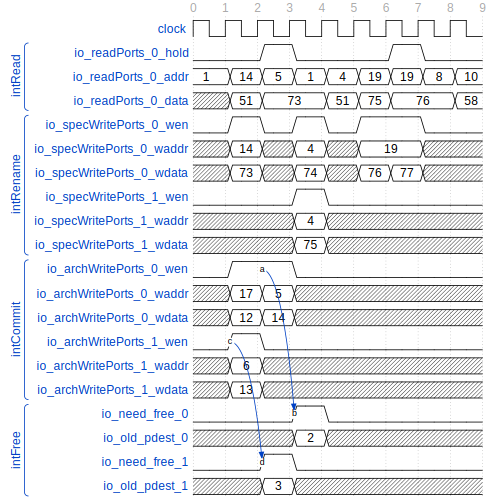

# 不支持 move 消除的 RenameTable

不支持 move 消除的 RenameTable 和 [@sec:me-rat] 基本类似，但并不包括 io\_need\_free\_\* 信号。浮点寄存器的重命名表 `RenameTable_1` 和向量寄存器的重命名表 `RenameTable_2` 使用了这种重命名表。

浮点寄存器的重命名表 `RenameTable_1` 维护了逻辑浮点寄存器与物理向量浮点寄存器的映射关系。其有 18 个读推测重命名表端口、6 个写推测重命名表端口和 6 个写体系结构重命名表端口，内部则由 34 个宽度为 8 的寄存器来实际维护映射关系。

浮点寄存器的重命名表 `RenameTable_2` 维护了逻辑向量寄存器与物理向量浮点寄存器的映射关系。其有 30 个读推测重命名表端口、6 个写推测重命名表端口和 6 个写体系结构重命名表端口，内部则由 48 个宽度为 8 的寄存器来实际维护映射关系。

## 接口时序

### 读写接口时序示意图

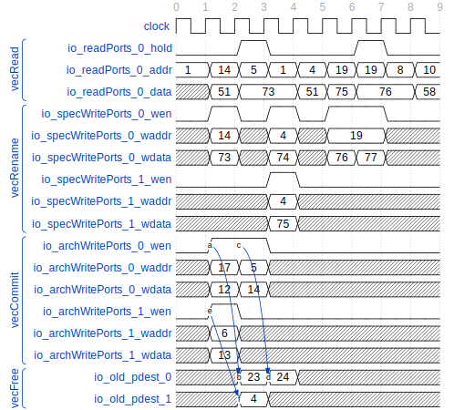

# StdFreeList

StdFreeList 在 Rename 模块中被例化为 fpFreeList 和 vecFreeList。正如 [@sec:alloc-fp-vec-prf] 、[@sec:commit-fp-vec-inst] 和 [@sec:rename-re-rename] 中所提到的那样，fpFreelist 在重命名时负责接收向量浮点物理寄存器的分配请求，返回分配的空闲向量浮点物理寄存器；在重新重命名时负责根据 RAB 传来的重新重命名请求重新对向量浮点物理寄存器进行分配；在提交时负责释放已经不会再被使用的向量浮点物理寄存器和更新体系结构出队指针。

## 整体框图

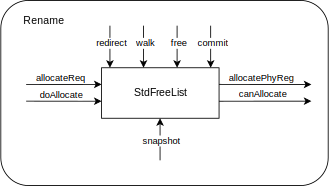

## 接口时序

### 空闲寄存器分配时序示意图

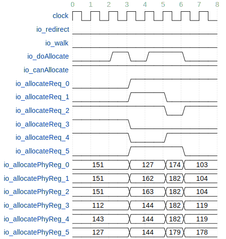{#fig:stdfreelist-alloc-io}

[@fig:stdfreelist-alloc-io] 示意了空闲物理寄存器分配的时序。在时刻 3、时刻 5 和时刻 6，io\_redirect 和 io\_walk 为低电平，io\_doAllocate 和 io\_canAllocate 为高电平，从而进行了空闲物理寄存器的分配。在时刻 3，io\_allocateReq\_[2-4] 为高电平，StdFreeList 通过 io\_allocatePhyReg\_[2-4] 分别返回了分配的空闲物理寄存器号 151、112 和 143；在时刻 5，io\_allocatePhyReg\_[0-2|5] 分别返回了分配的空闲物理寄存器号 127、162、163 和 144；在时刻 6，则返回了 174、182 和 179。每成功分配 `n` 个空闲物理寄存器，模块内部的 headPtr 便会加 `n`。

### 指令提交时序示意图

{#fig:stdfreelist-commit-io}

[@fig:stdfreelist-commit-io] 示意了指令提交的时序，其中 io\_freeReq\_\* 表示某一路的 io\_freeReq 信号，io\_freePhyReg\_\* 表示与 io\_freeReq\_\* 对应某路的 io\_freePhyReg 信号。当 io\_redirect 和 io\_walk 均为低电平时，若 io\_freeReq 为高电平，则 StdFreeList 会将对应的 io\_freePhyReg 加入空闲队列。

此外，在 io\_freeReq\_\* 的前一个周期，Rename 模块还会将 RAB 的提交信息传入，以更新体系结构出队指针 archHeadPtr。当 io\_commit\_isCommit 和对应通道的 io\_commit\_commitValid\_\* 信号处于高电平时，说明对应通道的更新信号有效。此时，若对应通道的 io\_commit\_info\_\*\_fpWen 或 io\_commit\_info\_\*\_vecWen 为高电平，则表明该通道会让 archHeadPtr 加一。若有 `k` 个通道满足上述条件，则 archHeadPtr 会加 `k`。

### 指令重新重命名时序示意图

{#fig:stdfreelist-re-rename-io}

[@fig:stdfreelist-re-rename-io] 示意了指令重新重命名的时序。当 io\_redirect 在时刻 1 拉高一个周期后，io\_walk 会被拉高数个周期，标志着模块进入重新重命名阶段。在时刻 1，由于 io\_snpt\_useSnpt 为低电平，因此 headPtr 会被恢复为 archHeadPtr 的值。这一恢复不会立即进行，而是在时刻 2 加上 io\_walkReq\_\* 高电平的数量（2）后得到 headPtrAllocate（5），并在时刻 3 写入 headPtr。此后，当 io\_walk 为高电平时，headPtrAllocate 置为 headPtr+PopCount(io\_walkReq\_\*) 的值，并在下一个周期写入 headPtr。

重新重命名过程旨在消除推测执行错误路径上的重命名状态。通过先将 headPtr 恢复到体系结构 archHeadPtr 状态（或当 io\_snpt\_useSnpt为高电平时，恢复到快照状态），然后再重新重命名到进入错误路径之前，以达到这一目的。

## 关键电路：环形队列

空闲物理寄存器由一个环形队列维护。这个环形队列由寄存器组 freeList（即代码中的 freeList\_\*，记其数量为 size），以及头指针 headPtr（即代码中的 headPtr\_\*）和尾指针 tailPtr（即代码中的 tailPtr\_\*）组成。其中 headPtr 为出队指针，tailPtr 为入队指针。

为方便说明，先考虑一个普通的队列，此时 headPtr 和 tailPtr 都是指向 freeList 中某个元素的指针。正常工作时，tailPtr 永远大于或等于 headPtr，队列中的元素为 {headPtr, headPtr + 1, ..., tailPtr - 1}。当有元素希望入队时，则将元素放置于 freeList[tailPtr]，再将 tailPtr 加一；当有元素出队时，则取出 freeList[headPtr]，再将 headPtr 加一。当 tailPtr 与 headPtr 相等时，说明队列为空；当 tailPtr 大于 headPtr 时，说明队列非空。

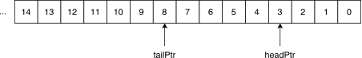

但是，由于 freeList 不可能无限长，我们设计出了环形队列。环形队列可以认为是将有限长的普通队列首尾相接。此时，tailPtr 和 headPtr 将不能仅仅只是指向 freeList 中某个元素的指针了：按原有设计，当 tailPtr 与 headPtr 相等时，环形队列可能是空的，也可能是满的。

为了解决这一问题，我们为 tailPtr 和 headPtr 新增了 flag 字段，该字段初始值为 false，且在每次由 freeList[size - 1] 变为 freeList[0] 时，将 flag 取反。这样，在 value 相同的情况下，若 flag 相同，则说明环形队列为空；若 flag 不同，则说明环形队列为满。

canAllocate 的更新时序：当拍会根据 headPtr， tailPtr， freeReq 以及 allocateReq 计算 freeRegCnt，然后将其打一拍得到 freeRegCntReg（它就是实际上的 size）。 freeRegCntReg 大于译码宽度时 canAllocate 置高，并当拍传出。

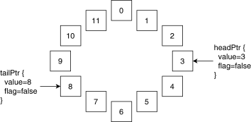

# MEFreeList

MEFreeList 在 Rename 模块中被例化为 intFreeList。正如 [@sec:alloc-int-prf] 、[@sec:commit-int-inst] 和 [@sec:rename-re-rename] 中所提到的那样，intFreelist 在重命名时负责接收整数物理寄存器的分配请求，返回分配的空闲整数物理寄存器；在重新重命名时负责根据RAB传来的重新重命名请求重新对整数物理寄存器进行分配；在提交时负责释放已经不会再被使用的整数物理寄存器。与 StdFreeList 不同的是，MEFreeList 支持 move 指令消除。如果一条指令是 move 指令，Rename 并不会将 io\_allocateReq\_\*\_valid 置高，因此 MEFreeList 并不会为其分配空闲物理寄存器。

## 整体框图

## 接口时序

### 空闲寄存器分配时序示意图

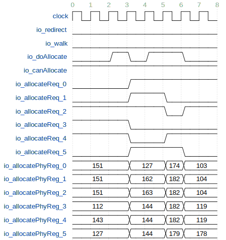{#fig:mefreelist-alloc-io}

[@fig:mefreelist-alloc-io] 示意了空闲物理寄存器分配的时序。在时刻 3、时刻 5 和时刻 6，io\_redirect 和 io\_walk 为低电平，io\_doAllocate 和 io\_canAllocate 为高电平，从而进行了空闲物理寄存器的分配。在时刻 3，io\_allocateReq\_[2-4] 为高电平，MEFreeList 通过 io\_allocatePhyReg\_[2-4] 分别返回了分配的空闲物理寄存器号 151、112 和 143；在时刻 5，io\_allocatePhyReg\_[0-2|5] 分别返回了分配的空闲物理寄存器号 127、162、163 和 144；在时刻 6，则返回了 174、182 和 179。

### 指令提交时序示意图

{#fig:mefreelist-commit-io}

[@fig:mefreelist-commit-io] 示意了指令提交的时序，其中 io\_freeReq\_\* 表示某一路的 io\_freeReq 信号，io\_freePhyReg\_\* 表示与 io\_freeReq\_\* 对应某路的 io\_freePhyReg 信号。当 io\_redirect 和 io\_walk 均为低电平时，若 io\_freeReq 为高电平，则 StdFreeList 会将对应的 io\_freePhyReg 加入空闲队列。

此外，在 io\_freeReq\_\* 的前两个周期，Rename 模块还会将 RAB 的提交信息传入，以更新体系结构出队指针 archHeadPtr。当 io\_commit\_isCommit 和对应通道的 io\_commit\_commitValid\_\* 信号处于高电平时，说明对应通道的更新信号有效。此时，若对应通道的 io\_commit\_info\_\*\_rfWen 为高电平、io\_commit\_info\_\*\_ldest 不为 0 且 io\_commit\_info\_\*\_isMove 为低电平，则表明该通道会让 archHeadPtr 加一。若有 `k` 个通道满足上述条件，则 archHeadPtr 会加 `k`。

当 io\_commit\_commitValid\_\* 在某个周期为高电平时，io\_freeReq\_\* 信号不总会在两个周期后为高电平。造成这一现象的原因是 move 消除。此处的 io\_freeReq\_\* 来自于 RenameTable 的输出信号 io\_need\_free。正如 RenameTable 模块中提到的那样，RenameTable 的 io\_need\_free 信号在 arch\_table 中存在相同的物理寄存器时，可能不会被拉高，而正是因为 move 消除导致不同的逻辑寄存器共享了同一个物理寄存器，才导致在 RenameTable 的不同项中存在相同的物理寄存器。

### 指令重新重命名时序示意图

{#fig:mefreelist-re-rename-io}

[@fig:mefreelist-re-rename-io] 示意了指令重新重命名的时序。当 io\_redirect 在时刻 1 拉高一个周期后，io\_walk 会被拉高数个周期，标志着模块进入重新重命名阶段。在时刻 1，由于 io\_snpt\_useSnpt 为低电平，因此 headPtr 会被恢复为 archHeadPtr 的值。这一恢复不会立即进行，而是在时刻 2 加上 io\_walkReq\_\* 高电平的数量（2）后得到 headPtrAllocate（5），并在时刻 3 写入 headPtr。此后，当 io\_walk 为高电平时，headPtrAllocate 置为 headPtr+PopCount(io\_walkReq\_\*) 的值，并在下一个周期写入 headPtr。

重新重命名过程旨在消除推测执行错误路径上的重命名状态。通过先将 headPtr 恢复到体系结构 archHeadPtr 状态（或当 io\_snpt\_useSnpt 为高电平时，恢复到快照状态），然后再重新重命名到进入错误路径之前，以达到这一目的。

# CompressUnit

CompressUnit 用于决定哪些指令可以共用同一个 ROB 项，即可以被压缩到同一个 ROB 项。该模块接受来自译码单元的输出，并根据译码输出的结果，得到 ROB 压缩信息。

一个通道被标记为可被 ROB 压缩（canCompress\_[0-5]），当且仅当这条通道传入的译码信息满足：该通道的译码信息有效（io\_in\_[0-5]\_valid），且该通道不存在指令融合（!io\_in\_[0-5]\_bits\_commitType[2]），且该通道不存在指令拆分或为指令拆分的最后一条微指令（io\_in\_[0-5]\_bits\_lastUop），且该通道不存在例外（io\_in\_[0-5]\_bits\_exceptionVec\_\* 均为低电平），且该通道被标记为可被 ROB 压缩（io\_in\_[0-5]\_bits\_canRobCompress）。

CompressUnit 会为每个通道输出是否需要分配 ROB 项的标志 io\_out\_needRobFlags\_[0-5]。当且仅当某个通道的 canCompress\_[0-5] 为 0，或该通道为自己所在的连续为 1 的 canCompress\_[0-5] 组中编号最大的那一个通道时，该通道的 io\_out\_needRobFlags\_[0-5] 会被置为高电平。

CompressUnit 会为每个通道输出该通道所在 ROB 项中的指令数量 io\_out\_instrSizes\_[0-5]。当某个通道的 canCompress\_[0-5] 为 0 时，该通道的 io\_out\_instrSizes\_[0-5] 为 1；当某个通道的 canCompress\_[0-5] 为 1 时，该通道的 io\_out\_instrSizes\_[0-5] 为自己所在的连续为 1 的canCompress\_[0-5] 组中元素的个数。

CompressUnit 会为每个通道输出与该通道共用同一个 ROB 项的通道掩码 io\_out\_masks\_[0-5]。该信号位宽为 6，与通道数相同。当某个通道的 canCompress\_n 为 0 时，该通道的 io\_out\_masks\_n[n] 为 1，除 io\_out\_masks\_n[n] 以外的位为 0；当某个通道的 canCompress\_n 为 1 时，io\_out\_masks\_n 中为 1 的那些位的索引为“自己所在的连续为 1 的 canCompress\_[0-5]组”中的通道的编号。

举例来说，如果 {canCompress\_5, canCompress\_4, canCompress\_3, canCompress\_2, canCompress\_1, canCompress\_0} == {1, 0, 0, 1, 1, 0}，那么 {io\_out\_needRobFlags\_5, io\_out\_needRobFlags\_4, io\_out\_needRobFlags\_3, io\_out\_needRobFlags\_2, io\_out\_needRobFlags\_1, io\_out\_needRobFlags\_0} == {1, 1, 1, 1, 0, 1}，{io\_out\_instrSizes\_5, io\_out\_instrSizes\_4, io\_out\_instrSizes\_3, io\_out\_instrSizes\_2, io\_out\_instrSizes\_1, io\_out\_instrSizes\_0} == {1, 1, 1, 2, 2, 1}，{io\_out\_masks\_5, io\_out\_masks\_4, io\_out\_masks\_3, io\_out\_masks\_2, io\_out\_masks\_1, io\_out\_masks\_0} == {{1, 0, 0, 0, 0, 0}, {0, 1, 0, 0, 0, 0}, {0, 0, 1, 0, 0, 0}, {0, 0, 0, 1, 1, 0}, {0, 0, 0, 1, 1, 0}, {0, 0, 0, 0, 0, 1}}。

## 整体框图

## 接口时序

该模块为纯组合逻辑，信号当拍进当拍出。

# SnapshotGenerator

正如在 [@sec:decide-snpt-gen] 中提到的那样，重命名快照是分布式的，它会分布在各个当发生重定向后需要排除错误重命名路径影响的模块之中，以达到加快重新重命名的目的。对于和重命名相关的模块而言，RenameTable、RenameTable_1、RenameTable_2、StdFreeList 和 MEFreeList 中都存在这一子模块。

不同的子模块中具体存储的快照数据 snapshots 各不相同。对于 RenameTable(\_\*) 而言，其中各存储了四份 spec\_table；对于 StdFreeList 和 MEFreeList 而言，其中则存储了四份 headPtr。

模块内部维护了一对环形指针 snptEnqPtr 和 snptDeqPtr。当 io\_redirect 为低电平时，如果快照存储没有满，且 io\_enq 为高电平，那么模块会将 io\_enqData\_\* 传入的数据记录到快照存储 snapshots\_[snptEnqPtr\_value] 处，并将 snptValids[snptEnqPtr\_value] 置一，然后 snptEnqPtr 加一。

与此相对的，当 io\_redirect 为低电平时，如果 io\_deq 为高电平，说明此时快照模块需要出队一个快照。此时，snptValids\_[snptDeqPtr\_value] 会被置低，然后 snptDrqPtr 加一。

重定向发生时，快照模块根据 io\_flushVec\_\* 信号对内部快照进行冲刷。首先，如果 io\_flushVec\_\* 为高电平，那么对应通道的 snptValids\_\* 会被置低；其次，snptEnqPtr 会被回退到被置低后的第一个 snptValids\_\* 为低的位置。

快照中存储的数据会通过 io\_snapshots\_[0-3]\_\* 接口传输到模块外部，以供各模块在重定向时恢复使用。重定向时是否使用快照以及使用哪一快照由 CtrlBlock 统一生成信号，本模块仅仅提供快照数据。
