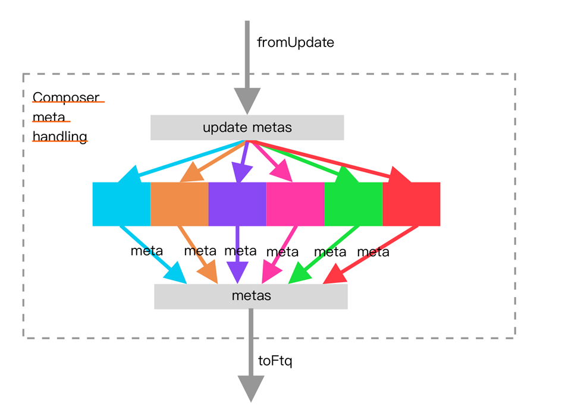

# BPU 子模块 Composer

## 功能概述

Composer 是一个用于组合多个预测器的模块。在南湖中，其组合了 uFTB、FTB、TAGE-SC、ITTAGE 和 RAS 五个预测器，并对外抽象成了一个 三级流水覆盖预测器。Composer 中的各个预测器可以通过写自定义寄存器 sbpctl 来实现开关，可以按需使用预测器。在检测到来自外部的重定向后，Composer 会把重定向请求发送给各预测器，以用于恢复推测更新的元素。在预测块所有指令提交后，Composer 中的各预测器会进行训练。最终，Composer 将三级预测结果输出至 Predictor。

三级 BPU 流水级内部重定向的时候如果有预测错误只会恢复那些推测更新的状态，比如说分支历史和 RAS，其它的预测器更新都是在提交后做。

此时如果不刷新预测器，只是刷新流水线，那下次这个地方不是还会预测错误？刷新流水线的同时是从纠正过的正确路径开始预测，如果接下来的路径又经过了同一个地方，是可能再次预测同一个结果的，但是也有可能因为分支历史不同，从而在 TAGE 等预测器里索引不同的表项。

如果在执行时发现目标地址错误，不会发起重定向，而是统一等到指令提交时再重定向。这样设计的一个原因是本身误预测的重定向就是在错误路径上的，它的执行结果可能也是错误的，这种情况下去训练，可能对预测器造成污染。

### 起始 PC 的配置

Composer 的 IO 接口 io_reset_vector 可以实现起始 PC 的配置。只需要将期望的起始 PC 传递给该 IO 即可。

### 与预测器的连接

Composer 将 uFTB、FTB、TAGE-SC、ITTAGE 和 RAS 五个预测器连接起来。因为共有三个分支预测器的流水级，且每个预测器是固定延迟的， 到那个流水级就一定完成预测，所以 Composer 只需要在对应流水级输出对应预测器的预测结果即可。

meta 是预测器预测的时候的数据，update 的时候拿回来更新用。都叫 meta 是因为 composer 将所有预测器整合起来，用共同的接口 meta 和外界交互。

### 预测器的开关

通过 Zicsr 指令，我们可以读写 sbpctl 这一自定义 CSR 来控制 Composer 中的各预测器的使能。sbpctl[6:0]代表了{LOOP, RAS, SC, TAGE, BIM, BTB, uFTB}这七个预测器的使能。其中，高电平代表使能，低电平代表未使能。具体地，spbctl 这一 CSR 的值通过 Composer 的 IO 接口 io_ctrl_*传入各个预测器，并由各预测器负责使能的实现。

### 重定向的恢复

Composer 通过 io_s2_redirect、io_s3_redirect 和 io_redirect_*等 IO 端口接收重定向请求。这些请求被发送给其各个预测器，用于恢复推测更新的元素，如 RAS 栈顶项等。

### 预测器训练

Composer 通过 IO 端口 io_update_*将训练信号发送给其各个预测器。总的来说，为防止错误执行路径对预测器内容的污染，各部分预测器在预测块的所有指令提交后进行训练。它们的训练内容来自自身的预测信息和预测块中指令的译码结果和执行结果，它们会被从 FTQ 中 读出，并送回 BPU。其中，自身的预测信息会在预测后打包传进 FTQ 中存储；指令的译码结果来自 IFU 的预译码模块，在取到指令后写回 FTQ；而执行结果来自各个执行单元。

## 整体框图

## 接口时序

### 控制信号 Ctrl 接口时序

上图示意了 Composer 模块控制信号 Ctrl 接口的时序示例，io_ctrl 信号在传入 Composer 模块后，被 delay 一拍传给内部 components 子模块 。

### 重定向接口时序

上图展示了 Composer 模块重定向请求的接口，在 BPU 接收到来自后端的重定向请求后，会延迟一拍发往 Composer，因此 Composer 内预测器 会晚一拍收到相应请求。

### 分支预测块训练接口时序

类似重定向，为优化时序，分支预测块训练的 update 接口同样在 BPU 内部被延迟一拍发往 Composer 及其内部各预测器。

## 关键电路

下图分别展示了 Composer meta 拼接和重定向/分支历史更新来源仲裁逻辑

