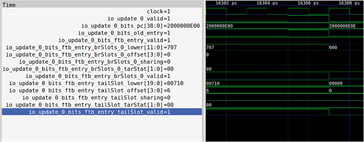

# BPU 子模块 FTB

## 功能概述

FTB 暂存 FTB 项，为后续高级预测器提供更为精确的分支指令位置、类型等信息。FTB 模块内有一 FTBBank 模块负责 FTB 项的实际存储，模块 内使用了一块多路 SRAM 作为存储器。

### 请求接收

0 阶段时，FTB 模块向内部 FTBBank 发送读请求，其请求 pc 值为 s0 传入的 PC,。

数据读取与返回

在发送请求的下一拍也就是预测器的 1 阶段，将暂存从 FTB SRAM 中读出的多路信号。

再下一拍也就是预测器的 2 阶段，从暂存数据中根据各路的 tag 和实际请求时 tag 的匹配情况生成命中信号并在命中时选出命中 FTB 数据。若存在 hit 请求，则返回值为选出的 FTB 项及命中的路信息，若未 hit，则输出数据无意义。tag 为 PC 的 29 到 10 位。

FTBBank 模块读出的数据在 FTB 模块内作为 2 阶段的预测结果以组合逻辑连线形式在当拍传递给后续预测器，此外这一读出的结果还会被暂 存到 FTB 模块内，在 3 阶段作为预测结果再次以组合逻辑连线传递给后续预测器。若 FTB 命中，则读出的命中路编号也会作为 meta 信息在 s3 与命中信息、周期数一起传递给后续 FTQ 模块。

此外，若 FTB 项内存在 always taken 标志，则 2 阶段的预测结果中对应 br_taken_mask 也在本模块内拉高处理。

### 数据更新

收到 update 请求后，FTB 模块会根据 meta 信息中是否 hit 决定更新时机。若 meta 中显示 hit，则在本拍立刻更新，否则需要延迟 2 周期等待读出 FTB 内现有结果后才可更新。

在 FTBBank 内部，当存在更新请求时，该模块行为也因立即更新和推迟更新两情况而有所不同。立即更新时，FTBBank 内的 SRAM 写通道拉高，按照给定的信息完成写入。推迟更新时，FTBBank 首先收到一个 update 的读请求且优先级高于普通预测的读请求，而后下一拍读出数据 ，选出给定地址命中的路编码传递给外部 FTB 模块。而若这一拍未命中，则下一拍需要写入到分配的路中。路选取规则为，若所有路均已 写满，则使用替换算法（此处为伪 LRU，详见 ICache 文档）选取要替换的路，否则选取一空路。

### SRAM 规格

单 bank，512 set，4 way，使用单口 SRAM，无读保持，有上电复位。

20 bit tag，60 bit FTB 项。

其中 FTB 项

1 bit valid

20 bit br slot（4 bit offset，12 bit lower 2 bit tarStat, 1bit sharing, 1 bit valid）

28 bit tail slot (4 bit offset , 20 bit lower, 2 bit tarStat, 1 bit sharing, 1 bit valid)

4 bit pftAddr

1 bit carry

1 bit isCall

1 bit isRet

1 bit isJalr

1 bit 末尾可能为 rvi call

2 bit always taken

## 整体框图

## 接口时序

### 结果输出接口

上图展示了分支预测器中 FTB 模块针对 fallThrough 地址为 0x2000001062 的请求连续三拍在分支预测器不同阶段输出预测结果的接口。

### 更新接口

上图展示了 FTB 模块的一次针对 0x2000000E00 地址的更新操作，所有更新数据在一拍内全部传递。

## FTBBank

### 接口时序

#### 读数据接口

上图展示了 FTBBank 读数据接口，FTBBank 在收到请求一拍后回复数据，即 16303ps 处回复的为 16301ps 的 0x2000001060 地址请求。

#### 更新读数据接口

上图展示了 FTBBank 更新读数据接口，FTBBank 在收到更新读请求一拍后回复数据，回复的数据被外 部在一拍后用于更新写数据，可以注意到请求一拍后的 pftAddr 被用于结果读出一拍后的数据写入。

#### 更新写数据接口

上图展示了 FTBBank 更新写数据接口，在收到写请求后一拍，数据完成写入。

### 功能概述

如上所述，FTBBank 主要存储 FTB 项，为 SRAM 模块的简单封装。

## FTB 项的生成条件简述

FTB 是 BPU 的核心。BPU 的其他预测部件所作出的预测全部依赖于 FTB 提供的信息。FTB 除了提供预测块内分支指令的信息之外，还提供预测块的结束地址。对于 FTB 来说，FTB 项的生成策略至关重要。南湖架构在原始论文 1 的基础上，结合这篇论文 2 的思想形成了现有的策略，记 FTB 项的起始地址为 start ，结束地址为 end ，具体策略如下：

- FTB 项由 start 索引， start 在预测流水线中生成，实际上， start 基本遵循如下原则之一：
  - start 是上一个预测块的 end
  - start 是来自 BPU 外部的重定向的目标地址；
- FTB 项内最多记录两条分支指令，其中第一条一定是条件分支；
- end 一定满足三种条件之一：
  - end - start = 预测宽度
  - end 是从 start 开始的预测宽度范围内第三条分支指令的 PC
  - end 是一条无条件跳转分支的下一条指令的 PC，同时它在从 start 开始的预测宽度范围内

这种训练策略下，同一条分支指令可能存在于多个 FTB 项内。

和论文中的实现[1](https://docs.xiangshan.cc/zh-cn/latest/frontend/bp/#fn:ftbcite)一样，我们只存储结束地址的低位，而高位用起始地址的高位拼接得到。和 AMD[3](https://docs.xiangshan.cc/zh-cn/latest/frontend/bp/#fn:amd)的做法相似，我们还对[FTB](https://docs.xiangshan.cc/zh-cn/latest/frontend/bp/#ftb)项中的条件分支指令记录“总是跳转”位，该位在第一次遇到该条件分支跳转时置 1，在它值为 1 的时候，该条件分支的方向总是预测为跳转，也不用它的结果训练条件分支方向预测器；当该条件分支遇到一次执行结果为不跳转的时候，将该位置 0，之后它的方向由条件分支方向预测器预测。

## FTB 存储结构

FTB 项结构如下

| total | valid  | brSlot         | tailSlot       | pftAddr        | carry                | isCall, isRet, isJalr | last_may_be_rvi_call | strong_bias |
| ----- | ------ | -------------- | -------------- | -------------- | -------------------- | --------------------- | -------------------- | ----------- |
|       | 有效位 | 第一条分支信息 | 第二条分支信息 | 预测块结束地址 | 结束地址高位是否进位 | tailSlot 分支类型     | RAS 标识特殊位       | 强 bias     |
| 62    | 1      | 21             | 29             | 4              | 1                    | 3                     | 1                    | 2           |

FTB slot 的组成，每个 slot 对应一条分支指令

| total | valid  | offset             | lower        | tarStat              | sharing                              | isRVC          |
| ----- | ------ | ------------------ | ------------ | -------------------- | ------------------------------------ | -------------- |
|       | 有效位 | 相对起始 PC 的偏移 | 目标地址低位 | 目标地址高位是否进位 | （对 tailSlot 来说）是否装了条件分支 | 是否是压缩指令 |
| 21/29 | 1      | 4                  | 12/20        | 2                    | 1                                    | 1              |

FTB 共有 2048 项，4 路组相联，每项最多记录 2 条分支，其中第一条一定是条件分支，第二条可能是任意类型分支指令

## 目标地址生成逻辑

对于每个 slot，根据三种可能的高位进位情况（进位/退位/不变），在（PC 高位+1, PC 高位-1, PC 高位）三种情况中选择一个，和存储的目标地址低位信息进行拼位

## 更新流程

1. 表项生成

    1.1 从FTQ读取必要信息：
      - 起始地址 startAddr
      - 预测时读出的旧FTB项 old_entry
      - 包含FTQ项内32Byte内所有分支指令的预译码信息 pd
      - 此FTQ项内有效指令的真实跳转结果 cfiIndex，包括是否跳转，以及跳转指令相对startAddr的偏移
      - 此FTQ项内分支指令（如跳转）的跳转地址（执行结果）
      - 预测时FTB是否真正命中（旧FTB项是否有效）
      - 对应FTQ项内所有可能指令的误预测 mask

    1.2 FTB项生成逻辑：
      - 情况1：FTB未命中或存在错误
        1) 无条件跳转指令处理：
          - 不论是否被执行，都一定会被写入新FTB项的tailSlot
          - 如果最终FTQ项内跳转的指令是条件分支指令，写入新FTB项的第一个brSlot，将对应的always_taken位置1
        2) pftAddr设置：
          - 存在无条件跳转指令时：以第一条无条件跳转指令的结束地址设置
          - 无无条件跳转指令时：以startAddr+取指宽度（32B）设置
          - 特殊情况：当4Byte宽度的第一条无条件跳转指令起始地址位于startAddr+30时，虽然结束地址超出取指宽度范围，仍按startAddr+32设置
        3) carry位根据pftAddr的条件同时设置
        4) 设置分支类型标志：
          - isJalr、isCall、isRet按照第一条无条件跳转指令的类型设置
          - 特殊标志：当且仅当4Byte宽度的第一条无条件跳转指令起始地址位于startAddr+30，且该指令是call类型时，置last_may_be_rvi_call位

      - 情况2：FTB命中且无错误
        1) 插入新条件分支：
          - 有空闲位置时：
            a) tailSlot有无条件跳转：新条件分支一定指令序先于该无条件跳转，直接插入brSlot
            b) brSlot有条件分支：按指令序排列，保持FTB项内brSlot的分支在指令序上先于tailSlot
            c) 以上情况pftAddr均无需修改
          - 无空闲位置时：
            a) tailSlot有无条件跳转：
              - 新条件分支指令序一定比该无条件跳转靠前
              - 新条件分支替代无条件跳转的位置
              - pftAddr按无条件跳转的PC设置
            b) tailSlot有条件分支：
              i) 新条件分支指令序比tailSlot内已有的条件分支指令序靠前：
                - 将brSlot内的条件分支和新条件分支按指令序排布
                - pftAddr按tailSlot内原有分支的PC设置
              ii) 新条件分支指令序位于已有的所有分支指令后面：
                - slot不发生任何改变
                - 只把pftAddr按新条件分支的PC设置
        2) 更新jalr跳转地址信息：
          - 当tailSlot内原来记载了jalr（RISC-V的无条件间接跳转指令）
          - 跳转地址改变时，修改tailSlot内记载的相应目标地址低位和高位进位信息
        3) 更新always_taken位：
          - 如果always_taken位置1，且对应的条件分支此次执行结果是不跳转，拉低always_taken位

2. 写入SRAM

    2.1 写入条件：

    - 新FTB项完全没有变化，或者虽然FTB未命中但uFTB命中：不需写入
    - 新FTB项有变化且非uFTB命中、FTB未命中的情况：需要写入

    2.2 写入流程：
      - 情况1：预测未命中
        1) 先用一拍做一次FTB读，判断此时命中情况
        2) 如命中，写入对应路
        3) 如仍未命中，根据替换算法选择一路写入
        4) 总流程需要3个时钟周期
        5) 过程中由于FTB读写口占用，需要FTQ配合不发出新的更新请求
           - 注：分bank可能提高更新带宽
      - 情况2：预测时命中（包括命中项内有错误信息的情况）
        1) 直接写入对应路，无需再次读出

3. 写入SRAM的流水线示意图如下：

