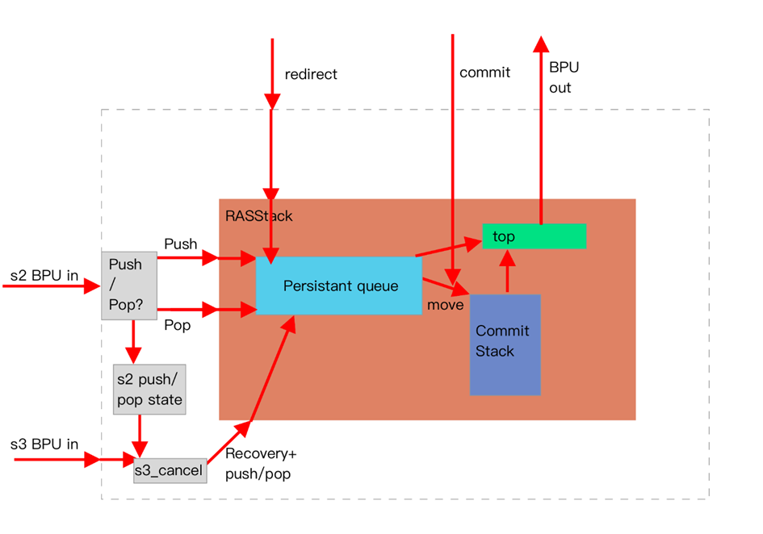
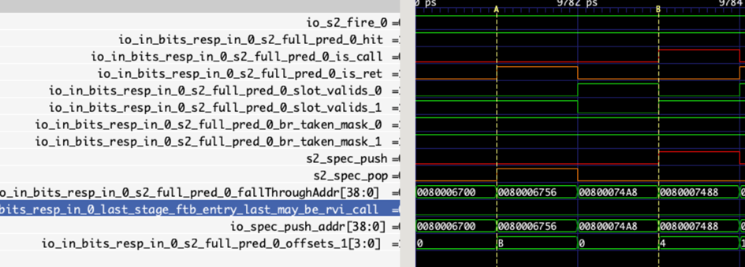
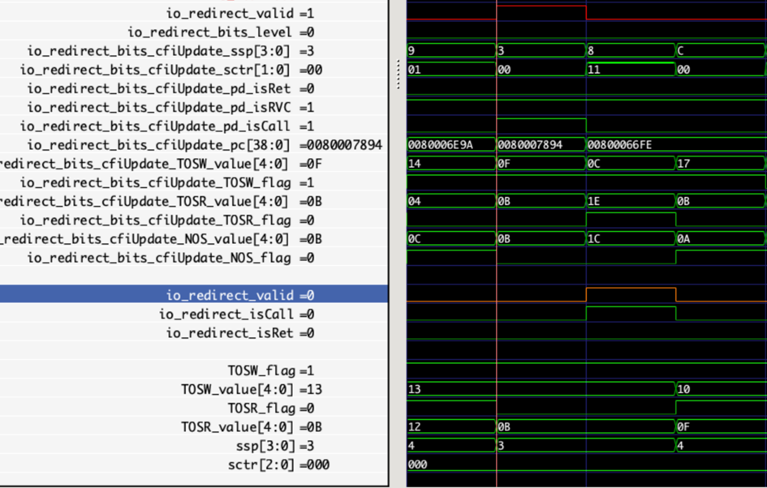

# BPU 子模块 RAS

## 功能

RAS 预测器使用栈结构来预测函数调用与返回这类具有成对匹配特性的执行流。其中调用（push/call）类指令的特征为类指令的特征为目标寄存器地址为 1 或 5 的 jal/jalr 指令。返回（ret）类指令的特征为源寄存器为 1 或 5 的 jalr 指令。

在实现中，RAS 预测器在 s2 和 s3 两阶段提供预测结果。

昆明湖架构的 RAS 预测器与南湖架构差异较大。通过引入持久化队列，新的 RAS 预测器结构解决了局部预测器因推测执行所导致的预测器数据污染问题。同时，新结构也保留了和南湖架构类似的栈结构作为提交栈，存储提交后的压栈信息，以弥补持久化队列存储密度不高的缺点。

### 基于持久化队列设计的 RAS 预测器架构整体概述

RAS 预测器利用分支预测 FTB 块中的 call/return 指令局部的配对信息对 return 指令作出预测。由于正常调用的函数执行完毕会返回到调用 指令的下一条指令，RAS 预测器可在遇到 call 指令时根据当前指令 PC 及当前指令是否为 RVC 指令（确定指令宽度为 2 还是 4）生成其函数调用返回地址的预测结果并压栈。

由于现代超标量乱序处理器通常采用深流水线推测执行技术，分支预测器会在之前所预测指令执行结果确定前为后续指令生成预测结果，也即，若面临 ABC 三个连续的分支指令预测请求，RAS 预测器并不能在预测 B 时获取到 A 块内指令的最终执行结果，而只能获取到 A 块的 Z 块内指令的最终执行结果和基于分支预测结果的 Z 到 A 块间推测结果。若 Z 到 A 块间存在错误的分支预测结果，则需要对其涉及的分支预测器状态进行误预测恢复。如前文所述，RAS 预测器基于栈结构对 call-return 指令对作出预测，配对信息准确性对其准确率至关重要。要精确地恢复 RAS 预测器在发生错误预测点的状态，最直观的做法是从当前最新预测点回溯到发生误预测点，撤销其间对 RAS 栈作出的所有改动。而为提升误预测恢复及时性，现代处理器通常难以允许误预测恢复时进行如此高复杂度的操作。在南湖架构设计中，RAS 预测器在发生误预测 时仅恢复发生误预测预测块对应栈顶项和 RAS 栈顶指针。这一恢复策略可以应对因推测执行导致的误预测点 RAS 栈顶及其更上方数据的污染，但无法应对推测执行中因先 pop 再 push 对 RAS 栈顶下方数据的污染。如下图所示，这类污染无法通过仅恢复栈顶项和栈顶指针修复。

这类污染会导致后续的 return 指令跳转目标出错，从而产生误预测。为解决这一问题，昆明湖架构的新 RAS 预测器通过引入持久化队列， 保存 RAS 推测执行过程中的所有局部状态，实现了抗上述污染的预测。具体地，持久化队列模拟的栈结构有读指针 TOSR、写指针 TOSW 和栈 底指针 BOS 三个指针，每一项除记录自身数据外，还记录其前一项在持久化队列中的位置指针 NOS；在每次栈 push 操作时均前移一次 TOSW 为当前压栈数据新分配一项存储空间，并将当前 TOSR 指向 TOSW 原位置（即新分配空间），新压栈的项记录的 NOS 存储 push 操作前的读指针位 置；在每次栈 pop 操作时，将 TOSR 移动到当前 TOSR 指向的项内 NOS 指针位置。通过上述方式，RAS 能够通过前向链表遍历当前版本（对应一 个推测执行路径）栈的所有项，这一设计也不会覆盖任何非本版本（对应其他推测执行路径）的 RAS 栈数据。

为提升 RAS 有效存储容量，并非所有 RAS 项均采用持久化队列形式存储。根据实践数据，为满足推测执行路径需要，持久化队列最大约需要 28 项，因而 RTL 实现中使用了 32 项持久化队列。在 RAS 项对应预测块（即含 call 指令的预测块）指令提交后，我们可以将该块从持久化队列释放移入提交栈中，释放操作通过改变 BOS 指针到提交预测块对应的 TOSW 指针。提交栈采用与南湖架构相同的设计，压栈时增加提交栈指 针 nsp 并将压入数据写入新栈顶；出栈时减少栈指针 nsp。由于其仅存放提交后的确定性信息，不存在推测执行污染问题。原 BOS 到新 TOSW 这一区间在提交栈中可能存在其他错误路径上的压栈结果，而这些结果可以在这一 BOS 移动过程中被自然释放。

由于引入了持久化队列和提交栈两个结构，栈顶项可能在二者之一，在提供预测结果时会需要动态判断。持久化队列是一个环形队列，其指针除用于寻址的 value 外还有一 flag 位，这一位可协助判定 BOS 和 TOSW、TOSR 的位置关系。当 TOSR 位于 BOS 之上 TOSW 之下时，栈顶项位于 持久化队列内部；当 TOSR 位于 BOS 之下时，栈顶项位于持久化队列外部，即位于提交栈内。因而，我们能够在运行时动态选出栈顶项。注 意到，我们从提交栈获取的栈顶项并非始终与已提交指令的栈顶一致，因而，我们需要为 RAS 预测器维护另一个提交栈指针 ssp，其含义为，持久化队列中该项在被压入提交栈后所处的位置。在从提交栈访问栈顶项时利用 ssp 而非 nsp 完成数据读取。

上述讨论全部基于持久化队列容量充足而不发生溢出的情况。若当前程序段内 push 操作过于密集而后端执行速度不够快，可能会出现持久化队列容量不足发生溢出的情况。这一情况有两种可能的处理方案：阻塞分支预测和强行覆盖。当前昆明湖架构选择了后一种实现策略。在当前 BOS 和 TOSW 即将重叠时，将 BOS 强制前进一项来避免持久化队列被意外清空。由于 BOS 记录项并不一定需要在此期间使用，此策略能 够略微减少前端的阻塞。

为时序优化考虑，栈顶项的读取/更新并非在收到读取请求的当拍完成，而是在其上一拍或上 N 拍根据当拍的压/出栈操作更新。为减少对 推测队列的写操作，在 BPU 2 流水级的 push/pop 结果也不会直接写入推测队列，而是延迟一拍后写入。考虑到存在本拍写入的数据在下一 拍需要获取读数据的情况，设计了写 bypass 机制，准备写入的数据将在本拍首先用于更新写 bypass 的 writeEntry 项。下一拍要求读取的指针若与写 bypass 记录的指针位置匹配，则使用 bypass 值，否则使用从栈顶读取的值（实际因时序优化考虑这一逻辑被提前到读取栈顶的上一拍）。

### 2 阶段结果

在 BPU 2 阶段，由于其他分支预测器的预测结果还未完全确定，可能存在需要更新的预测结果，当前的预测结果并非最终确定的推测执行路径。当前的预测结果对同一时刻位于 3 阶段的分支预测块不会改变当前 2 阶段预测块的起始地址和现在位于 call/ret 指令前的其他分支指令不会再被预测跳转作出了成立假设。若 2 阶段从 FTB 传来的 FTB 项有效且其中存在 push 类指令，则将该指令之后下一指令的 PC 值压入 RAS 栈；若 2 阶段从 FTB 预测器传来的 FTB 项有效且其中存在 pop 类指令，则将当前栈顶的地址作为结果返回并对结果出栈

在 RAS 内，上述行为具体分解如下

在 2 阶段的 FTB 项内看到预测跳转的 call 指令，则拉高 s2_spec_push 信号并根据当前 call 指令 pc 生成压栈的地址信息，指示内部 RASStack 模块动作。RASStack 模块在检测到 push 动作时，会利用传入的栈顶地址作为新写入持久化队列 entry 的预测地址，若新写入地址与原地址相同且原栈顶 counter 未饱和，则基于原栈顶项 counter+1 作为新项 counter，否则新项 counter 取 0。生成的新 entry 被用于以下三个用途：1，下一拍更新 writeByassEntry 寄存器，供连续预测读取栈顶项使用；2，当拍内更新栈顶项，供连续预测读取使用；3，打拍后用于在下下拍更新持久化队列。与此同时，如上所述，TOSR 被更新为当前的 TOSW，TOSW 更新为当前 TOSW+1，全局的 ssp、sctr 类似上述 counter 更新算法，若新旧栈顶地址相同且原 sctr（与原栈顶 entry 的 ctr 相同）未饱和，则 ssp 不变，sctr=sctr+1；否则 ssp=ssp+1，sctr=0。为 处理可能的持久化队列溢出情形，若此时 TOSW 新值与 BOS 相等，则强制 BOS=BOS+

在 2 阶段的 FTB 项内看到预测跳转的 call 指令，则拉高 s2_spec_pop 信号，指示内部 RASStack 模块动作。RASStack 模块在检测到 pop 动作时，若当前 sctr 非 0，则 sctr=sctr-1，ssp 不变；否则 ssp=ssp-1，sctr=新栈顶项的 sctr。TOSR=原 top 的 NOS，TOSW 保持不变。单独维护的栈顶项也会利用更新后的 ssp、sctr、TOSR 和 TOSW 来更新

### 3 阶段结果

在 3 阶段的 FTB 项内看到预测跳转的 return 指令，则拉高 s3_push 信号；在 3 阶段的 FTB 项内看到预测跳转的 call 指令，则拉高 s3_pop 信号。当前预测块在 2 阶段作出的预测结果也分别被打拍到 3 阶段（s3_pushed_in_s2 和 s3_poped_in_s2）。若 2 阶段与 3 阶段判断要 采取的动作不同，则需要在 3 阶段进行恢复，无论是否恢复，3 阶段均使用 2 阶段读出的 RAS 栈顶项作为预测结果

因为 2 阶段的 push/pop 和 3 阶段的 push 和 pop 仅存在如下几种情况，因而 3 阶段可通过 push/pop 操作撤销 2 阶段的操作。

|         |         |               |
| ------- | ------- | ------------- |
| S2 push | S3 push | No fix needed |
| S2 push | S3 keep | Fix by pop    |
| S2 keep | S3 push | Fix by push   |
| S2 keep | S3 keep | No fix needed |
| S2 keep | S3 pop  | Fix by pop    |
| S2 pop  | S3 keep | Fix by push   |
| S2 pop  | S3 pop  | No fix needed |

3 阶段 push/pop 操作在 RASStack 内的具体动作与 2 阶段相同，此处不再重复

### 误预测状态恢复

在预测块离开 BPU 后，在 IFU 或后端执行时可能会触发重定向，在遇到重定向时，RAS 预测器需要进行状态恢复。具体地，RAS 的 TOSR、TOSW、ssp 和 sctr 都需要根据误预测发生前的对应 meta 信息恢复，随后，根据误预测的指令自身是否为 call/return 指令，还需要分别通过 push 和 pop 操作来调整栈结构。Push 和 pop 操作的具体动作同 2、3 预测流水级，此处略。

### 提交 entry 迁移

如上所述，在含 call 指令的预测块提交时，BOS 会被更新为预测时的 TOSW，同时将预测块对应的 entry 写入 commit stack 栈顶（以 nsp 寻址 ）并更新 nsp。Nsp 更新算法类似 ssp，若存在递归且栈顶 counter 未满则 counter=counter+1，nsp 不变，否则 nsp=nsp+1，counter=0。

## 整体框图



## 接口时序

### RAS 模块 2 阶段更新输入输出接口



上图展示了 RAS 模块 2 阶段更新的一次 pop 和一次 push，由于 push 和 pop 的块前一个分支预测 slot 均无效，在本流水级看到 return 和 call 指令跳转，因而分别指示 RASStack 模块出/压栈。在压栈时，使用 FTB 的 fallThrough 地址作为跳转返回地址。若最后一条指令为被截断的 RVI call 指令，则该地址+2 才是正确的返回地址

### RAS 模块 3 阶段更新输入输出接口


### RASStack 模块输入接口


上图展示了 RASStack 模块 2 阶段更新的一次 push 和一次 pop 操作，可以注意到，在 push 操作后，从 RASStack 模块中读出的栈顶被更新为新 push 的值，而 pop 操作后，栈顶恢复为 push 操作前的值

### RAS 模块重定向恢复接口



上图展示了 RAS 和 RASStack 模块重定向恢复且恢复点指令为 call 指令的情形，BPU 传入的重定向信号在 RAS 预测器内部被打一拍后送入 RASStack，用于恢复持久化队列中各项指针。由于该误预测点指令为 call 指令，还需压入新项


类似地，若误预测点指令为 return 指令，则需基于当时的栈顶 pop 出一项

### RAS 模块指令提交训练接口


如图展示了一次含 return 和一次含 call 指令的指令提交，可以看到，在提交时提交栈顶发生变化，且在 call 指令提交后 BOS 指针也相 应调整

## 关键电路


## 栈顶数据读取

返回堆栈的栈顶数据可能在推测栈中，也有可能在提交栈中。当推测栈为空时，栈顶数据就在提交栈中。推测栈和提交栈采用不同的策略进行维护。推测栈是推测执行的，允许回退。提交栈的数据是真实有效的，不允许回退。推测栈有 4 个指针分别是 TOSW、TOSR、BOS、NOS。TOSR 代表当前推测栈的栈顶位置，TOSW 代表新压栈项 Push 应当存放的位置，BOS 代表推测栈的栈底位置，NOS 代表次栈顶项的位置。（稍微解释一下，栈顶项与次栈顶项之间可能存在一些废弃项，推测栈在执行的过程，不会主动将压入推测栈的数据。拉长一些看，就是所有推测压栈的数据都会被记录。这是需要 NOS 指针的原因）

推测栈判不为空的逻辑是``（BOS<=TOSR<TOSW）``，反之推测栈为空。（解释一下，推测栈弹栈时 TOSR 是向 BOS 逼近的。因此 TOSR 不在推测栈内，就说明推测栈为空。推测栈的数据去那了呢？在提交栈中，这与 BOS 的更新逻辑有关，前提是推测栈不能溢出。）


## 出栈 Pop 和压栈 Push

### 推测栈的 Pop 和 Push

推测栈进行 Pop 的时候，只会移动一个指针 TOSR，用于指向当前推测栈的栈顶。`TOSR := spec_nos(TOSR)`。NOS 不进行更新，是因为每一个推测栈项都记录了 nos 点，TOSR 移动，也就代表着当前的 NOS 跟着移动了。TOSW 不移动，目的保留压栈历史，便于追踪回溯。还有一个指针是 ssp，用于记录预测过程中栈顶的位置。它的更新是按照原始的 RAS 栈结果进行更新的，Pop 的时候，ssp 减一。（忽略了对 counter 情况的考虑）

推测栈进行 Push 的时候，`TOSW := TOSW + 1`,`spec_nos(TOSW) := TOSR`,`TOSR := TOSW`,`spec_queue(TOSW) := io.spec_push_addr`,`ssp = ssp + 1.U`。当压入新项时，TOSW 指向新的未分配项，TOSR 指向新的栈顶，NOS 指针将记录上一个栈顶的位置，即为记录在 spec_nos 队列中，便于后续的恢复使用。新压入项的地址将被记录在 spec_queue 中。（你可能会疑惑，栈一直在增长，炸了这么办。--- BOS 指针更新与栈溢出机制处理）

### 提交栈的 Pop 和 Push

推测栈如果一直增长肯定会炸，需要有一个地方进行释放，提交栈刚好起到这个的作用。当 call 指令退休时，它就不需要存放在推测栈中了，因为它的结果是确定的。提交栈按照原始的堆栈结构进行维护，每当 call 指令退休时，提交栈就压入一项值，同时通知推测栈的栈底可以更新了，`BOS := io.commit_meta_TOSW`。退休 call 指令压栈时，`nsp := nsp + 1.U`。这样避免了推测栈一直增长的情况。

每当 ret 指令退休时，提交栈会进行出栈。此时`nsp := nsp - 1.U`。

## 重定向

对 RAS 来说重定向可分为三种分别是 call 指令重定向、ret 指令重定向、其他重定向。重定向信号会携带`redirect_meta_TOSW,redirect_meta_TOSR,redirect_meta_NOS,redirect_meta_sctr,redirect_meta_ssp`。可以拆分进行理解，重定向时，RAS 预期是进行历史回退。对于推测栈来说，理论上只要不发生 TOSW 咬尾 BOS 的情况，就能够正常进行历史回溯。我们根据重定向时携带的信号，将 `TOSW,TOSR,ssp`的值进行回溯。有一个概念需要理解，比如当前是到来了一条 call 指令，在流水线中与 call 信号一起向下一个阶段流动的`TOSW,TOSR,ssp`信号代表的是当前 call 指令执行完毕后的结果，还是上一条指令执行完毕后的结果呢？-----所以如果重定向时的指令是 call 或者 ret，我们还需要按照推测栈的 push 或者 pop 规则再走一遍更新。

有三种情况会影响 RAS 的推测栈更新，分别是重定向信号，正常的推测更新以及来自 S3 阶段的矫正信号。优先级是重定向>S3 阶段矫正>正常推测更新。

有一个小问题，对于乱序重定向的情况会对历史回溯造成影响吗？---理论上是不会的。假设一种情景，指令执行的分支流是分支 1，分支 2。但由于乱序执行的原因分支 2 先发送了重定向信号，进行了一个版本的历史回溯，分支 1 再发送重定向信号，还能正常进行历史回溯吗？---据我理解是可以的。

## S3 阶段的矫正输出

S3 阶段会对 S2 的阶段的信号信号进行矫正，需要注意理解的是 S3 阶段矫正后的`TOSW,TOSR,ssp`值。预测器分为 3 级流水，一级比一级精确，第三级的预测结果可能反对第二级的预测结果。比如第二级认为是一条 call 指令，但第三级认为不是 call 指令。S3 阶段的矫正信号，看成一种重定向理解方便一些。

我们已知的一种 BPU 内部重定向是，当 S3 阶段与 S2 阶段预测的目标地址不一致，将产生`S3_redirect信号`时。问题一：是否存在一种情况，S3 发出矫正信号，但实际并没有影响指令的控制流？--- 我的理解是不存在这种情况，call 和 ret 都将引发跳转，矫正的时候会引发跳转到不跳，或者不跳转到跳。（这成功避开了 s3 发送矫正信号时，新的 S2 存在 call 和 ret 的情况问题考虑）

问题二：S2 阶段和 S3 阶段的 TOSW 是否保持一致，即使发生了矫正？---是保持一致的

## counter 机制

目前只有提交栈真正使用到了 counter 机制，含义是 RAS 的每一项中增加了 3 位的 counter 计数器。当连续压入相同的地址时，可以增加 counter 计数器的值，而不分配新项，直至 counter 计数器饱和。这种方法优势在于发生递归时，能够缓解 RAS 项的分配，缓解因 RAS 提交栈溢出而丢失一些有效信息。推测栈的 counter 维护主要是为了与提交栈保持一致。当推测栈为空时，推测需要从提交栈拿数据，利用的是 ssp 指针。ssp 指针增减需要考虑当前项的 counter 值问题，如果压栈地址和栈顶地址相同，且 counter 没有满，则不分配新项，对应的 counter 值+1。ssp 维持不变。

目前推测栈在每次进行推测 Push 的时候都会分配一个新的 RAS 项，counter 值的结果按照理论进行增减。推测栈本身不会因为压栈地址相同，而节约空间。（推测栈不实现压缩空间的原因：1. 更新比较复杂，2. BOS 没想到是否需要进行额外的处理。）

问题一：推测栈为空，根据 ssp 值从提交栈中拿到的数据是对的吗？---我的理解是提交栈的数据是比推测栈的数据出栈晚的，在不考虑溢出的情况下，拿到的压栈地址是对的，拿到的 counter 计数器值（我暂时还没有理清楚。）

问题二：在发生重定向时，对于 counter 值，有两种获取方式，一种是根据重定向时的 counter 信息，一种是根据重定向时的 TOSR 指针信息，找到对应的项，然后获得 counter 值。这两者的值相等吗，那一种值更为合理一些？---目前 RAS 的结构中存在混合使用，我倾向于使用重定向时的 counter 信息，但没有证据表明，这两种方式存在差别。

## RAS 的 pop-push 指令的测试程序移植（jalr ra,t0 或者 jalr t0, ra）

经过几轮在网上的搜索，目前找到使用 jalr ra, t0 指令情况的只有 GO 程序。（排查了 glibc 等一些协程库使用 pop-push 指令的情况-反编译观察指令）

### 一些相关的讨论信息

[https://groups.google.com/a/groups.riscv.org/g/isa-dev/c/uZUTszCtgAA/m/f3jDhbjEAAAJ](https://groups.google.com/a/groups.riscv.org/g/isa-dev/c/uZUTszCtgAA/m/f3jDhbjEAAAJ)

[https://groups.google.com/a/groups.riscv.org/g/isa-dev/c/jeQaL554U3o](https://groups.google.com/a/groups.riscv.org/g/isa-dev/c/jeQaL554U3o)

## 笔记

+ RASPtr
+ IPC 波动
+ s3 阶段矫正输出

| s2 与 s3 行为不一致的情况 |                                                    |
| ------------------------- | -------------------------------------------------- |
| s3 push,     s2 pop       | 写入新值，两者的预测地址应当不同，应当产生重定向。 |
| s3 push,     s2 无操作    | 写入新值，两者的预测地址不一致，产生重定向。       |
| s3 pop,       s2 push     | 弹出旧值，两者的预测地址不一致，应当产生重定向。   |
| s3 pop,       s2 无操作   | 弹出旧值，两者的预测地址不一致，应当产生重定向。   |
| s3 无操作， s2 pop        | 两者的预测地址不一致，应当产生重定向。             |
| s3 无操作， s2 push       | 两者的预测地址不一致，产生重定向。                 |

+ call 和 ret 指令的识别

```plain
C.J    可以扩展为: jal x0, offset.
C.JAL   只属于RV32，可以扩展为jal x1, offset.

C.JR    可扩展为jalr x0, 0(rs1)。rs1等于0的情况被保留.不会是ret and call 指令。
C.JALR  可扩展为jalr x1, 0(rs1)。rs1 = 0被认为是C.EBREAK指令。C.JALR有可能成为ret and call指令。
```

## 存储结构

+ 32 项寄存器堆，栈结构，为减少时延，栈顶项独立存储一份
+ 带栈指针

## 预测流程

+ s2 使用栈顶项作为待使用的返回地址预测结果，如果有返回指令，推测更新栈、栈顶项和栈指针
+ s3 如果检测到应该做的更新操作和 s2 不同，则重新做推测更新
