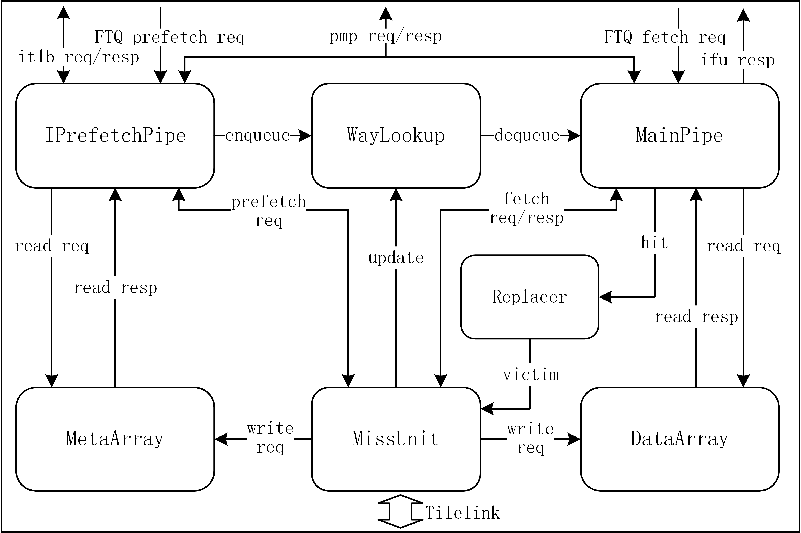
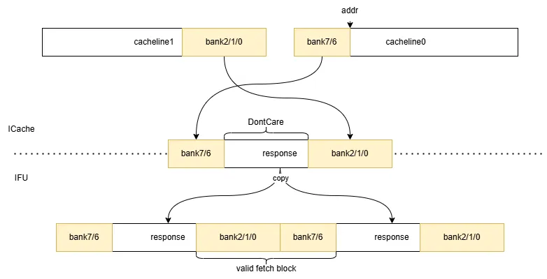

# XiangShan ICache 设计文档

- 版本：V2R2
- 状态：OK
- 日期：2025/01/03
- commit：[6c106319588f5988a282dc2e7c687a9d44e9c209](https://github.com/OpenXiangShan/XiangShan/tree/6c106319588f5988a282dc2e7c687a9d44e9c209)

## 术语说明

| 缩写 | 全称 | 描述 |
| --- | --- | --- |
| ICache/I$ | Instruction Cache | L1 指令缓存 |
| DCache/D$ | Data Cache | L1 数据缓存 |
| L2 Cache/L2$ | Level Two Cache | L2 缓存 |
| IFU | Instruction Fetch Unit | 取指单元 |
| ITLB | Instruction Translation Lookaside Buffer | 地址翻译缓冲 |
| PMP | Physical Memory Protection | 物理内存保护模块 |
| PMA | Physical Memory Attribute | 物理内存属性模块（是 PMP 的一部分） |
| BEU | Bus Error Unit | 总线错误单元 |
| FDIP | Fetch-directed Instruction Prefetch | 取指导向指令预取 |
| MSHR | Miss Status Holding Register | 缺失状态保持寄存器 |
| a/(g)pf | Access / (Guest) Page Fault | 访问错误 / （客户机）页错误 |
| v/(g)paddr | Virtual / (Guest) Physical Address | 虚拟地址 / （客户机）物理地址 |
| PBMT | Page-Based Memory Types | 基于页的内存类型，见特权手册 Svpbmt 扩展 |

## 子模块列表

| 子模块 | 描述 |
| --- | --- |
| [MainPipe](MainPipe.md) | 主流水线 |
| [IPrefetchPipe](IPrefetchPipe.md) | 预取流水线 |
| [WayLookup](WayLookup.md) | 元数据缓冲队列 |
| MetaArray | 元数据 SRAM |
| DataArray | 数据 SRAM |
| [MissUnit](MissUnit.md) | 缺失处理单元 |
| [Replacer](Replacer.md) | 替换策略单元 |
| [CtrlUnit](CtrlUnit.md) | 控制单元，目前仅用于控制 ECC 功能 |

## 设计规格

- 缓存指令数据
- 缺失时通过 tilelink 总线向 L2 请求数据
- 软件维护 L1 I/D Cache 一致性（`fence.i`）
- 支持跨 cacheline （预）取指请求
- 支持冲刷（bpu redirect、backend redirect、`fence.i`）
- 支持预取指请求
  - 硬件预取为 FDIP 预取算法
  - 软件预取为 Zicbop 扩展`prefetch.i`指令
- 支持可配置的替换算法
- 支持可配置的缺失状态寄存器数量
- 支持检查地址翻译错误、物理内存保护错误
- 支持 ECC 检查 & 自动恢复
- DataArray 支持分 bank 存储，细存储粒度实现低功耗

## 参数列表

| 参数 | 默认值 | 描述 | 要求 |
| --- | --- | --- | --- |
| nSets | 256 | SRAM set 数量 | 2 的幂次 |
| nWays | 4 | SRAM way 数量 | |
| nFetchMshr | 4 | 取指 MSHR 的数量 | |
| nPrefetchMshr | 10 | 预取 MSHR 的数量 | |
| nWayLookupSize | 32 | WayLookup 深度，同时可以反压限制预取最大距离 | |
| DataCodeUnit | 64 | 校验单元大小，单位为 bit，每 64bit 对应 1bit 的校验位 | |
| ICacheDataBanks | 8 | cacheline 划分 bank 数量 | |
| ICacheDataSRAMWidth | 66 | DataArray 基本 SRAM 的宽度 | 大于每 bank 的 data 和 code 宽度之和 |

## 功能概述

FTQ 中存储着 BPU 生成的预测块，fetchPtr 指向取指预测块，prefetchPtr 指向预取预测块，当复位时 prefetchPtr 与 fetchPtr 相同，每成功发送一次取指请求时 fetchPtr++，每成功发送一次预取请求时 prefetchPtr++。详细说明见[FTQ 设计文档](../FTQ/FTQ.md)。


ICache 结构如下图所示。有 MainPipe 和 IPrefetchPipe 两个流水线，MainPipe 接收来自 FTQ 的取指请求，IPrefetchPipe 接收来自 FTQ/MemBlock 的硬/软件预取请求。对于预取请求，IPrefetch 对 MetaArray 进行查询，将元数据（在哪一路命中、ECC 校验码、是否发生异常等）存储到 WayLookup 中，如果该请求缺失，就发送至 MissUnit 进行预取。对于取指请求，MainPipe 首先从 WayLookup 中读取命中信息，如果 WayLookup 中没有可用信息，MainPipe 就会阻塞，直至 IPrefetchPipe 将信息写入 WayLookup 中，该方案将 MetaArray 和 DataArray 的访问分离，一次只访问 DataArray 单路，实现了较低的功耗，代价是产生了一个周期的重定向延迟。



MissUnit 处理来自 MainPipe 的取指请求和来自 IPrefetchPipe 的预取请求，通过 MSHR 进行管理，所有 MSHR 公用一组数据寄存器以减少面积。

Replacer 为替换器，默认采用 PLRU 替换策略，接收来自 MainPipe 的命中更新，向 MissUnit 提供待替换的 waymask。

MetaArray 分为奇偶两个 bank，用于支持跨 cacheline 的双行访问。

DataArray 中的 cacheline 默认分为 8 个 bank 存储，每个 bank 中存储的有效数据为 64bit，另外对于每 64bit 还需要 1bit 的校验位，由于 65bit 宽度的 SRAM 表现不好，所以选用 256*66bit 的 SRAM 作为基本单元，一共有 32 个这样的基本单元。一次访问需要 34Byte 的指令数据，每次需要访问 5 个 bank（$8\times5>34$），根据起始地址进行选择。

## 功能详述

### （预）取指请求

FTQ 分别把（预）取指请求发送到（预）取指流水线进行处理。如前所述，由 IPrefetch 对 MetaArray 和 ITLB 进行查询，将元数据（在哪一路命中、ECC 校验码、是否发生异常等）在 IPrefetchPipe s1 流水级存储到 WayLookup 中，以供 MainPipe s0 流水级读取。

在上电解复位/重定向时，由于 WayLookup 为空，而 FTQ 的 prefetchPtr、fetchPtr 复位到同一位置，MainPipe s0 流水级不得不阻塞等待 IPrefetchPipe s1 流水级的写入，这引入了一拍的额外重定向延迟。但随着 BPU 向 FTQ 填充预测块的进行和 MainPipe/IFU 因各种原因阻塞（e.g. miss、IBuffer 满），IPrefetchPipe 将工作在 MainPipe 前（`prefetchPtr > fetchPtr`），而 WayLookup 中也会有足够的元数据，此时 MainPipe s0 级和 IPrefetchPipe s0 级的工作将是并行的。


详细的取指过程见[MainPipe 子模块文档](MainPipe.md)、[IPrefetchPipe 子模块文档](IPrefetchPipe.md)和[WayLookup 子模块文档](WayLookup.md)。

### 异常传递/特殊情况处理

ICache 负责对取指请求的地址进行权限检查（通过 ITLB 和 PMP），可能的异常和特殊情况有：

| 来源 | 异常 | 描述 | 处理 |
| --- | --- | --- | --- |
| ITLB | af | 虚拟地址翻译过程出现访问错误 | 禁止取指，标记取指块为 af，经 IFU、IBuffer 发送到后端处理 |
| ITLB | gpf | 客户机页错误 | 禁止取指，标记取指块为 gpf，经 IFU、IBuffer 发送到后端处理，将有效的 gpaddr 发送到后端的 GPAMem 以备使用 |
| ITLB | pf | 页错误 | 禁止取指，标记取指块为 pf，经 IFU、IBuffer 发送到后端处理 |
| PMP | af | 物理地址无权限访问 | 同 ITLB af |
| MissUnit | L2 corrupt | L2 cache 响应 tilelink corrupt （可能是 L2 ECC 错误，亦可能是无权限访问总线地址空间导致 denied） | 同 ITLB af |

| 来源 | 特殊情况 | 描述 | 处理 |
| --- | --- | --- | --- |
| PMP | mmio | 物理地址为 mmio 空间 | 禁止取指，标记取指块为 mmio，由 IFU 进行**非推测性**取指 |
| ITLB | pbmt.NC | 页属性为不可缓存、幂等 | 禁止取指，由 IFU 进行**推测性**取指 |
| ITLB | pbmt.IO | 页属性为不可缓存、非幂等 | 同 pmp mmio |
| MainPipe | ECC error | 主流水检查发现 MetaArray/DataArray ECC 错误 | 见[ECC 一节](#ecc)，旧版同 ITLB af，新版做自动重取 |

### DataArray 分 bank 的低功耗设计

目前，ICache 中每个 cacheline 分为 8 个 bank，bank0-7。一个取指块需要 34B 指令数据，故一次访问连续的 5 个 bank。存在两种情况：

1. 这 5 个 bank 位于单个 cacheline 中（起始地址位于 bank0-3）。假设起始地址位于 bank2，则所需数据位于 bank2-6。如下图 a。
2. 跨 cacheline（起始地址位于 bank4-7）。假设起始地址位于 bank6，则数据位于 cacheline0 的 bank6-7、cacheline1 的 bank0-2。有些类似于环形缓冲区。如下图 b。


当从 SRAM 或 MSHR 中获取 cacheline 时，根据地址将数据放入对应的 bank。

由于每次访问只需要 5 个 bank 的数据，因此 ICache 到 IFU 的端口实际上只需要一个 64B 的端口，将两个 cacheline 各自的 bank 选择出来并拼接在一起返回给 IFU（在 DataArray 模块内完成）；IFU 将这一个 64B 的数据复制一份拼接在一起，即可直接根据取指块起始地址选择出取指块的数据。不跨行/跨行两种情况的示意图如下：




亦可参考 [IFU.scala 中的注释](https://github.com/OpenXiangShan/XiangShan/blob/fad7803d97ed4a987a743036cec42d1c07b48e2e/src/main/scala/xiangshan/frontend/IFU.scala#L474-L502)。

### 冲刷

在后端/IFU 重定向、BPU 重定向、`fence.i` 指令执行时，需要视情况对 ICache 内的存储结构和流水级进行冲刷。可能的冲刷目标/动作有：

1. MainPipe、IPrefetchPipe 所有流水级
    - 冲刷时直接将 `s0/1/2_valid` 置为 `false.B` 即可
2. MetaArray 中的 valid
    - 冲刷时直接将 `valid` 置为 `false.B` 即可
    - `tag`、`code`不需要冲刷，因为它们的有效性由 `valid` 控制
    - DataArray 中的数据不需要冲刷，因为它们的有效性由 MetaArray 中的 `valid` 控制
3. WayLookup
    - 读写指针复位
    - `gpf_entry.valid` 置为 `false.B`
4. MissUnit 中所有 MSHR
    - 若 MSHR 尚未向总线发出请求，直接置无效（`valid === false.B`）
    - 若 MSHR 已经向总线发出请求，记录待冲刷（`flush === true.B` 或 `fencei === true.B`），等到 d 通道收到 grant 响应时再置无效，同时不把 grant 的数据回复给 MainPipe/IPrefetchPipe

每种冲刷原因需要执行的冲刷目标：

| 冲刷原因 | 1 | 2 | 3 | 4 |
| --- | --- | --- | --- | --- |
| 后端/IFU 重定向 | Y | | Y | Y |
| BPU 重定向 | Y[^redirect_tab_bpu] | | | |
| `fence.i` | Y[^redirect_tab_fencei] | Y | Y[^redirect_tab_fencei] | Y |

[^redirect_tab_bpu]: BPU 精确预测器（BPU s2/s3 给出结果）可能覆盖简单预测器（BPU s0 给出结果）的预测，显然其重定向请求最晚在预取请求的 1- 2 拍之后就到达 ICache，因此仅需要：

    BPU s2 redirect：冲刷 IPrefetchPipe s0

    BPU s3 redirect：冲刷 IPrefetchPipe s0/1

    当 IPrefetchPipe 的对应流水级中的请求来自于软件预取时 `isSoftPrefetch === true.B`，不需要进行冲刷

    当 IprefetchPipe 的对应流水级中的请求来自于硬件预取，但 `ftqIdx` 与冲刷请求不匹配时，不需要进行冲刷

[^redirect_tab_fencei]: `fence.i` 在逻辑上需要冲刷 MainPipe 和 IPrefetchPipe（因为此时流水级中的数据可能无效），但实际上`io.fencei`拉高必然伴随一个后端重定向，因此目前的实现中没有冲刷 MainPipe 和 IPrefetchPipe 的必要。

ICache 进行冲刷时不接收取指/预取请求（`io.req.ready === false.B`）

#### 对 ITLB 的冲刷

ITLB 的冲刷比较特殊，其缓存的页表项仅需要在执行 `sfence.vma` 指令时冲刷，而这条冲刷通路由后端负责，因此前端/ICache 一般不需要管理 ITLB 的冲刷。只有一个特例：目前 ITLB 为了节省资源，不会存储 `gpaddr`，而是在 `gpf` 发生时去 L2TLB 重取，重取状态由一个 `gpf` 缓存控制，这要求 ICache 在收到 `ITLB.resp.excp.gpf_instr` 时保证下面两个条件之一：

1. 重发相同的 `ITLB.req.vaddr`，直到 `ITLB.resp.miss` 拉低（此时`gpf`、`gpaddr`均有效，正常发往后端处理即可），ITLB 此时会冲刷 `gpf` 缓存。
2. 给 `ITLB.flushPipe`，ITLB 在收到该信号时会冲刷 `gpf` 缓存。

若 ITLB 的 `gpf` 缓存未被冲刷，就收到了不同 `ITLB.req.vaddr` 的请求，且再次发生 `gpf`，将导致核卡死。

因此，每当冲刷 IPrefetchPipe 的 s1 流水级时，无论冲刷原因为何，都需要同步冲刷 ITLB 的 `gpf` 缓存（即拉高 `ITLB.flushPipe`）。

### ECC

ICache 支持 ECC 功能（亦称 RAS[^ras] 或 RERI[^reri]），由 CtrlUnit 进行控制。目前除了基础的错误检测能力以外，主要实现了两个高级能力：错误自动恢复、错误注入。

[^ras]: 此 RAS（Reliability, Availability, and Serviceability）非彼 RAS（Return Address Stack）。

[^reri]: RERI（RAS Error-record Register Interface），参考 [RISC-V RERI 手册](https://github.com/riscv-non-isa/riscv-ras-eri)。

#### 错误检测

在 MissUnit 向 MetaArray 和 DataArray 重填数据时，会计算 meta 和 data 的校验码，前者和 meta 一起存储在 Meta SRAM 中，后者存储在单独的 Data Code SRAM 中。

当取指请求读取 SRAM 时，会同步读取出校验码，在 MainPipe 的 s1/s2 流水级中分别对 meta/data 进行校验。软件可以通过向 CSR 中相应位置写入特定的值来使能/关闭这一功能，在 6-12 月的版本中为自定义 CSR `sfetchctl`，后续换成 mmio-mapped CSR，详见 [CtrlUnit 文档](./CtrlUnit.md)。

在校验码设计方面，ICache 使用的校验码可由参数控制，默认使用的是 parity code，即校验码为对数据做规约异或 $code = \oplus data$。检查时只需将校验码和数据一起做规约异或 $error = (\oplus data) \oplus code$，结果为 1 则发生错误，反之**认为没有**错误（可能出现偶数个错误，但此处检查不出来）。

在 [#4044](https://github.com/OpenXiangShan/XiangShan/pull/4044) 以后的版本中，ICache 支持错误注入，这要求 ICache 支持向 MetaArray/DataArray 写入错误的校验码。因此实现了一个`poison`位，当其拉高时，翻转写入的 code，即 $code = (\oplus data) \oplus poison$。

为了减少检查不出的情况，目前将 data 划分成 DataCodeUnit（默认为 64bit）的单元分别进行奇偶校验，因此对每个 64B 的缓存行，总计会计算 $8(data) + 1(meta) = 9$ 个校验码。

当 MainPipe 的 s1/s2 流水级检查到错误时，会进行以下处理：

在 6 月至 11 月的版本中：

1. 错误处理：引起 access fault 异常，由软件处理。
2. 错误报告：向 BEU 报告错误，后者会引起中断向软件报告错误。
3. 取消请求：当 MetaArray 被检查出错误时，其读出的 ptag 不可靠，进而对 hit 与否的判断不可靠，因此无论是否 hit 都不向 L2 Cache 发送请求，而是直接将异常传递到 IFU、进而传递到后端处理。

在后续版本（[#3899](https://github.com/OpenXiangShan/XiangShan/pull/3899) 后）实现了错误自动恢复机制，故只需进行以下处理：

1. 错误处理：从 L2 Cache 重新取指，见[下节](#错误自动恢复)。
2. 错误报告：同上向 BEU 报告错误。

#### 错误自动恢复

注意到，ICache 与 DCache 不同，是只读的，因此其数据必然不是 dirty 的，这意味着我们总是可以从下级存储结构（L2/3 Cache、memory）中重新获取正确的数据。因此，ICache 可以通过向 L2 Cache 重新发起 miss 请求来实现错误自动恢复。

实现重取功能本身只需要复用现有的 miss 取指路径，走 MainPipe -> MissUnit -> MSHR --tilelink-> L2 Cache 的请求路径。MissUnit 向 SRAM 重填数据时会自然地计算新的校验码并存储，因此在重取后会回到无错误的状态而不需要额外的处理。

6-11 月和后续代码行为差异的伪代码示意如下：

```diff
- exception = itlb_exception || pmp_exception || ecc_error
+ exception = itlb_exception || pmp_exception

- should_fetch = !hit && !exception
+ should_fetch = (!hit || ecc_error) && !exception
```

需要留意的是：为了避免重取后出现 multi-hit（即，同一个 set 内存在多个 way 的 ptag 相同），需要在重取前将 metaArray 对应位置的 valid 清空：

- 若 MetaArray 错误：meta 保存的 ptag 本身可能出错，命中结果（one-hot 的 waymask）不可靠，“对应位置”指该 set 的所有 way
- 若 DataArray 错误：命中结果可靠，“对应位置”指该 set 中 waymask 拉高的那一 way

#### 错误注入

根据 RERI 手册[^reri]的说明，为了使软件能够测试 ECC 功能，进而更好地判断硬件功能是否正常，需要提供错误注入功能，即主动地触发 ECC 错误。

ICache 的错误注入功能由 CtrlUnit 控制，通过向 mmio-mapped CSR 中相应位置写入特定的值来触发。详见 [CtrlUnit 文档](./CtrlUnit.md)。

目前 ICache 支持：

- 向特定 paddr 注入，当请求注入的 paddr 未命中时，注入失败
- 向 MetaArray 或 DataArray 注入
- 当 ECC 校验功能本身未使能时，注入失败

软件注入流程示意如下：

```asm
inject_target:
  # maybe do something
  ret

test:
  la t0, $BASE_ADDR     # 载入 mmio-mapped CSR 基地址
  la t1, inject_target  # 载入注入目标地址
  jalr ra, 0(t1)        # 跳转到注入目标以保证其加载到 ICache
  sd t1, 8(t0)          # 向 CSR 写入注入目标地址
  la t2, ($TARGET << 2 | 1 << 1 | 1 << 0)  # 设置注入目标、注入使能、校验使能
  sd t1, 0(t0)          # 向 CSR 写入注入请求
loop:
  ld t1, 0(t0)          # 读取 CSR
  andi t1, t1, (0b11 << (4+1)) # 读取注入状态
  beqz t1, loop         # 如果注入未完成，继续等待

  addi t1, t1, -1
  bnez t1, error        # 如果注入失败，跳转到错误处理

  jalr ra, 0(t1)        # 注入成功，跳转到注入目标地址以触发错误
  j    finish           # 结束

error:
  # handle error
finish:
  # finish
```

我们编写了一个测试用例，见[此仓库](https://github.com/OpenXiangShan/nexus-am/pull/48)，其测试了如下情况：

1. 正常注入 MetaArray
2. 正常注入 DataArray
3. 注入无效的目标
4. 注入但 ECC 校验未使能
5. 注入未命中的地址
6. 尝试写入只读的 CSR 域

## 参考文献

1. Glenn Reinman, Brad Calder, and Todd Austin. "[Fetch directed instruction prefetching.](https://doi.org/10.1109/MICRO.1999.809439)" 32nd Annual ACM/IEEE International Symposium on Microarchitecture (MICRO). 1999.
