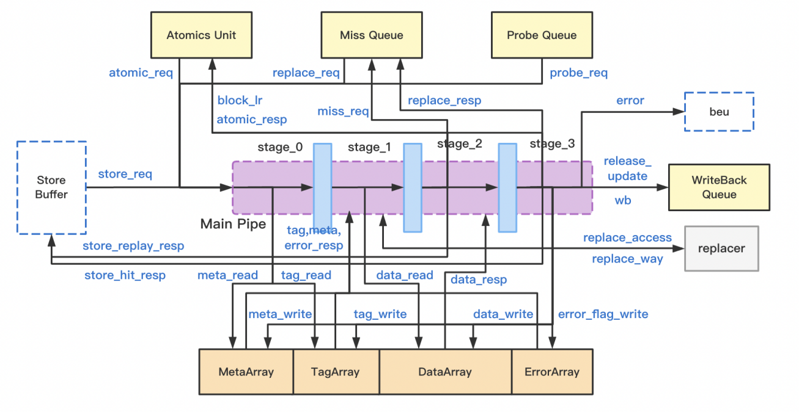

# 主流水线 MainPipe

## 功能描述
用流水线控制Store, Probe, Replace以及原子操作的执行（即所有需要争用writeback queue向下层cache发起请求/写回数据的指令）。

### 特性 1：MainPipe 各级流水线完成的功能：
  * Stage 0：仲裁传入的 Main Pipeline 请求选出优先级最高者；根据请求信息判断请求所需的资源是否就位；发出 tag, meta 读请求
  * Stage 1：获得 tag, meta 读请求的结果；进行 tag 匹配检查, 判断是否命中；如果需要替换, 获得 PLRU 提供的替换选择结果；根据读出的 meta 进行权限检查；提前判断是否需要执行 miss queue 访问
  * Stage 2：获得读 data 的结果, 与要写入的数据拼合；如果 miss, 尝试将这次请求信息写入 miss queue；检查tag_error和l2_error
  * Stage 3：根据操作的结果, 更新 meta, data, tag；如果命中则向lsu返回store响应；如果指令需要向下层 cache 发起访问/写回数据, 则在这一级生成 writeback queue 访问请求, 并尝试写 writeback queue；检查data_error；对原子指令的特殊支持：AMO 指令在这一级停留两拍, 先完成 AMO 指令的运算操作, 再将结果写回到 dcache并返回响应；LR/SC 指令会在这里设置/检查其 reservation set queue。

### 特性 2：mainpipe争用和阻塞：
  Main Pipeline 的争用存在以下优先级: probe_req > replace_req > store_req > atomic_req
  一个请求只有在其所请求的资源全部就绪, 不存在 set 冲突, 且没有比它优先级更高的请求的情况下才会被接受. 来自 committed store buffer 的写请求由于时序原因, 拥有单独的检查逻辑。
### 特征 3: set阻塞逻辑：
  确保并行执行的指令不会同时访问到同一个set中的不同行，以维护数据一致性和正确性即防止s3（或者s1,s2）处理的数据还没写完，s0进来的数据没读对这类情况发生。在各个阶段valid有效的情况下，MainPipe的set冲突要比对 s0和s1的，s0和s1，s0和s2的地址索引是否一致，如果一致则是出发了set冲突。阻塞s0。

### 特征 4: meta更新

### 特征 5: AMO指令处理

### 特征 6: MainPipe写回
  介绍各级流水线的关键设计点，包括不限于：
  介绍各级流水线的功能
  介绍 s0 的请求仲裁逻辑
  介绍 s0 的 set 阻塞逻辑，并介绍阻塞的原因
  介绍 s3 不同请求分别如何更新 meta
  介绍 LR/SC 与 AMO 指令的处理
  介绍写回逻辑，那些请求需要进入 wbq

## 整体框图

## 接口时序

### 请求接口时序实例
接口时序如下图所示，req1为store请求，第一拍读meta和tag，第二拍进行tag比较发现请求miss，根据替换算法选出要替换的路，第三拍将miss请求发送给miss queue，第四拍因为miss，不会向store buffer返回响应。req2为probe请求，第一拍读meta和tag，第二拍读data，第三拍获取probe数据块结果，第四拍根据probe命令更新meta，并向writeback queue发起wb请求，返回probeAck应答。req3是amo指令，第一拍读meta和tag，第二拍进行tag比较命中，发出data读请求，第三拍获得data结果，第四拍和第五拍都处于stage_3流水级，第四拍执行指令运算，第五拍发出data写操作更新原数据块内容，并向atomic unit返回响应。req4为req1对应的replace请求，miss queue发来replace_req的第一拍读meta，由于此时req2正在进行meta写，而metaArray写优先于读，req4在stage_0停留一拍，下一拍才能成功握手，第三拍stage_1读data，由于此时req3正在进行data写，再在stage_1停留一拍，第五拍stage_2获取要被替换的数据块data，第六拍stage_3向writeback queue发起wb请求，尝试让替换块提前进入wb队列，并向miss queue返回replace响应。

