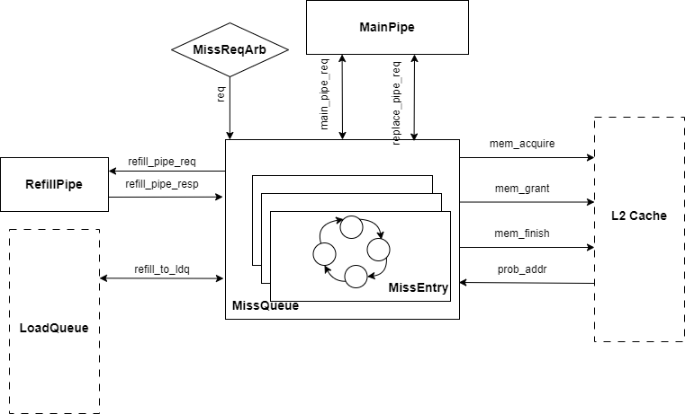
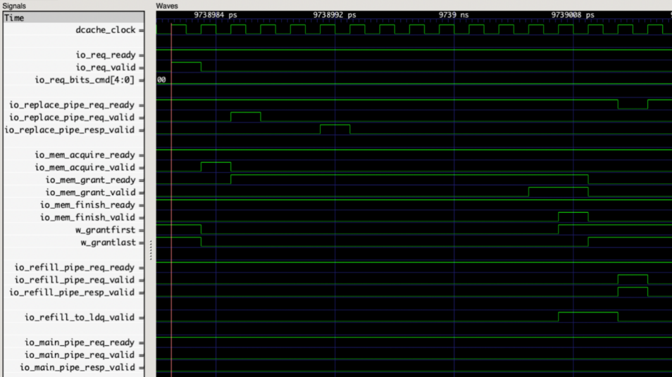
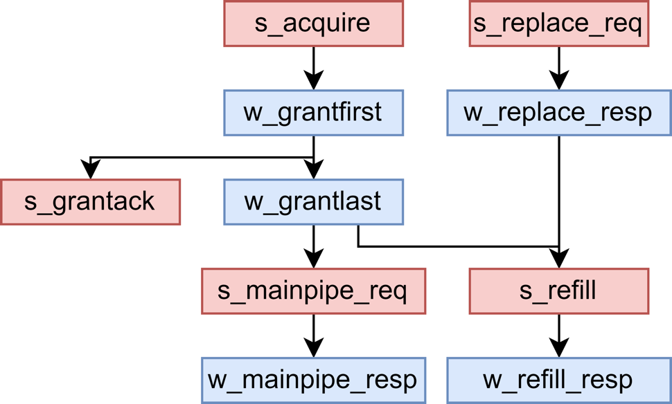

# 缺失队列 MissQueue

## 功能描述
负责处理miss的load、store和原子请求，包含16项Miss Entry, 每一项负责一个请求，通过一组状态寄存器控制其处理流程。
* miss的load请求：
  Miss Queue为它分配一项空的Miss Entry，并且可以在一定条件下合并请求或拒绝请求，分配后在Miss Entry中记录相关信息。根据 way_en 所在的块是否有效, 判断是否需要替换，如果要替换则向 Main Pipe 发送 replace 请求；此外还会向 L2 发送 Acquire 请求，如果是对整个 block 的覆盖写则发送 AcquirePerm (L2 将会省去一次 sram 读操作)，否则发送 AcquireBlock；等待 L2 返回权限 (Grant) 或者数据加权限 (GrantData)；在收到 GrantData 每一个 beat 后要将数据转发给 Load Queue；在收到 Grant / GrantData 第一个 beat 后向 L2 返回 GrantAck；在收到 Grant / GrantData 最后一个 beat，并且 replace 请求已经完成后, 向 Refill Pipe 发送 refill 请求, 并等待应答, 完成数据回填；最后释放Miss Entry。

* miss的store请求：
  和load的流程基本一致, 区别在于不需要把回填的数据转发给 Load Queue，而是在最终完成回填后由Refill Pipe向 Store Buffer 返回应答, 表示 store 已完成。

* miss的原子指令：
    和load的流程基本一致, 区别在于不需要把回填的数据转发给 Load Queue，而是在最终完成回填后由Refill Pipe向 Store Buffer 返回应答, 表示 store 已完成。

### 特性 1： MissQueue 入队处理
MissQueue对于新入队请求，总的操作可分为响应和拒绝，而响应又可以分为分配和合并。Miss Queue 支持一定程度的请求合并, 从而提高 miss 请求处理的效率。
* 空项分配：如果新的miss请求不符合合并或者拒绝条件，则为该请求分配新的 Miss Entry。
* 请求合并条件：当已分配的 Miss Entry (请求 A) 和新的 miss 请求 B 的块地址相同时，在下述两种情况下可以将请求B合并：
  * 向L2的Acquire 请求还没有握手, 且 A 是 load 请求, B 是 load 或 store 请求，即A还未成功发起对L2的读请求前可以合并B，一起发送Acquire；
  * 向 L2 的 Acquire 已经发送出去，但是还没有收到 Grant(Data)，或收到 Grant(Data) 但还没有转发给 Load Queue，且 A 是 load 或 store 请求，B 是 load 请求，即新来的load请求可以在refill前合并，而store请求只能在acquire握手前合并。
* 请求拒绝条件：下述三种情况下需要将新的miss请求拒绝，该请求会在一定时间后重新发出：
  * 新的 miss 请求和某个 Miss Entry 中请求的块地址相同, 但是不满足请求合并条件；
  * 新的 miss 请求的块和某个 Miss Entry 中请求的块地址不同, 但是在 DCache 中位于相同的slot (即具有相同的 set 和 way)；

### 特征 2：MSHR给LoadUnit数据前递
MissQueue支持数据前递，如果，lsq重发信号有效（具体重发逻辑请参考LoadQueueReplay部分，选出最合适的最老指令），在loadUnit的stage1，前递指定的mshrid以及地址，MissQueue拿到前递信息后，去比对，如果匹配，直接将重填的数据在LoadUnits的stage2传给LoadUnit，通过前递的方式更快地获得先前请求的数据，以减少加载指令的等待时间。

### 特征 3：MissQueue 预取处理

### 特征 4：Miss Queue 中发出的替换请求
这里提前进行替换操作，可以便于在收到回填数据之后立马进行写入。但是这里的替换并不是真的令替换块无效, 而是先把替换块的数据读出来, 并暂时放在写回队列中sleep。在替换请求 sleep 期间, 其他请求可以正常访问 DCache 中的替换块, 只要把对替换块的写同步一份到写回队列中即可（对Probe TtoB请求的额外检查详见writeback queue模块说明）。当得到回填数据块后，再唤醒写回队列里 sleep 的块向下release，同时Miss Queue 请求 Refill Pipe 完成回填。

## 整体框图

## 接口时序

### 请求接口时序实例
下图展示了一个load miss请求进入MissQueue之后的接口时序。请求到达后分配miss entry，下一拍向L2发送acquire请求，第二拍再向main pipe发送replace请求；接收到grant数据的第一个beat之后，向ldq返回load响应，接收到grant数据的最后一个beat之后，下一拍向refill pipe发出回填请求。

#### MissEntry模块
##### 特征 1：Miss Entry 分配、合并、拒绝
  * 空项分配：如果新的miss请求不符合合并或者拒绝条件，则为该请求分配新的 Miss Entry。
  * 请求合并条件：当已分配的 Miss Entry (请求 A) 和新的 miss 请求 B 的块地址相同时，在下述两种情况下可以将请求B合并：
    * 向L2的Acquire 请求还没有握手, 且 A 是 load 请求, B 是 load 或 store 请求，即A还未成功发起对L2的读请求前可以合并B，一起发送Acquire；
    * 向 L2 的 Acquire 已经发送出去，但是还没有收到 Grant(Data)，或收到 Grant(Data) 但还没有转发给 Load Queue，且 A 是 load 或 store 请求，B 是 load 请求，即新来的load请求可以在refill前合并，而store请求只能在acquire握手前合并。
  * 请求拒绝条件：下述三种情况下需要将新的miss请求拒绝，该请求会在一定时间后重新发出：
    * 新的 miss 请求和某个 Miss Entry 中请求的块地址相同, 但是不满足请求合并条件；
    * 新的 miss 请求的块和某个 Miss Entry 中请求的块地址不同, 但是在 DCache 中位于相同的slot (即具有相同的 set 和 way)；
    * Miss Queue已满。
##### 特征 2：Miss Entry状态设计：
  Miss Entry由一系列状态寄存器控制操作的执行, 以及这些操作之间的顺序。s_* 寄存器表示需要调度的请求是否发送，w_* 寄存器表示要等待的应答是否返回，这些寄存器在初始状态下被置为 true.B, 在为请求分配一项 Miss Entry 时，会将相应的 s_* 和 w_* 寄存器置为 false.B，这表示请求还没有发出去，以及要等待的响应没有握手。
  下面的图和表格展示了各个寄存器的含义描述以及执行的先后顺序：
| 状态                | 描述                                                        |
|-------------------|-----------------------------------------------------------|
| s_acquire         | 向 L2 发送 AcquireBlock / AcquirePerm请求                      |
| w_grantfirst      | 等待接收到 GrantData 的第一个 beat，拉高表示接收到                         |
| w_grantlast       | 等待接收到 GrantData 的最后一个 beat，拉高表示接收到                        |
| s_grantack        | 在收到 L2 的数据后向 L2 返回应答, 在收到 Grant 的第一个 beat 时就可以返回 GrantAck |
| s_mainpipe_req    | 向Main Pipe发送原子请求，将数据回填到 DCache                            |
| w_mainpipe_resp   | 表示将原子请求发送到 Main Pipe 回填入DCache 后, 接收到 Main Pipe 的应答       |
| s_replace_req     | 向MainPipe发送替换请求                                           |
| w_replace_resp    | 完成替换                                                      |
| s_refill          | load / store 请求需要发送到 Refill Pipe 进行回填                     |
| w_refill_resp     | 完成回填                                                      |
| s_write_storedata | 是store请求，需要在数据从L2返回后将store_data写入DCache                   |

##### 特征 3： MissEntry 别名处理
