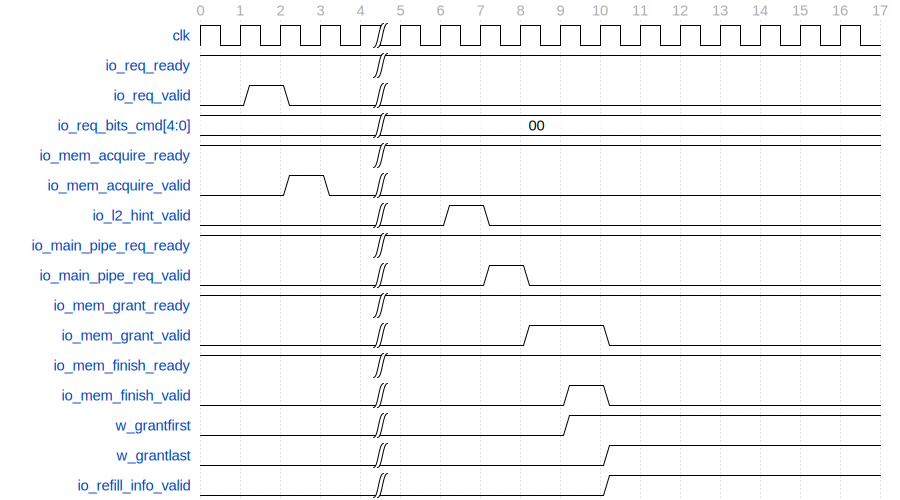

# 缺失队列 MissQueue

## 功能描述

负责处理miss的load、store和原子请求，包含16项Miss Entry, 每一项负责一个请求，通过一组状态寄存器控制其处理流程。

* miss的load请求：
  MissQueue为它分配一项空的MissEntry，并且可以在一定条件下合并请求或拒绝请求，分配后在MissEntry中记录相关信息。进入MissQueue的请求会向 L2 发送 Acquire 请求，如果是对整个 block 的覆盖写则发送 AcquirePerm (L2 将会省去一次 sram 读操作)，否则发送 AcquireBlock；等待 L2 返回权限 (Grant) 或者数据加权限 (GrantData)，并在收到Grant / GrantData 第一个 beat 后向 L2 返回 GrantAck。在收到L2返回的结果前，会提前先收到L2向上发送的hint信号，表明对应的权限和数据会在2拍后到达tilelink D通道。收到hint后MissQueue会向MainPipe发起回填请求，并在后续收到Grant / GrantData后通过前递的方式将回填数据送至MainPipe中，等待应答，待完成回填后释放对应的MissEntry。

* miss的store请求：
  和load的流程基本一致, 在最终完成回填后由MainPipe向StoreBuffer返回应答, 表示store已完成。

* miss的原子指令：
  和load的流程基本一致, 在最终完成回填后由MainPipe向AtomicsUnit返回应答, 表示原子指令操作已完成。

### 特性 1： MissQueue 入队处理

MissQueue对于新入队请求，总的操作可分为响应和拒绝，而响应又可以分为分配和合并。MissQueue支持一定程度的请求合并, 从而提高miss请求处理的效率。

* 空项分配：如果新的miss请求不符合合并或者拒绝条件，则为该请求分配新的MissEntry。

* 请求合并条件：当已分配的 MissEntry (请求 A) 和新的 miss 请求 B 的块地址相同时，在下述两种情况下可以将请求B合并：
  * 向L2的Acquire 请求还没有握手, 且 A 是 load 请求, B 是 load 或 store 请求，即A还未成功发起对L2的读请求前可以合并B，一起发送Acquire；
  * 向 L2 的 Acquire 已经发送出去，但是还没有收到 Grant/GrantData，且 A 是 load 或 store 请求，B 是 load 请求，即新来的load请求可以在refill前合并，而store请求只能在acquire握手前合并。

* 请求拒绝条件：下述情况下需要将新的miss请求拒绝，该请求会在一定时间后重新发出：
  * 新的 miss 请求和某个 MissEntry 中请求的块地址相同, 但是不满足请求合并条件；
  * Miss Queue已满。

### 特征 2：MSHR给LoadUnit数据前递

MissQueue支持数据前递，如果，lsq重发信号有效（具体重发逻辑请参考LoadQueueReplay部分，选出最合适的最老指令），在loadUnit的stage1，前递指定的mshrid以及地址，MissQueue拿到前递信息后，去比对，如果匹配，直接将重填的数据在LoadUnits的stage2传给LoadUnit，通过前递的方式更快地获得先前请求的数据，以减少加载指令的等待时间。

### 特征 3：MissQueue 预取处理

对于进入MissQueue的预取请求，会在MissEntry内对预取请求的来源进行标记，其余操作与一条普通的load指令一致，向L2发出Acquire请求等待收到Grant/GrantData后完成回填。

### 特征 4：MissQueue 中发出的回填请求

为了提升数据回填的效率，可以便于在收到回填数据之后立刻进行DCache的写入，因此采用提前向MainPipe发出回填请求的方式进行完成元数据的读取以及替换路的选取。在收到L2返回的hint信号后，对应请求所在的MissEntry会向MainPipe发起回填请求，此时该回填请求中不携带具体的待写回数据，在MainPipe进行元数据读取及替换路选择的同时继续等待回填数据的到达。接收到Grant/GrantData后，通过前递的方式将回填数据块直接传递到MainPipe的stage2，与提前发出的回填请求进行匹配，完成写回操作。待写回操作完成后接收MainPipe传回的release信号，释放对应的MissEntry，完成本次请求。

## 整体框图

MissQueue整体架构如[@fig:DCache-MissQueue]所示。

{#fig:DCache-MissQueue}

## 接口时序

### 请求接口时序实例

[@fig:DCache-MissQueue-Timing]展示了一个load miss请求进入MissQueue之后的接口时序。请求到达后分配MissEntry，下一拍向L2发送Acquire请求等待hint和数据的响应。接收到l2_hint信号后的下一拍向MainPipe发起回填请求；接收到Grant数据的第一个beat之后，向L2返回mem_finish响应，接收到Grant数据的最后一个beat之后，下一拍通过refill_info将回填数据前递到MainPipe的stage2，完成数据的写入。。

{#fig:DCache-MissQueue-Timing}

## MissEntry模块
### 特征 1：Miss Entry 分配、合并、拒绝

  * 空项分配：如果新的miss请求不符合合并或者拒绝条件，则为该请求分配新的 Miss Entry。
  * 请求合并条件：当已分配的 Miss Entry (请求 A) 和新的 miss 请求 B 的块地址相同时，在下述两种情况下可以将请求B合并：
    * 向L2的Acquire 请求还没有握手, 且 A 是 load 请求, B 是 load 或 store 请求，即A还未成功发起对L2的读请求前可以合并B，一起发送Acquire；
    * 向 L2 的 Acquire 已经发送出去，但是还没有收到 Grant/GrantData，且 A 是 load 或 store 请求，B 是 load 请求，即新来的load请求可以在refill前合并，而store请求只能在acquire握手前合并。
  * 请求拒绝条件：下述情况下需要将新的miss请求拒绝，该请求会在一定时间后重新发出：
    * 新的 miss 请求和某个 Miss Entry 中请求的块地址相同, 但是不满足请求合并条件；
    * Miss Queue已满。

### 特征 2：MissEntry状态设计：

Miss Entry由一系列状态寄存器控制操作的执行, 以及这些操作之间的顺序。s_* 寄存器表示需要调度的请求是否发送，w_* 寄存器表示要等待的应答是否返回，这些寄存器在初始状态下被置为 true.B, 在为请求分配一项 Miss Entry 时，会将相应的 s_* 和 w_* 寄存器置为 false.B，这表示请求还没有发出去，以及要等待的响应没有握手。
[@tbl:MissEntry-state]和[@fig:DCache-MissEntry]展示了各个寄存器的含义描述以及执行的先后顺序：

Table: MissEntry状态列表 {#tbl:MissEntry-state}

| 状态                | 描述                                                        |
|-------------------|-----------------------------------------------------------|
| s_acquire         | 向 L2 发送 AcquireBlock / AcquirePerm请求                      |
| w_grantfirst      | 等待接收到 GrantData 的第一个 beat，拉高表示接收到                         |
| w_grantlast       | 等待接收到 GrantData 的最后一个 beat，拉高表示接收到                        |
| s_grantack        | 在收到 L2 的数据后向 L2 返回应答, 在收到 Grant 的第一个 beat 时就可以返回 GrantAck |
| s_mainpipe_req    | 向Main Pipe发送回填请求，将数据回填到 DCache                            |
| w_mainpipe_resp   | 表示将原子请求发送到 Main Pipe 回填入DCache 后, 接收到 Main Pipe 的应答       |
| w_l2hint          | 表示当前miss请求已收到l2_hint信号, 可以唤醒, 向MainPipe发起乎提案请求 |
| w_refill_resp     | 表示非原子操作的回填请求已完成, 可以释放MissEntry |

{#fig:DCache-MissEntry}

### 特征 3： MissEntry别名处理

L1 DCache支持与L2配合处理缓存别名问题，MissEntry在向L2发送Acquire请求时会携带请求地址的别名位（vaddr[13:12]）, 供L2保存及判断是否有别名问题需要处理。别名问题的具体处理流程详见ProbeQueue一节。
