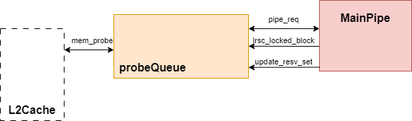
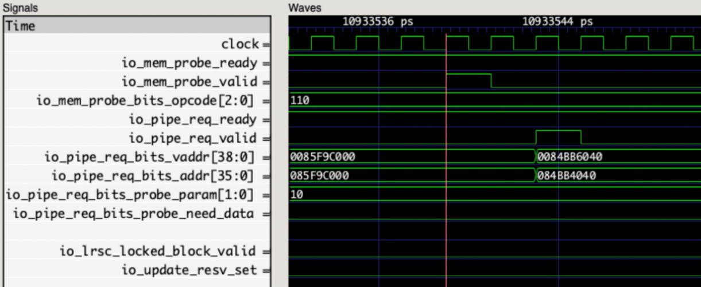

# Probe 队列 ProbeQueue

## 功能描述
负责接收并处理来自L2的一致性请求，包含 16 项 Probe Entry，每一项负责一个Probe 请求, 将 Probe 请求转成内部信号后发送到 Main Pipe, 由 Main Pipe 修改被 Probe 块的权限，等Main Pipe返回应答后释放Probe Entry。

ProbeQueue只和L2通过B通道交互，以及与MainPipe互连。内部由16项entry组成，每一项通过一组状态寄存器控制请求信号的接收、转换以及发送。

### 特征 1： 别名问题

Kunminghu架构采用了64KB的VIPT cache，从而引入了 cache 别名问题。为解决别名问题，L2 Cache的目录会维护在DCache中保存的每一个物理块对应的别名位。当DCache在某个物理地址上想要获取另一别名位的块时，L2 Cache会发起Probe请求，将DCache中原有的别名块probe下来，并且在TileLink B通道中记录其别名位。Probe Queue收到请求后会将别名位和页偏移部分进行拼接，转成内部信号发送到 Main Pipe, 由 Main Pipe 访问DCache存储模块读取数据。

### 特征 2：由原子指令引发的阻塞

由于原子操作 (包括 lr-sc) 在 DCache 中完成，执行 LR 指令时会保证目标地址已经在 DCache 中，此时为了简化设计， LR 在 Main Pipe 中会注册一个 reservation set，记录 LR 的地址, 并阻塞对该地址的 Probe。为了避免带来死锁, Main Pipe 会在等待 SC 一定时间后不再阻塞 Probe (由参数 LRSCCycles 和 LRSCBackOff 决定), 此时再收到 SC 指令则均被视为 SC fail. 因此, 在 LR 注册 reservation set 后等待 SC 配对的时间里需要阻塞 Probe 请求对 DCache 进行操作。

介绍别名有关的处理；介绍 LR/SC 有关的阻塞逻辑

## 整体框图

## 接口时序
### 请求接口时序实例
下图展示了Probe Queue处理一个probe请求的接口时序，Probe Queue首先收到来自L2的probe请求，转换成内部请求并为其分配一项空的Probe Entry；经过一拍的状态转换可以向 Main Pipe 发送 probe 请求, 但由于时序考虑该请求会再被延迟一拍（probe queue里选择一项有一个arbiter， mainpipe入口也有一个arbiter选择各来源的请求，两次仲裁在一拍完成比较困难，因此在这里先锁存一拍），因此两拍后pipe_req_valid拉高；再下一拍即认为MainPipe返回了应答（这里实际上不需要等mainpipe返回resp），直接释放Probe Entry。

#### ProbeEntry模块
