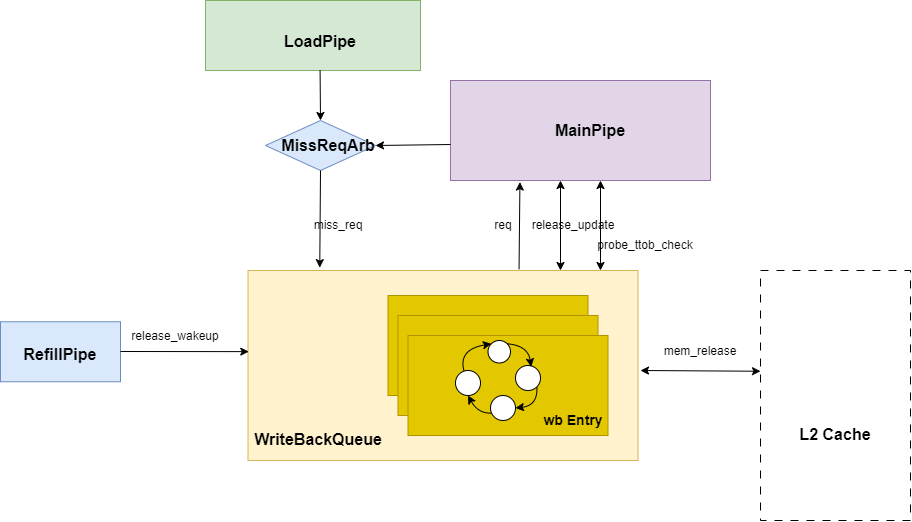
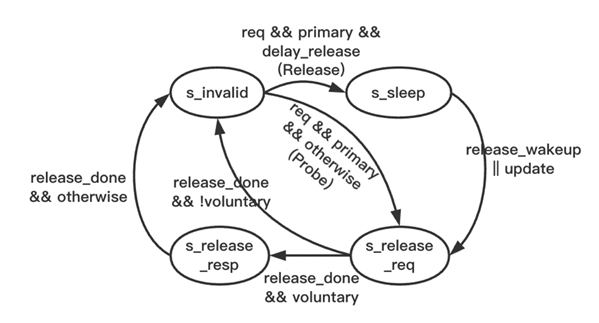

# 写回队列 WritebackQueue

## 功能描述

Writeback Queue包含18项WritebackEntry，负责通过TL-C的C通道向L2 Cache写回替换块(Release)，以及对Probe请求做出应答 (ProbeAck)，且支持Release和ProbeAck之间相互合并以减少请求数目并优化时序。

### 特性 1：Writeback Queue空项分配、合并与拒绝

为了时序考虑, 在 wbq 满的时候无论新请求是否能被合并都会被拒绝; 而当 wbq 不满的时候所有请求都会被接收, 此时或者为新请求分配空项, 或者将新请求合并到已有的 Writeback Entry 中, 后面在状态维护部分将会看到 Writeback Entry 任何时候都可以合并进新的 Release 或 ProbeAck 请求。因此 NanHu 架构中判断写回队列能否入队只需要看队列有没有空项即可。

### 特性 2：请求阻塞条件

TileLink 手册对并发事务的限制要求如果 master 有 pending Grant (即还没有发送 GrantAck), 则不能发送相同地址的 Release. 因此所有 miss 请求在进入 Miss Queue 时如果发现和 Writeback Queue 中某一项有相同地址, 则该 miss 请求会被阻塞.

### 特性 3：对Probe TtoB请求的额外检查

对于提前放入写回队列的release替换块，如果后续请求对该缓存块进行操作，通常的操作是在main pipe中处理后将写同步到写回队列的release块中。特别地，对于访问同一缓存块的Probe请求，如果Probe在Release发生之前到来，wb_queue可以将ProbeAck合并到Release的wb_entry中（toN），而同时在main pipe中的处理可能会对原cache_line的一致性meta进行修改（toB），这会导致L1和L2中该缓存行的一致性状态不一致。因此，对于所有的probe请求需要在MainPipe里做额外的检查再更新meta_coh，如果是TtoB probe请求，且wb queue中存在相应的cache_line release请求等待写回，那么需要在main pipe中把对应的meta_coh设为N。

### 特性 4：WritebackQueue 项数必须大于 MissQueue 项数

因为每一个miss的请求通常对应一个需要writeback的替换块，而wb_queue除了写回替换块之外，还需要对probe请求做出应答。为了避免请求在wbq造成拥堵，wbq的项数需要大于missqueue项数。

```
包括不限于：
介绍 wbq 入队逻辑（alloc/merge/reject）
1.介绍对 Probe TtoB 请求的额外检查
2.介绍 wbq 项数要求（必须大于 MissQueue 项数）及其原因
```

## 整体框图



## 接口时序

### XXXX 接口时序实例

#### 三级模块WritebackEntry
##### 关键电路
状态设计：Writeback Entry中的状态机设计如下图表所示:

| 状态             | 描述                                   |
|----------------|--------------------------------------|
| s_invalid      | 复位状态，该 Writeback Entry 为空项           |
| s_sleep        | 准备发送Release请求, 但暂时sleep并等待refill请求唤醒 |
| s_release_req  | 正在发送 Release 或者 ProbeAck 请求          |
| s_release_resp | 等待ReleaseAck请求                       |


