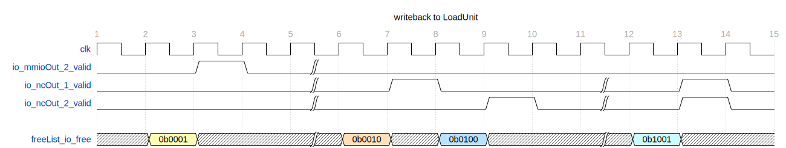
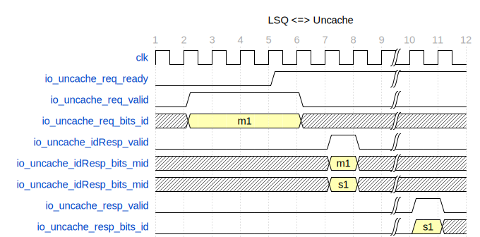

# Uncache Load 处理单元 LoadQueueUncache

| 更新时间   | 代码版本                                                                                                                                                     | 更新人                                      | 备注     |
| ---------- | ------------------------------------------------------------------------------------------------------------------------------------------------------------ | ------------------------------------------- | -------- |
| 2025.02.26 | [eca6983](https://github.com/OpenXiangShan/XiangShan/blob/eca6983f19d9c20aa907987dff616649c3d204a2/src/main/scala/xiangshan/mem/lsqueue/LoadQueueUncache.scala) | [Maxpicca-Li](https://github.com/Maxpicca-Li/) | 完成初版 |
|            |                                                                                                                                                              |                                             |          |

## 功能描述

LoadQueueUncache 和 Uncache 模块，对于 uncache load 访问请求来说，起到一个从 LoadUnit 流水线到总线访问的中间站作用。其中 Uncache 模块，作为靠近总线的一方，所起到的作用详见 [Uncache](../Uncache.md "Uncache 处理单元 Uncache")。LoadQueueUncache 作为靠近流水线的一方，需要承担以下责任：

1. 接收 LoadUnit 流水线传过来的 uncache load 请求。
2. 选择已准备好 uncache 访问的 uncache load 请求 发送到 Uncache  Buffer。
3. 接收来自 Uncache  Buffer 的处理完的 uncache load 请求。
4. 将处理完的 uncache load 请求 返回给 LoadUnit。

LoadQueueUncache 结构上，目前有 4 项（项数可配）UncacheEntry，每一项独立负责一个请求并利用一组状态寄存器控制其具体处理流程；有一个 FreeList，管理各项分配和回收的情况。而 LoadQueueUncache 主要是协同 4 项的新项分配、请求选择、响应分派、出队等统筹逻辑。

### 特性 1：入队逻辑

LoadQueueUncache 负责接收来自 LoadUnit 0、1、2 三个模块的请求，这些请求可以是 MMIO 请求，也可以是 NC 请求。首先，系统会根据请求的 robIdx 按照时间顺序（从最老到最新）对请求进行排序，以确保最早的请求能优先分配到空闲项，避免特殊情况下因老项回滚（rollback）而导致死锁。进入处理的条件是：请求没有重发、没有异常，并且系统会根据 FreeList 中可分配的空闲项依次为请求分配项。

当 LoadQueueUncache 达到容量上限，且仍有请求未分配到项时，系统会从这些未分配的请求中选择最早的请求进行 rollback。

### 特性 2：出队逻辑

当一个项完成 Uncache 访问操作并返回给 LoadUnit ，或被 redirect 刷新时，则该项出队并释放 FreeList 中该项的标志。同一拍可能有多个项出队。返回给 LoadUnit 的请求，会在第一拍中选出，第二拍返回。

其中，可供处理 uncache 返回请求的 LoadUnit 端口是预先设定的。当前，MMIO 只返回到 LoadUnit 2；NC 可返回到 LoadUnit 1\2。在多个端口返回的情况下，利用 uncache entry id 与端口数的余数，来指定每个项可以返回到的 LoadUnit 端口，并从该端口的候选项中选择一个项进行返回。

### 特性 3：Uncache 交互逻辑

（1）发送 `req`

第一拍先从当前已准备好 uncache 访问中选择一个，第二拍将其发送给 Uncache Buffer。发送的请求中，会标记选中项的 id，称为 `mid` 。其中是否被成功接收，可根据 `req.ready` 判断。

（2）接收 `idResp`

如果发送的请求被 Uncache Buffer 接收，那么会在接收的下一拍收到 Uncache 的 `idResp`。该响应中，包含 `mid` 和 Uncache Buffer 为该请求分配 entry id（称为 `sid`）。LoadQueueUncache 利用 `mid` 找到内部对应的项，并将 `sid` 存储在该项中。

（3）接收 `resp`

待 Uncache Buffer 完成该请求的总线访问后，会将访问结果返回给 LoadQueueUncache。该响应中，包含 `sid`。考虑到 Uncache Buffer 的合并特性（详细入队合并逻辑见 [Uncache](../Uncache.md)），一个 `sid` 可能对应 LoadQueueUncache 的多个项。LoadQueueUncache 利用 `sid` 找到内部所有相关项，并将访问结果传递给这些项。

## 整体框图

<!-- 请使用 svg -->

## 接口时序

### 入队接口时序实例

如下图所示，假设连续 5 个 NC 依次通过 LoadUnit 0\1\2 进入，当前 LoadQueueUncache 只有 4 项。故前四项正常分配现有空项。第 3 拍出现的 `r5` 因 buffer 满而无法分配项，故在第 5 拍产生回滚。注意，图中假设了每拍 NC 按顺序进入，即 `r1` < `r2` < `r3` 且 `r4` < `r5`；如果需要排序，将排序结果依次替换 `io_req` 即可，其余逻辑一致。

<!-- 
{
  signal: [
    {name: 'clk',                       wave: 'p.....'},
    {name: 'io_req_0_valid',            wave: '01.0..'},
    {name: 'io_req_1_valid',            wave: '01.0..'},
    {name: 'io_req_2_valid',            wave: '010...'},
    {name: 'io_req_0_bits*robIdx*',     wave: 'x36x..', data: ['r1','r4']},
    {name: 'io_req_0_bits*robIdx*',     wave: 'x47x..', data: ['r2','r5']},
    {name: 'io_req_0_bits*robIdx*',     wave: 'x5x...', data: ['r3']},
    {},
    {name: 'freeList_io_doAllocate_0',  wave: '0.1.0.'},
    {name: 'freeList_io_doAllocate_1',  wave: '0.10..'},
    {name: 'freeList_io_doAllocate_2',  wave: '0.10..'},
    {},
    {name: 'io_rollback_valid',         wave: '0...10'},
    {name: 'io_rollback_bits*robIdx*',  wave: 'x...7x', data: ['r5']},
  
    // 先不绘制 freeList 和 Entry 的更新
    // {name: 'freeList_io_canAllocate_0',  wave: '01.0|.....'},
    // {name: 'freeList_io_canAllocate_1',  wave: '01.0|.....'},
    // {name: 'freeList_io_canAllocate_2',  wave: '01.0|.....'},
    // {name: 'freeList_io_allocateSlot_0', wave: 'x34x|.....', data: ['s1','s2']},
    // {name: 'freeList_io_allocateSlot_1', wave: 'x34x|.....', data: ['s1','s2']},
    // {name: 'freeList_io_allocateSlot_2', wave: 'x34x|.....', data: ['s1','s2']},
    // {name: 'entries_0_req_valid',        wave: '01.0|.....'},
    // {name: 'entries_1_req_valid',        wave: '01.0|.....'},
    // {name: 'entries_2_req_valid',        wave: '01.0|.....'},
    // {name: 'entries_3_req_valid',        wave: '01.0|.....'},
    // {name: 'entries_0_req_bits*robIdx*', wave: 'x34x|.....', data: ['s1','s2']},
    // {name: 'entries_1_req_bits*robIdx*', wave: 'x34x|.....', data: ['s1','s2']},
    // {name: 'entries_2_req_bits*robIdx*', wave: 'x34x|.....', data: ['s1','s2']},
    // {name: 'entries_3_req_bits*robIdx*', wave: 'x34x|.....', data: ['s1','s2']},
  ],
  config: { hscale: 1 },
  head: {
    text:'enq from LoadUnit',
    tick:1,
    every:1
  },
}
 -->

### 出队接口时序实例

下图展示了 `mmioOut`、一拍只有一个 `ncOut` 和一拍同时有两个 `ncOut` 的情况。用第一个例子详细说明，第 2 拍选出写回项，并更新 freeList，寄存一拍，第 3 拍写回 LoadUnit。后续例子同理可得。

<!-- 
{
  signal: [
    {name: 'clk',                 wave: 'p.............'},
    {name: 'io_mmioOut_2_valid',  wave: '0.10|.........'},
    {name: 'io_ncOut_1_valid',    wave: '0...|.10..|.10'},
    {name: 'io_ncOut_2_valid',    wave: '0...|...10|.10'},
    {},
    {name: 'freeList_io_free',    wave: 'x3x.|4x5x.|6x.', data: ['0b0001', '0b0010','0b0100', '0b1001']},
  ],
  config: { hscale: 2 },
  head: {
    text:'writeback to LoadUnit',
    tick:1,
    every:1
  },
}
 -->

### uncache 接口时序实例

（1）没有 outstanding 时，每段只能发出一个 uncache 访问（由 `io_uncache_req_ready` 控制流出量），直至收到 uncache 回复。如下图，在第 5 拍 `io_uncache_req_ready` 拉高时，uncache 请求发出，第 6 拍 Uncache 收到请求并在第 7 拍返回 `idResp`。经过一段时间访问，在第 10+n 拍收到 Uncache 访问结果。

<!--
{
  signal: [
    {name: 'clk',                         wave: 'p.......|..'},
    {name: 'io_uncache_req_ready',        wave: '0...1...|..'},
    {name: 'io_uncache_req_valid',        wave: '01...0..|..'},
    {name: 'io_uncache_req_bits_id',      wave: 'x3...x..|..', data:['m1','m2','m3','m4']},
    {name: 'io_uncache_idResp_valid',     wave: '0.....10|..'},
    {name: 'io_uncache_idResp_bits_mid',  wave: 'x.....3x|..', data: ['m1', 'm2', 'm3', 'm4']},
    {name: 'io_uncache_idResp_bits_mid',  wave: 'x.....3x|..', data: ['s1', 's2', 's3', 's4']},
    {name: 'io_uncache_resp_valid',       wave: '0.......|10'},
    {name: 'io_uncache_resp_bits_id',     wave: '0.......|3x', data: ['s1', 's2']},
  ],
  config: { hscale: 1 },
  head: {
    text:'LSQ <=> Uncache',
    tick:1,
    every:1
  },
}
-->

（1）存在 outstanding 时，每段可发出多个 uncache 访问（由 `io_uncache_req_ready` 控制流出量）。如下图，连续发出 m1，m2，m3，m4 个请求，在第 4 拍和第 5 拍收到前2个请求的 Uncache 分派结果，此时 Uncache 满，m3 被中间寄存器寄存，m4 在等待 `io_uncache_req_ready` 拉高。第 9+n 拍 `io_uncache_req_ready` 拉高，m4 也发出了，并在第10+n、11+n拍分别收到 m3 和 m4 的 Uncache 分派结果。之后的拍数里将陆续收到 Uncache 的访问回复。

<!--
{
  signal: [
    {name: 'clk',                         wave: 'p.....|。.......'},
    {name: 'io_uncache_req_ready',        wave: '01..0.|.10.....'},
    {name: 'io_uncache_req_valid',        wave: '01....|..0.....'},
    {name: 'io_uncache_req_bits_id',      wave: 'x3456.|..x.....', data:['m1','m2','m3','m4']},
    {name: 'io_uncache_idResp_valid',     wave: '0..1.0|..1.0...'},
    {name: 'io_uncache_idResp_bits_mid',  wave: 'x..34x|..56x...', data: ['m1', 'm2', 'm3', 'm4']},
    {name: 'io_uncache_idResp_bits_mid',  wave: 'x..34x|..56x...', data: ['s1', 's2', 's3', 's4']},
    {name: 'io_uncache_resp_valid',       wave: '0.....|....1010'},
    {name: 'io_uncache_resp_bits_id',     wave: 'x.....|....3x4x', data: ['s1', 's2']},
  ],
  config: { hscale: 1 },
  head: {
    text:'LSQ <=> Uncache when outstanding',
    tick:1,
    every:1
  },
}
-->

## UncacheEntry 模块

UncacheEntry 负责独立处理一个请求的生命周期，并利用一组状态寄存器来控制其具体的处理流程。关键结构如下：

* `req_valid`：表示该项是否有效。
* `req`：存储收到的请求的所有相关内容。
* `uncacheState`：记录该项当前的生命阶段。
* `slaveAccept`、`slaveId`：记录该项是否分配到 Uncache Buffer 以及分配的 UnCache Buffer ID。
* `needFlushReg`：指示该项是否需要延迟刷新。

### 特性 1：生命周期及状态机

每一个 UncacheEntry 的生命周期可以由 `uncacheState` 完全描述。其中包括以下几个状态：

* `s_idle`：默认状态，表示没有请求，或者请求存在但尚不具备发送到 Uncache Buffer 的条件。
* `s_req`：表示当前已经具备将请求发送到 Uncache Buffer 的条件，静待被 LoadQueueUncache 选中，并由其中间寄存器接收（理论上应由 Uncache Buffer 接收，但在 LoadQueueUncache 选中后，会先将请求存放一拍，再发送给 Uncache Buffer；若未被 Uncache Buffer 接收，则会继续寄存在中间寄存器中）。对于 UncacheEntry 来说，它并不感知中间寄存器的存在，它只知道请求已发送且成功接收。
* `s_resp`：表示该请求已被中间寄存器接收，静待 Uncache Buffer 返回访问结果。
* `s_wait`：表示已经收到 Uncache Buffer 的访问结果，静待被 LoadQueueUncache 选中并由 LoadUnit 接收。

状态转换图如下，其中黑色标识该项正常生命周期，红色标识由于 redirect 需要刷新该项而导致该项生命周期非正常结束。

对于正常的生命周期，各个触发事件详细说明如下：

* `canSendReq`: 对于 MMIO 请求，当其对应的指令到达 ROB 头部时，则可发送该 Uncache 访问。对于 NC 请求，当 `req_valid` 有效时，则可发送该 Uncache 访问。
* `uncacheReq.fire`: 该项被 LoadQueueUncache 中间寄存器接收。该项会在下一拍收到 Uncache Buffer 传递来的 `idResp`，并更新 `slaveAccept` 和 `slaveId`。
* `uncacheResq.fire`: 该项收到的 Uncache Buffer 返回的访问结果。
* `writeback`: 当处于 `s_wait` 状态时，则可以发送写回请求。其中 MMIO 请求和 NC 请求的写回信号不一样，需要区分。

### 特性 2：redirect 刷新逻辑

对于非正常生命周期的情况，通常由流水线 redirect 引起。

当接收到流水线 redirect 信号时，判断当前项是否比 redirect 项更新。如果当前项更新，则需要刷新该项，并产生 `needFlush` 信号。一般情况下，会立即刷新该项所有内容，并由 FreeList 回收该项。但 Uncache 的请求和响应需要完整对应到同一个 uncache load 请求，故如果此时该项已经发出了 uncache 请求，需要等待接收到 Uncache 回复时才能结束该项的生命周期，此时产生了“刷新延迟”的情况。因此，在 `needFlush` 信号产生时，如果不能立即刷新该项，则需要将该信号存储到 `needFlushReg` 寄存器中。等到接收到 Uncache 回复时，才会执行刷新操作，并清除 `needFlushReg。`

### 特性 3：异常情况

LoadQueueUncache 中的异常情况有：

1. 该请求发往总线时，总线返回 corrupt 或 denied 的情况。该异常需要在 UncacheEntry 写回时进行标记，并由 LoadUnit 处理。
