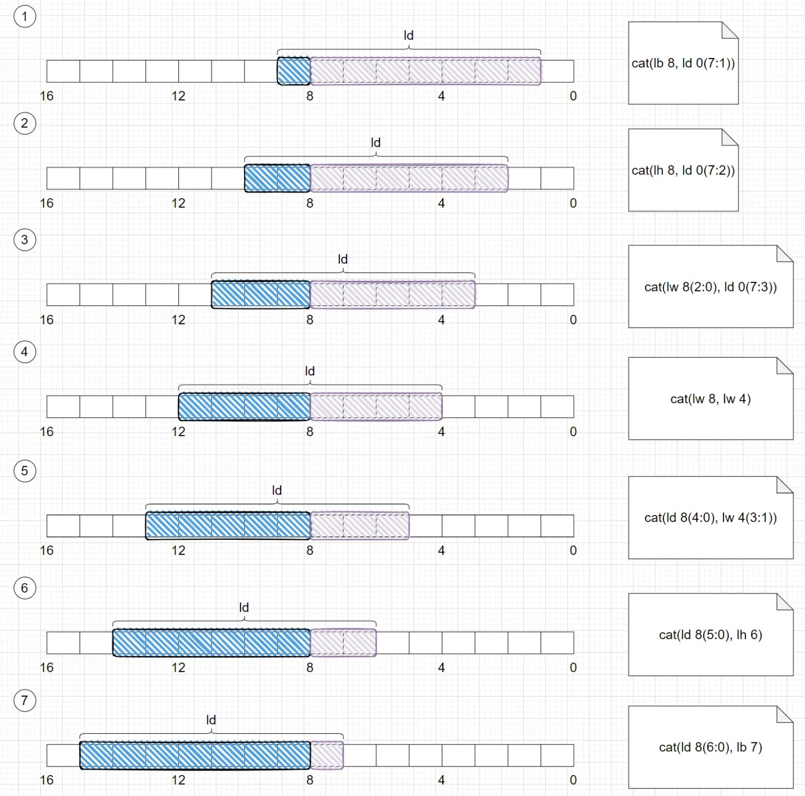

# Load 非对齐访存单元 LoadMisalignBuffer

## 功能描述

LoadMisalignBuffer 中存储 1 条非对齐且跨越 16Byte 边界的 Load 指令。
执行逻辑为具有 7 个状态的状态机，
当一条指令在 LoadUnit 中检测到非对齐且跨越 16Byte 时，则会申请进入 LoadMisalignBuffer。
LoadMisalignBuffer 会锁存住这条 Load，并将其分别拆分成两条 Load 访存(flow)重新进入 LoadUnit。

LoadMisalignBuffer 会收集由自身发出的 Load 访存，等两条 Load 访存都执行完成之后，会进行数据拼接，然后向 LoadUnit 再发送一次唤醒操作，该操作不实际进入 LoadUnit 流水线执行，只是触发唤醒信号并打三拍。
等三拍后，LoadMisalignBuffer 会再次收到 LoadUnit 的写回请求，并标记为来自唤醒操作，这时，LoadMisalignBuffer 会出队并真正的写回给后端并 bypass。

标量非对齐写回后端需在 LoadUnit 1 未使能标量写回时进行。如不满足，则阻塞 LoadMisalignBuffer 写回后端。
向量非对齐写回 VLMergeBuffer 需在 LoadUnit 1 未使能向量标量写回时进行。如不满足，则阻塞 LoadMisalignBuffer 写回 VLMergeBuffer。

### 特性 1：支持跨越 16Byte 边界的非对齐 Load 进行拆分访存

根据已经执行完的 flow 进行不同的变化。转态机会再第一条 flow 写回后再进入 s_req 状态，发送第二条 flow。
如果第一次 flow 携带异常写回至 LoadMisalignBuffer，则直接携带异常信息写回给后端，无需进行第二条 flow 的执行。
任意一条 flow 写回时都有可能产生任意原因的 replay，LoadMisalignBuffer 选择重新发送该 flow 至 LoadUnit，无论是什么原因的 replay。

- lb 指令永远不可能产生非对齐。

- lh 拆成两个对应的 lb 操作：

- lw 根据地址拆分方式不同：
  

- ld 根据地址拆分方式不同：

### 特性 2：支持向量非对齐

向量非对齐的 flow 与标量非对齐处理方式一致，区别在向量写回至 VLMergeBuffer，而标量直接写回至后端。

### 特性 3：不支持非 Memory 空间的非对齐 Load

不支持非 Memory 空间的非对齐 Load，当非 Memory 空间的 Load 产生非对齐时，会产生 LoadAddrMisalign 异常。

## 整体框图

**状态介绍**

|              状态 | 说明                                        |
| ----------------: | :------------------------------------------ |
|            s_idle | 等待非对齐的 Load uop 进入                  |
|           s_split | 拆分非对齐 Load                             |
|             s_req | 发射拆分后的非对齐 Load 操作至 LoadUnit     |
|            s_resp | LoadUnit 写回                               |
| s_comb_wakeup_rep | 合并两条非对齐 Load 的结果，发射 wakeup uop |
|              s_wb | 写回后端或 VLMergeBuffer                    |

## 主要端口

|                  | 方向 | 说明                                                    |
| ---------------: | :--- | :------------------------------------------------------ |
|         redirect | In   | 重定向端口                                              |
|              req | In   | 接收来自 LoadUnit 的入队请求                            |
|              rob | In   | 内部悬空                                                |
|     splitLoadReq | Out  | 发送至 LoadUnit 的拆分后的 flow 的访存请求              |
|    splitLoadResp | In   | 接收 LoadUnit 写回的拆分后的 flow 的访存响应            |
|        writeBack | out  | 标量非对齐写回至后端                                    |
|     vecWriteBack | Out  | 向量非对齐写回至 VLMergeBuffer                          |
|     loadOutValid | In   | Load Unit 存在 Load 指令将要写回至后端                  |
|  loadVecOutValid | In   | Load Unit 存在 Vector Load 指令将要写回至 VLMergeBuffer |
|  overwriteExpBuf | Out  | 悬空                                                    |
| loadMisalignFull | Out  | LoadMisalignBuffer 满标记                               |

## 接口时序

接口时序较简单，只提供文字描述。

|                  | 说明                                               |
| ---------------: | :------------------------------------------------- |
|         redirect | 具备 Valid。数据同 Valid 有效                      |
|              req | 具备 Valid、Ready。数据同 Valid && ready 有效      |
|              rob | 内部悬空                                           |
|     splitLoadReq | 具备 Valid、Ready。数据同 Valid && ready 有效      |
|    splitLoadResp | 具备 Valid。数据同 Valid 有效                      |
|        writeBack | 具备 Valid、Ready。数据同 Valid && ready 有效      |
|     vecWriteBack | 具备 Valid、Ready。数据同 Valid && ready 有效      |
|     loadOutValid | 不具备 Valid，数据始终视为有效，对应信号产生即响应 |
|  loadVecOutValid | 不具备 Valid，数据始终视为有效，对应信号产生即响应 |
|  overwriteExpBuf | 悬空                                               |
| loadMisalignFull | 不具备 Valid，数据始终视为有效，对应信号产生即响应 |
