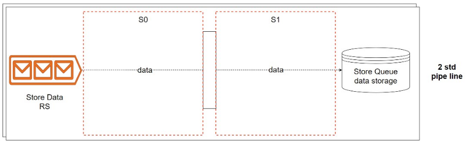
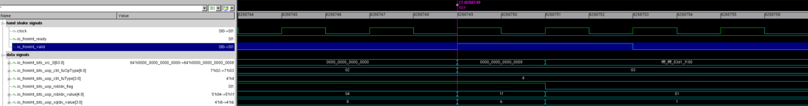

# Store 数据执行单元 StdExeUnit

## 功能描述

store指令数据流水线，用于给StoreQueue对应位置写入store的数据。

## 整体框图
<!-- 请使用 svg -->

## 接口时序

### 接口时序实例

上图中io_fromInt_ready和io_fromInt_valid为高握手后，接收到了有效的写入请求，数据为io_fromInt_bits_src_0，上图示例了写入到sq的第11项，数据为8。