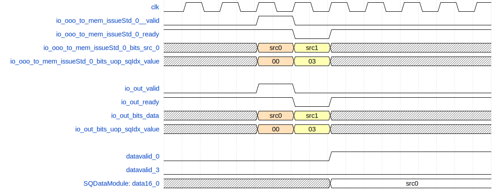

# Store 数据执行单元 StdExeUnit

## 功能描述

标量store指令数据流水线，用于给StoreQueue对应位置写入store的数据。

## 整体框图
{#fig:LSU-StdExeUnit}

## 接口时序

### 接口时序实例

{#fig:LSU-StdExeUnit-Timing}

如图\ref{fig:stdExeUnit-timing}, io_ooo_to_mem_issueStd_0_ready和io_ooo_to_mem_issueStd_0_valid为高握手后，接收到了有效的写入请求，数据为io_ooo_to_mem_issueStd_0_bits_src_0，上图示例了在第三个clk时写入到StoreQueue的第sqIdx0项，数据为src0。在第四个clk时io_ooo_to_mem_issueStd_0_ready为低电平，此时数据不写入StoreQueue。这种情况一般是有向量store指令要向StoreQueue写数据。
