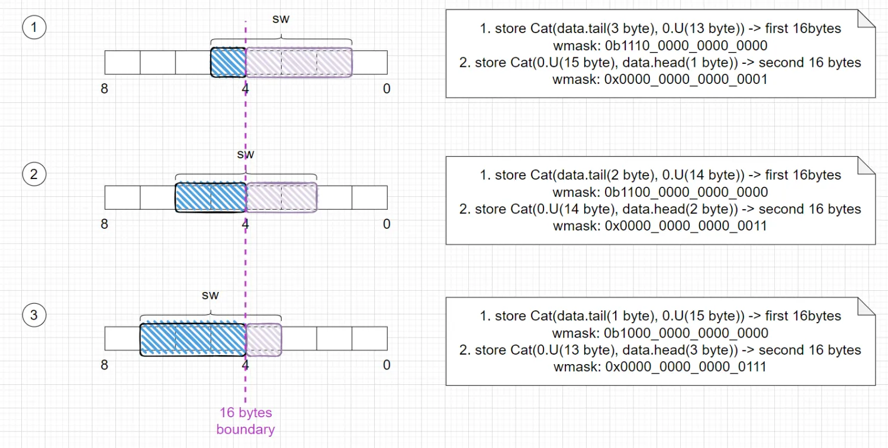
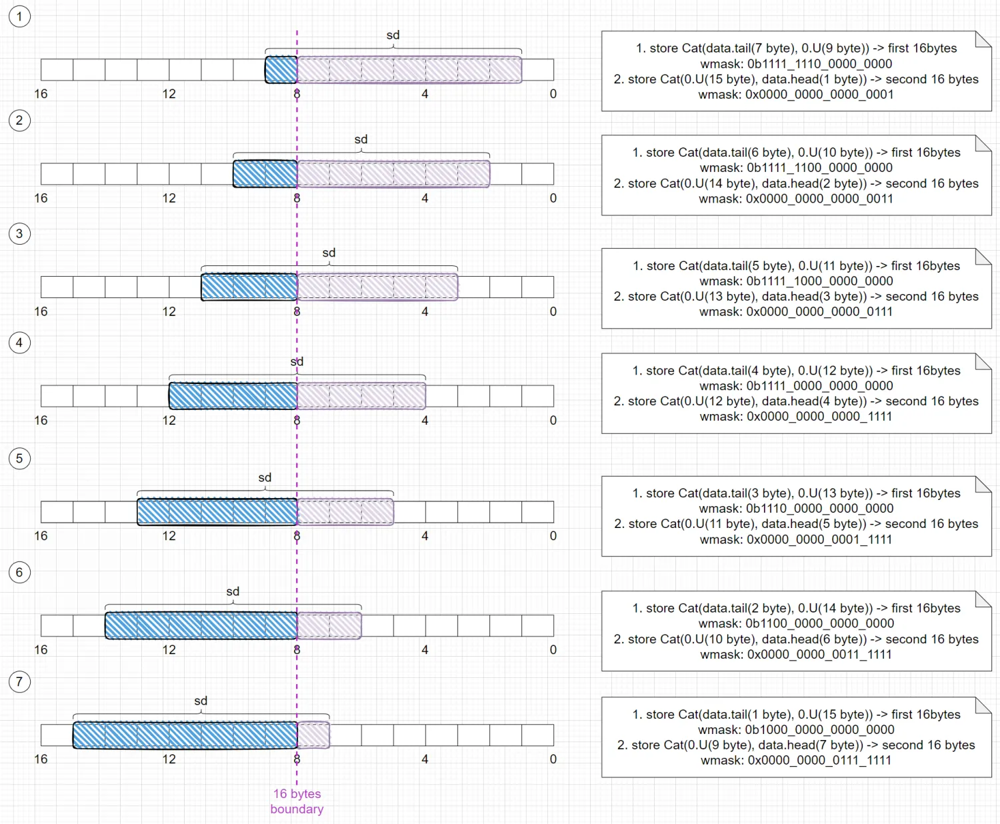

# Store 非对齐访存单元 StoreMisalignBuffer

## 功能描述

StoreMisalignBuffer 中存储 1 条非对齐且跨越 16Byte 边界的 Store 指令。
执行逻辑为具有 7 个状态的状态机，
当一条指令在 StoreUnit 中检测到非对齐且跨越 16Byte 时，则会申请进入 StoreMisalignBuffer。
StoreMisalignBuffer 会锁存住这条 Store，并将其分别拆分成两条 Store 访存(flow)重新进入 StoreUnit。

StoreMisalignBuffer 会收集由自身发出的 Store 访存，等两条 Store 访存都执行完成之后，如果是非跨页的非对齐，则写回。
标量非对齐写回后端需在 StoreUnit 1 未使能标量写回时进行。如不满足，则阻塞 StoreMisalignBuffer 写回后端。
向量非对齐写回 VSMergeBuffer 需在 StoreUnit 1 未使能向量标量写回时进行。如不满足，则阻塞 StoreMisalignBuffer 写回 VSMergeBuffer。

对于跨 4K 页的 Store，我们要求当该指令到达 Rob 队头时才能进行执行。如果这期间能老的 Store 进入 StoreMisalignBuffer，则会踢掉当前的跨 4K 页的 Store，并将 needFlushPipe 标记设为 true。
当最终某条 Store 写回时，我们会产生一次 redirect。

对于向量，当存在某条向量的 Store flow 被踢出时，会通知 VSMergeBuffer 将该 flow 对于的项置为 needRsReplay，从而让该 uop 被重发。

### 特性 1：支持跨越 16Byte 边界的非对齐 Store 进行拆分访存

根据已经执行完的 flow 进行不同的变化。转态机会再第一条 flow 写回后再进入 s_req 状态，发送第二条 flow。
如果第一次 flow 携带异常写回至 StoreMisalignBuffer，则直接携带异常信息写回给后端，无需进行第二条 flow 的执行。
任意一条 flow 写回时都有可能产生任意原因的 replay，StoreMisalignBuffer 选择重新发送该 flow 至 StoreUnit，无论是什么原因的 replay。

- sb 指令永远不可能产生非对齐。

- sh 拆成两个对应的 sb 操作：

- sw 根据地址拆分方式不同：
  

- sd 根据地址拆分方式不同：

### 特性 2：支持向量非对齐

向量非对齐的 flow 与标量非对齐处理方式一致，区别在向量写回至 VSMergeBuffer，而标量直接写回至后端。

### 特性 3：不支持非 Memory 空间的非对齐 Store

不支持非 Memory 空间的非对齐 Store，当非 Memory 空间的 Store 产生非对齐时，会产生 StoreAddrMisalign 异常。

### 特性 4：支持跨页 Store

Store 因为需要写入 Sbuffer，在跨页的情况下，会产生两个物理地址。低页的物理地址可以存在 StoreQueue 中，而高页的物理地址需要找一个地方单独存储。我们选择存在 StoreMisalignBuffer 中，这样的话，对于跨页的 Store 来说，我们要等这条指令从 Store Queue 中提交到 Sbuffer 之后才可以在 StoreMisalignBuffer 中清除这一项。
因此，我们会为 StoreQueue 提供当前 StoreMisalignBuffer 中锁存的元数据与地址，以供 Store Queue 写回使用。
具体的，我们会通过 rob 与 StoreQueue 传来的相关信号来判断是否需要锁存保持住目前的 Store 元数据。

## 整体框图

状态转换图与转换细节待补充
  
**状态介绍**

|    状态 | 说明                                                      |
| ------: | :-------------------------------------------------------- |
|  s_idle | 等待非对齐的 Store uop 进入                               |
| s_split | 拆分非对齐 Store                                          |
|   s_req | 发射拆分后的非对齐 Store 操作至 StoreUnit                 |
|  s_resp | StoreUnit 写回                                            |
|    s_wb | 写回后端或 VSMergeBuffer                                  |
| s_block | 阻塞这条指令出队，直到 Store Queue 中将该项写入到 Sbuffer |

## 主要端口

|                       | 方向   | 说明                                                      |
| --------------------: | :----- | :-------------------------------------------------------- |
|              redirect | In     | 重定向端口                                                |
|                   req | In     | 接收来自 StoreUnit 的入队请求                             |
|                   rob | In     | 接收 Rob 中相关元数据信息                                 |
|         splitStoreReq | Out    | 发送至 StoreUnit 的拆分后的 flow 的访存请求               |
|        splitStoreResp | In     | 接收 StoreUnit 写回的拆分后的 flow 的访存响应             |
|             writeBack | out    | 标量非对齐写回至后端                                      |
|          vecWriteBack | Out    | 向量非对齐写回至 VSMergeBuffer                            |
|         StoreOutValid | In     | Store Unit 存在 Store 指令将要写回至后端                  |
|      StoreVecOutValid | In     | Store Unit 存在 Vector Store 指令将要写回至 VSMergeBuffer |
|       overwriteExpBuf | Out    | 悬空                                                      |
|             sqControl | In/Out | 与 Store Queue 的交互接口                                 |
| toVecStoreMergeBuffer | Out    | 将 flush 相关信息发送至 VSMergeBuffer                     |

## 接口时序

接口时序较简单，只提供文字描述。

|                       | 说明                                               |
| --------------------: | :------------------------------------------------- |
|              redirect | 具备 Valid。数据同 Valid 有效                      |
|                   req | 具备 Valid、Ready。数据同 Valid && ready 有效      |
|                   rob | 不具备 Valid，数据始终视为有效，对应信号产生即响应 |
|         splitStoreReq | 具备 Valid、Ready。数据同 Valid && ready 有效      |
|        splitStoreResp | 具备 Valid。数据同 Valid 有效                      |
|             writeBack | 具备 Valid、Ready。数据同 Valid && ready 有效      |
|          vecWriteBack | 具备 Valid、Ready。数据同 Valid && ready 有效      |
|         StoreOutValid | 不具备 Valid，数据始终视为有效，对应信号产生即响应 |
|      StoreVecOutValid | 不具备 Valid，数据始终视为有效，对应信号产生即响应 |
|       overwriteExpBuf | 悬空                                               |
|             sqControl | 不具备 Valid，数据始终视为有效，对应信号产生即响应 |
| toVecStoreMergeBuffer | 不具备 Valid，数据始终视为有效，对应信号产生即响应 |
