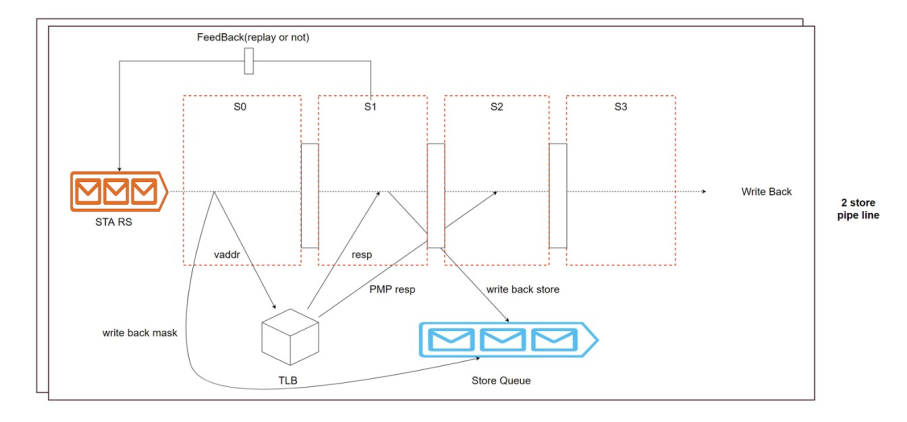

# Store 地址执行单元 StoreUnit

## 功能描述

Store指令地址流水线分为S0/S1/S2/S3/S4五级, 如下图StoreAddrPipe所示。接收store地址保留站发来的请求，处理完成之后需要给结果总线发响应，处理过程中需要给保留站反馈信息，给StoreQueue反馈信息，最后写回, 如果中间出现异常则从保留站重新发射。

### 特性 1：StoreUnit 各级流水线功能

* stage 0:
    * 计算VA地址
    * 地址Miss-Align 检查更新到uop.cf.exceptionVec(storeAddrMisaligned)
    * 发出DTLB读请求到总线tlb
    * 更新指令的Mask信息到总线s0_mask_out -> StoreQueue
    * 预测执行的Store有可能被ROB flush

* stage 1:
    * 更新DTLB查询结果到总线lsq -> storeQueue
    * 向LoadQueue发出store-load违例检查请求到总线stld_nuke_query
    * 如果DTLB hit，广播Store issue信息到总线issue
    * ROB flush或停止流水(TLB miss)

* stage 2
    * mmio/PMP检查并更新总线lsq_replenish -> storeQueue
    * 更新DTLB结果到总线feedback_slow->RV

* stage 3
    * 违例检查延时

* stage 4
    * 发起Write-Back请求到总线stout

## 整体框图
<!-- 请使用 svg -->

## 接口时序

### 接口时序实例

store指令进入StoreUnit后，在stage 0 请求TLB，stage 1得到TLB返回的paddr。在stage 0将mask写入StoreQueue，stage 1向 RAW发送请求，并通过io_lsq将store指令的其他信息更新到LoadStoreQueue。在stage 2得到feedback相关信息，stage 4 通过stout写回。

