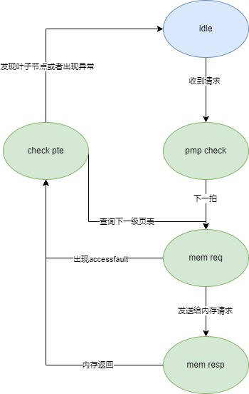

# 三级模块 Hypervisor Page Table Walker

Hypervisor Page Table Walker 指的是如下模块：

* HPTW hptw

## 设计规格

1. 支持访问 G-stage 的三级页表
2. 支持向内存发送请求
3. 支持向 Page Cache 发送 refill 信号
4. 支持异常处理
5. bypass 特殊处理

## 功能

### 支持访问 G-stage 的三级页表

HPTW 整体设计与 PTW 基本相同，每次只能处理一个请求，并且 HPTW 可以进行完整的第二阶段的三级页表的翻译，翻译过程中如果需要访问内存，会对访问内存的地址进行 PMP 检查，如果检查出错则直接返回，否则发送访存请求。HPTW 返回的情况有：

1. 访问到叶子节点
2. 访问出现 pagefault 或者 accessfault

### 支持向内存发送请求

HPTW 与 PTW 和 LLPTW 类似，在访问页表的时候需要向内存发送请求，通过仲裁器发送请求。

### 向 Page Cache 发送 refill 信号

HPTW 得到 PTW 返回的结果后，会向 Page Cache 发送 refill 请求，将返回的页表项填入 Page Cache，HPTW 会提供填入 Page Cache 的信息。

### 异常处理机制

当出现 pagefault 或者 accessfault 的异常时候，HPTW 会直接返回给 PTW 或者 LLPTW。

### Bypass 特殊处理

对于 bypass 请求，我们一般将其放入 MissQueue 中重新查询，但对于 hptw 请求（即 isHptwReq 有效）不放入 MissQueue（避免出现阻塞），所以出现 bypass 的请求的时候，为了避免 Page Cache 填入重复的页表项，hptw 请求传入 HPTW 的时候如果 bypass 信号有效，则向内存发送请求的时候，内存返回的结果不会重填 Page Cache。

## 整体框图

HPTW 的状态转移关系图如下：

状态机的各个状态的描述如下：

* idle：Hypervisor Page Table Walker 状态机的初始状态，接收一个 PTW 请求后，进入 pmp_check 状态。
* pmp_check：在该状态下将需要访问的物理地址发送给 PMP 模块做 PMP 和 PMA 检查，下一拍进入 mem_req 状态。PMP 模块需要当拍返回物理地址检查结果是否出现 access fault。
* mem_req：根据 PMP 和 PMA 的检查结果，如果检查结果出现 access fault，则进入 check_pte 状态；否则向内存发送请求。在 mem_req 状态继续等待，直至和内存握手成功，表示成功发送请求，之后后进入 mem_resp 状态。
* mem_resp：在 mem_req 状态时，Hypervisor Page Table Walker 已经向内存发送了 PTW 请求，在 mem_resp 状态下，Hypervisor Page Table Walker 等待内存回复。在收到内存回复，内存和 Hypervisor Page Table Walker 握手成功后进入 check_pte 状态。
* check_pte：该状态对目前的查询情况进行判断，从而决定下一步操作。该状态处理的情况如下：
    1. 出现 accessfault 或者 pagefault，返回给 PTW 或者 LLPTW。
    2. 在内存返回的页表是叶子节点，则直接返回给 PTW 或者 LLPTW。
    3. 如果不是叶子节点，则将物理地址发送给 PMP 模块做 PMP&PMA 检查，同时状态转移到 mem_req，重复上文中介绍的流程。

## 接口时序

与 PTW 类似，不再赘述。
