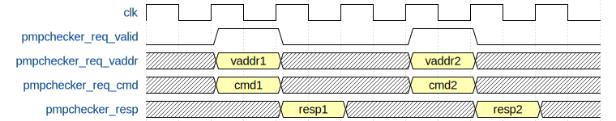

# 二级模块 PMP&PMA

PMP 包括如下模块，PMA 检查包括在 PMP 模块中：

1. PMP（分布式 PMP & PMA 寄存器）
    1. PMP pmp（Frontend）
    2. PMP pmp（Memblock）
    3. PMP pmp（L2TLB）
2. PMPChecker（PMP & PMA 检查器，当拍返回结果）
    1. PMPChecker PMPChecker（Frontend）
    2. PMPChecker PMPChecker_1（Frontend）
    3. PMPChecker PMPChecker_2（Frontend）
    4. PMPChecker PMPChecker_3（Frontend）
    5. PMPChecker PMPChecker（L2TLB）
    6. PMPChecker PMPChecker_1（L2TLB）
3. PMPChecker_8（PMP & PMA 检查器，下一拍返回结果）
    1. PMPChecker_8 PMPChecker（Memblock）
    2. PMPChecker_8 PMPChecker_1（Memblock）
    3. PMPChecker_8 PMPChecker_2（Memblock）
    4. PMPChecker_8 PMPChecker_3（Memblock）
    5. PMPChecker_8 PMPChecker_4（Memblock）
    6. PMPChecker_8 PMPChecker_5（Memblock）

## 设计规格

1. 支持物理地址保护
2. 支持物理地址属性
3. 支持 PMP 和 PMA 并行执行检查
4. 支持动态检查和静态检查
5. 支持分布式 PMP 和分布式 PMA
6. 支持异常处理机制

## 功能

### 支持物理地址保护

香山处理器支持物理地址保护（PMP）检查，PMP 默认为 16 项，可以参数化修改。出于时序考虑，采用分布复制式实现方法，在 CSR 单元中的 PMP 寄存器负责 CSRRW 等指令；在前端取指、后端访存、Page Table Walker 处都拥有一份 PMP 寄存器的拷贝，通过拉取 CSR 写信号保证和 CSR 单元中 PMP 寄存器的一致。

PMP 寄存器的格式、复位值等请参考香山开源处理器用户手册、RISC-V 特权级手册。

### 支持物理地址属性

物理地址属性（PMA）的实现采用了类 PMP 的方式，利用了 PMP Configure 寄存器的两个保留位，设为 atomic 和 cachable，分别为是否支持原子操作和是否可缓存。PMP 寄存器没有初始值，而 PMA 寄存器默认拥有初始值，需手动设置与平台地址属性一致。PMA 寄存器利用了 M 态 CSR 的保留寄存器地址空间，默认为 16 项，可参数化修改。

PMA 默认配置请参考香山开源处理器用户手册。

### PMP 和 PMA 并行执行检查

PMP 和 PMA 检查并行查询，如果违反其中一个权限，即为非法操作。核内所有的物理地址访问都需要进行物理地址权限检查，包括在 ITLB 和 DTLB 检查之后，以及 Page Table Walker、Hypervisor Page Table Walker 和 Last Level Page Table Walker 访存之前。ITLB、DTLB、Page Table Walker、Last Level Page Table Walker、Hypervisor Page Table Walker 各自使用的分布式 PMP、PMA，以及 PMP、PMA 检查器的对应关系如 [@tbl:PMP-PMA-modules] 所示。也就是说，对于 Frontend、Memblock 以及 L2 TLB 各自拥有一份 PMP 和 PMA 寄存器的备份（参见 5.2.5 节），这些备份分别驱动 Frontend、Memblock 以及 L2 TLB 的 PMP 和 PMA 检查器。

Table: PMP 和 PMA 检查模块的对应关系 {#tbl:PMP-PMA-modules}

| 模块    | 通道                             | 分布式 PMP&PMA  | PMP&PMA 检查器件 |
| ------- | -------------------------------- | --------------- | ---------------- |
| ITLB    |                                  |                 |                  |
|         | requestor(0)                     | pmp（Frontend） | PMPChecker       |
|         | requestor(1)                     | pmp（Frontend） | PMPChecker_1     |
|         | requestor(2)                     | pmp（Frontend） | PMPChecker_2     |
|         | requestor(3)                     | pmp（Frontend） | PMPChecker_3     |
| DTLB_LD |                                  |                 |                  |
|         | requestor(0)                     | pmp（Memblock） | PMPChecker       |
|         | requestor(1)                     | pmp（Memblock） | PMPChecker_1     |
|         | requestor(2)                     | pmp（Memblock） | PMPChecker_2     |
| DTLB_ST |                                  |                 |                  |
|         | requestor(0)                     | pmp（Memblock） | PMPChecker_3     |
|         | requestor(1)                     | pmp（Memblock） | PMPChecker_4     |
| DTLB_PF |                                  |                 |                  |
|         | requestor(0)                     | pmp（Memblock） | PMPChecker_5     |
| L2 TLB  |                                  |                 |                  |
|         | Page Table Walker                | pmp（L2 TLB）   | PMPChecker       |
|         | Last Level Page Table Walker     | pmp（L2 TLB）   | PMPChecker_1     |
|         | Hypervisor     Page Table Walker | Pmp（L2TLB）    | PMPChecker_2     |

根据 RV 手册，Page Fault 的优先级高于 Access Fault，但是如果 Page Table Walker 或 Last Level Page Table Walker 在 PMP 检查或 PMA 检查时出现 Access Fault，此时页表项为非法，会发生 Page Fault 和 Access Fault 一起出现的特殊情况，香山选择报 Access Fault。手册对于这种情况没有明确说明，或与手册不符，其余情况下均满足 Page Fault 的优先级高于 Access Fault。

### 动态检查和静态检查

按照手册规定，PMP 和 PMA 的检查应该为动态检查，即需要经过 TLB 翻译之后，使用翻译后的物理地址进行物理地址权限检查。Frontend、L2 TLB 以及 Memblock 的 5 个 PMPChecker（参见 [@tbl:PMP-PMA-modules]）均为动态检查。出于时序考虑，DTLB 的 PMP & PMA 检查结果可以提前查询好，在回填时存入 TLB 项中，此为静态检查。具体地，当 L2 TLB 的页表项回填入 DTLB 时，同时将回填的页表项送给 PMP 和 PMA 进行权限检查，将检查得到的属性位（包括 R、W、X、C、Atomic，这些属性位的具体含义参见 5.4 节）同时存储在 DTLB 中，这样可以直接将这些检查结果返回给 MemBlock，无需再次检查。为实现静态检查，需要提升 PMP 和 PMA 的粒度为 4KB。

需要注意的是，目前 PMP & PMA 检查暂时并非昆明湖的时序瓶颈，因此未采用静态检查，全部使用动态检查的方式，即 TLB 查询得到物理地址后，再进行检查。昆明湖 V1 的代码中不包括静态检查，只包括动态检查，请再次注意。但出于兼容性，PMP 和 PMA 的粒度依然保持为 4KB。

动态检查和静态检查得到的结果信息如下：

* 动态检查：返回是否发生 inst access fault，load access fault，store access fault；检查的物理地址是否属于 mmio 地址空间
* 静态检查：返回检查的物理地址的属性位，包括 R、W、X、C、Atomic。请注意，昆明湖 V1 默认不会采用静态检查。

### 分布式 PMP 和 PMA

PMP 和 PMA 的具体实现包括 CSR Unit、Frontend、Memblock、L2 TLB 四部分，在 CSR Unit 负责响应 CSRRW 等 CSR 指令对这些 PMP 和 PMA 寄存器的读写。由于 CSR Unit 和 ITLB、DTLB、L2 TLB 距离均较远，需要在 ITLB、DTLB、L2 TLB 中均存储一份 PMP 和 PMA 的备份用于物理地址检查和物理属性检查。为此，我们需要实现分布式 PMP 和 PMA，在 ITLB、DTLB、L2 TLB 附近都保存这些寄存器的备份。

在 Frontend、Memblock 和 L2 TLB 中包含这些 PMP 和 PMA 寄存器的备份，负责地址检查，通过拉取 CSR 的写信号可以保证这些寄存器的内容一致性。由于 L1 TLB 的面积较小，因此 PMP 和 PMA 寄存器的备份存储在 Frontend 或 Memblock 中，分别为 ITLB 和 DTLB 提供检查。L2 TLB 的面积较大，因此 PMP 和 PMA 寄存器的备份直接存储在 L2 TLB 中。

### PMP 和 PMA 的检查流程

在 ITLB、DTLB 查询得到物理地址，以及 L2 TLB 的 Page Table Walker、Last Level Page Table Walker 和 Hypervisor Page Table Walker 访问内存之前，都需要进行物理地址检查。ITLB、DTLB、L2 TLB 需要向 PMPChecker 提供的信息包括 PMP 和 PMA 配置寄存器、地址寄存器的相关信息；PMP 和 PMA 地址寄存器由低向高数连续 1 的个数（由于 PMP 和 PMA 的粒度为 4KB，因此最小为 12）；需要查询的物理地址；需要查询哪种权限，包括执行（ITLB）、读写（L2 TLB、LoadUnits 和 StoreUnits）、原子读写（AtomicsUnit）。

PMP 和 PMA 检查请求需要提供的相关信息如 [@tbl:PMP-PMA-req-info] 所示：

Table: PMP 和 PMA 检查请求需要提供的相关信息 {#tbl:PMP-PMA-req-info}

| PMPChecker 模块   | 需要提供的信息                                                                                  | 来源                                                                                 |
| ----------------- | ----------------------------------------------------------------------------------------------- | ------------------------------------------------------------------------------------ |
| Frontend          |                                                                                                 |                                                                                      |
|                   | PMP 和 PMA 配置寄存器                                                                           | Frontend pmp                                                                         |
|                   | PMP 和 PMA 地址寄存器                                                                           | Frontend pmp                                                                         |
|                   | PMP 和 PMA 的 mask，也就是地址寄存器由低向高数连续 1 的个数，最小为 12                          | Frontend pmp                                                                         |
|                   | 查询的 paddr                                                                                    | Icache、IFU                                                                          |
|                   | 查询的 cmd，ITLB 固定为 2，表示需要执行权限                                                     | Icache、IFU                                                                          |
| Memblock          |                                                                                                 |                                                                                      |
|                   | PMP 和 PMA 配置寄存器                                                                           | Memblock pmp                                                                         |
|                   | PMP 和 PMA 地址寄存器                                                                           | Memblock pmp                                                                         |
|                   | PMP 和 PMA 的 mask，也就是地址寄存器由低向高数连续 1 的个数，最小为 12                          | Memblock pmp                                                                         |
|                   | 查询的 paddr                                                                                    | LoadUnits、L1 Load Stream & Stride Prefetch   StoreUnits、AtomicsUnit、SMSprefetcher |
|                   | 查询的 cmd，DTLB 可能为 0、1、4、5；分别表示需要 read、write、atom_read、atom_write 权限。      | LoadUnits、L1 Load Stream & Stride Prefetch   StoreUnits、AtomicsUnit、SMSprefetcher |
| Memblock 静态检查 |                                                                                                 |                                                                                      |
|                   | PMP 和 PMA 配置寄存器                                                                           | Memblock pmp                                                                         |
|                   | PMP 和 PMA 地址寄存器                                                                           | Memblock pmp                                                                         |
|                   | PMP 和 PMA 的 mask，mask 的形式是低 i 位为 1，高位为 0，i 的个数为 log2(pmp 条目匹配的地址空间) | Memblock pmp                                                                         |
|                   | 查询的 paddr                                                                                    | L2 TLB 返回的 PTW                                                                    |
| L2 TLB            |                                                                                                 |                                                                                      |
|                   | PMP 和 PMA 配置寄存器                                                                           | L2 TLB pmp                                                                           |
|                   | PMP 和 PMA 地址寄存器                                                                           | L2 TLB pmp                                                                           |
|                   | PMP 和 PMA 的 mask，mask 的形式是低 i 位为 1，高位为 0，i 的个数为 log2(pmp 条目匹配的地址空间) | L2 TLB pmp                                                                           |
|                   | 查询的 paddr                                                                                    | Page Table Walker、Last Level   Page Table Walker、Hypervisor Page   Table Walker    |
|                   | 查询的 cmd，L2 TLB 固定为 0，表示需要读权限                                                     | Page Table Walker、Last Level   Page Table Walker、Hypervisor Page   Table Walker    |

PMPChecker 需要向 ITLB、DTLB、L2 TLB 返回是否出现 inst access fault（ITLB）、是否出现 load access fault（LoadUnits、L2 TLB）、是否出现 store access fault（StoreUnits、AtomicsUnit）、地址是否属于 MMIO 空间（ITLB、DTLB、L2 TLB）。同时静态检查需要向 DTLB 填入地址的属性位，包括 cacheable、atomic、x、w、r。

对于来自 ITLB 和 L2 TLB 的请求，会在当拍给出 PMP 和 PMA 检查的结果；对于来自 DTLB 的请求，会在下一拍给出 PMP 和 PMA 检查的结果。PMP 和 PMA 检查需要返回的相关信息如 [@tbl:PMP-PMA-resp-info] 所示：

Table: PMP 和 PMA 检查需要返回的相关信息 {#tbl:PMP-PMA-resp-info}

| PMPChecker 模块   | 需要返回的信息              | 去向                                                                              |
| ----------------- | --------------------------- | --------------------------------------------------------------------------------- |
| Frontend          |                             |                                                                                   |
|                   | 是否出现 inst access fault  | Icache、IFU                                                                       |
|                   | 地址是否属于 MMIO 空间      | Icache、IFU                                                                       |
| Memblock 动态检查 |                             |                                                                                   |
|                   | 是否出现 load access fault  | LoadUnits                                                                         |
|                   | 是否出现 store access fault | StoreUnits、AtomicsUnit                                                           |
|                   | 地址是否属于 MMIO 空间      | LoadUnits、StoreUnits、AtomicsUnit                                                |
| Memblock 静态检查 |                             |                                                                                   |
|                   | 地址是否可缓存              | DTLB                                                                              |
|                   | 地址是否为原子性的          | DTLB                                                                              |
|                   | 地址是否可执行              | DTLB                                                                              |
|                   | 地址是否可写                | DTLB                                                                              |
|                   | 地址是否可读                | DTLB                                                                              |
| L2 TLB            |                             |                                                                                   |
|                   | 是否出现 load access fault  | Page Table Walker、Last Level   Page Table Walker、Hypervisor Page   Table Walker |
|                   | 地址是否属于 MMIO 空间      | Page Table Walker、Last Level   Page Table Walker、Hypervisor Page   Table Walker |

### 异常处理

PMP 和 PMA 检查可能产生的异常包括：inst access fault（ITLB）、load access fault（LoadUnits、L2 TLB）、store access fault（StoreUnits、AtomicsUnit）。对于 ITLB 和 DTLB 产生的异常，会根据请求来源分别交付给发送物理地址查询的模块进行处理，ITLB 会交付给 Icache 或 IFU；DTLB 会交付给 LoadUnits、StoreUnits 或 AtomicsUnit 进行处理。

由于 Page Table Walker 或 Last Level Page Table Walker 或 Hypervisor Page Table Walker 在访问内存之前需要对访问的物理地址进行 PMP 和 PMA 检查，因此 L2 TLB 可能产生 access fault。L2 TLB 并不会直接将产生的 access fault 进行处理，而是会将该信息返回给 L1 TLB。L1 TLB 在查询发现出现 access fault 后，会根据请求的 cmd，产生 inst access fault、load access fault 或 store access fault；并根据请求来源交付给各模块处理。

可能产生的异常以及 MMU 模块的处理流程如 [@tbl:PMP-PMA-exceptions] 所示：

Table: PMP 和 PMA 检查可能产生的异常以及处理流程 {#tbl:PMP-PMA-exceptions}

| **模块** |   **可能产生的异常**    |                      **处理流程**                       |
| :------: | :---------------------: | :-----------------------------------------------------: |
|   ITLB   |                         |                                                         |
|          | 产生 inst access fault  |       根据请求来源，分别交付给 Icache 或 IFU 处理       |
|   DTLB   |                         |                                                         |
|          | 产生 load access fault  |                交付给 LoadUnits 进行处理                |
|          | 产生 store access fault | 根据请求来源，分别交付给 StoreUnits 或 AtomicsUnit 处理 |
|  L2 TLB  |                         |                                                         |
|          |    产生 access fault    |       交付给 L1 TLB，L1 TLB 根据请求来源交付处理        |

### 检查规则

香山昆明湖架构 PMP 和 PMA 的检查规则遵循 RV 手册中的 PMP 和 PMA 部分，在这里只介绍匹配模式。通过 PMP 或 PMA 配置寄存器的 A 位以及 PMP 或 PMA 地址寄存器可以共同决定某条 PMP 或 PMA 项控制的物理地址范围。为支持 DTLB 的静态检查（参见 5.4.2.4 节），需要提升 PMP 和 PMA 的粒度为 4KB，因此某条 PMP 或 PMA 项控制的物理地址范围最小为 4KB。

配置寄存器 A 位对应的匹配模式如下，A 位为 0、1、2、3 分别对应 OFF、TOR、NA4、NAPOT 模式。

* A 为 0，OFF 模式：该 PMP 或 PMA 条目被禁用，不匹配地址；
* A 为 1，TOR 模式（Top of range）：匹配上一条 PMP 或 PMA 项的地址寄存器至该 PMP 或 PMA 项地址寄存器之间的地址；
* A 为 2，NA4 模式（Naturally Aligned Four-byte regions）：香山的昆明湖架构不支持 NA4 模式；
* A 为 3，NAPOT 模式（Naturally Aligned Power-of-two regions）：从 PMP 或 PMA 项地址寄存器的低位开始寻找连续 1 的个数，设 PMP 或 PMA 项地址寄存器为 `ADDR=yyy...111`（有 x 个 1），则匹配的地址为从 `yyy...000`（ `ADDR >> 2` 位）开始的 $2^{x+3}$ 位。由于香山的昆明湖架构规定 PMP 或 PMA 检查的最小粒度为 4KB，因此匹配的地址范围最小为 4KB。

为便于地址匹配，因此分布式 PMP 和 PMA 需要向 PMPChecker 发送 mask 信号。mask 的形式是低 i 位为 1，高位为 0，i 的个数为 log2(pmp 条目匹配的地址空间)，在 PMP 和 PMA 条目更新时会同时更新 mask 值。香山的昆明湖架构对 PMP 和 PMA 支持的最小粒度为 4KB，因此 mask 信号的低 12 位一定为 1。

例如，某 pmp 项的 pmpaddr 为 `16'b1111_0000_0000_0000`，由于香山的昆明湖架构对 PMP 和 PMA 支持的最小粒度为 4KB，因此 napot 模式匹配的地址范围大小为 $2^{12}$ B 即 4 KB，mask 信号的值为 18'hfff。

又例如，某 pmp 项的 pmpaddr 为 `16'b1011_1111_1111_1111`，因此 napot 模式匹配的地址范围大小为 $2^{17}$ B 即 128KB，mask 信号的值为 `18'h1ffff`。

## 整体框图

PMP 模块和 PMA 模块的整体框图分别如 [@fig:PMP-overall] 和 [@fig:PMA-overall] 所示。在 CSR Unit 负责响应 CSRRW 等 CSR 指令对这些 PMP 和 PMA 寄存器的读写；在 Frontend、Memblock 和 L2 TLB 中包含这些 PMP 和 PMA 寄存器的备份，负责地址检查，通过拉取 CSR 的写信号可以保证这些寄存器的内容一致性。

{#fig:PMP-overall}

{#fig:PMA-overall}

## 接口列表

参见接口列表文档。

## 接口时序

对于 ITLB 和 L2 TLB，PMP 和 PMA 检查需要当拍返回结果；对于 DTLB，PMP 和 PMA 检查会在下一拍返回结果。ITLB 和 L2 TLB PMP 模块接口时序如 [@fig:PMP-time-ITLB] 所示。

{#fig:PMP-time-ITLB}

DTLB PMP 模块接口时序如 [@fig:PMP-time-DTLB] 所示，静态检查和动态检查的接口时序相同。

{#fig:PMP-time-DTLB}

