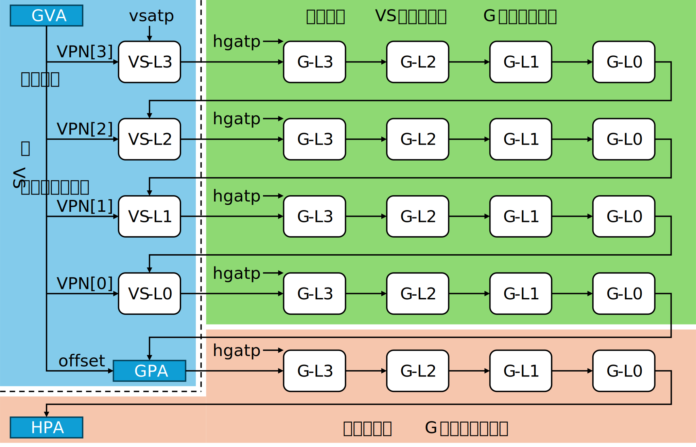
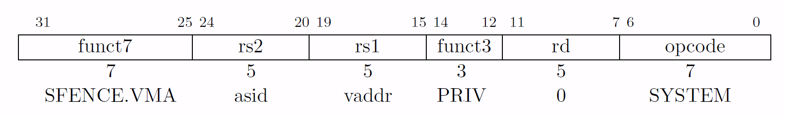
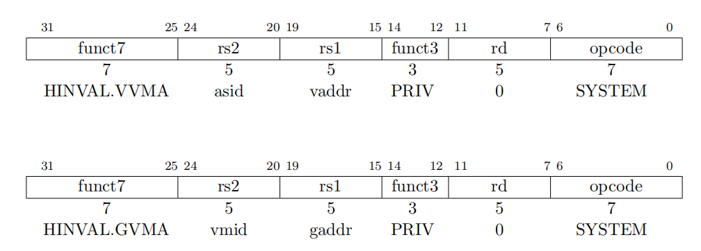
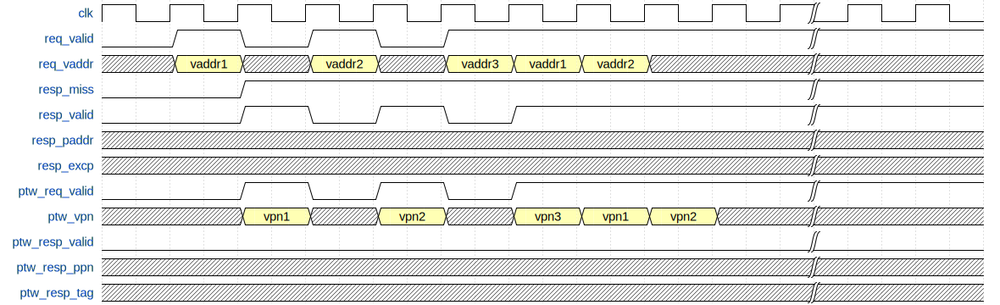

# 内存管理单元概述

## 术语说明

Table: 内存管理单元术语说明 {#tbl:MMUTerm}

| 缩写     | 全称                                                   | 描述                                     |
| -------- | ------------------------------------------------------ | ---------------------------------------- |
| MMU      | Memory Management Unit                                 | 内存管理单元                             |
| TLB      | Translation Lookaside Buffer                           | 页表的缓存                               |
| ITLB     | Instruction TLB                                        | 指令页表缓存                             |
| DTLB     | Data TLB                                               | 数据页表缓存                             |
| L1 TLB   | Level 1 TLB                                            | 一级 TLB                                 |
| L2 TLB   | Level 2 TLB                                            | 二级 TLB                                 |
| SV39     | Page-Based 39-bit Virtual-Memory System                | RISC-V 手册中规定的一种分页机制          |
| PGD      | Page Global Directory                                  | 页全局目录                               |
| PMD      | Page Mid-level Directory                               | 页中间目录                               |
| PTE      | Page Table Entry                                       | 页表项                                   |
| PTW      | Page Table Walk                                        | 页表查询过程                             |
| PMP      | Physical Memory Protection                             | 物理内存保护                             |
| PMA      | Physical Memory Attributes                             | 物理地址属性                             |
| ASID     | Address Space IDentifier                               | 地址空间标识符                           |
| CSR      | Control and Status Register                            | 控制和状态寄存器                         |
| VPN      | Virtual Page Number                                    | 虚拟页号                                 |
| PPN      | Physical Page Number                                   | 物理页号                                 |
| PLRU     | Pseudo-Least Recently Used                             | 一种近似最近最少使用的算法               |
| VMID     | Virtual Machine Identifier                             | 虚拟机号                                 |
| GVPN     | Guest Virtual Page Number                              | 第二阶段翻译的虚拟页号（客户机物理地址） |
| VS-Stage | Virtual Superior Stage                                 | 第一阶段翻译                             |
| G-Stage  | Guest Stage                                            | 第二阶段翻译                             |
| SV39x4   | A Variation on Page-Based 39-bit Virtual-Memory System | 地址扩大两位的 SV39，根页表此时为 16KB  |
| HPTW     | Hypervisor Page Table Walker                           | 负责第二阶段翻译的页表查询               |
| GPA      | Guest Physical Address                                 | 客户机物理地址                           |

## 设计规格

MMU 模块的整体设计规格如下：

1. 支持将虚拟地址转换为物理地址
2. 支持 Sv39 分页机制
3. 支持访问内存中的页表
4. 支持动态、静态 PMP 检查
5. 支持动态、静态 PMA 检查
6. 支持 asid
7. 支持 Sfence.vma
8. 支持软件更新 A/D 位
9. 支持 H 拓展的两阶段地址翻译
10. 支持 Sv39x4 分页机制
11. 支持 vmid
12. 支持 hfence.vvma 和 hfence.gvma

## 功能描述

香山的 MMU 模块由 L1 TLB，Repeater，L2 TLB，PMP 和 PMA 模块组成，其中 L2TLB 模块又分为 Page Cache、Page Table Walker、Last Level Page Table Walker、Miss Queue 和 Prefetcher 五部分。在核内进行内存读写，包括前端取指和后端访存之前，都需要由 MMU 模块进行地址翻译。前端取指和后端访存分别通过 ITLB 和 DTLB 进行地址翻译，均为非阻塞式访问，TLB 需要返回请求是否 miss，返回给请求来源，并由请求来源调度重新发送 TLB 查询请求，直至命中。对于 miss 的 Load 请求，昆明湖架构支持 TLB Hint，即当 L2 TLB refill 页表至 L1 TLB 时，可以精准唤醒因该虚拟地址 TLB miss 而导致阻塞的 Load 指令。当 L1 TLB（ITLB 和 DTLB）发生 miss 时，会访问 L2 TLB。如果 L2 TLB 依然 miss，则会通过 Page Table Walker 访问内存中的页表。

Repeater 是 L1 TLB 到 L2 TLB 的请求缓冲，在 L1 TLB 和 L2 TLB 之间存在较长的物理距离，需要通过 Repeater 在中间加拍。由于 ITLB 和 DTLB 均支持多个 outstanding 的请求，因此 repeater 会同时承担类似 MSHR 的功能，并过滤重复请求。MMU 模块支持对物理地址访问进行权限检查，分为 PMP 和 PMA 两部分。PMP 和 PMA 检查并行查询，违反任一权限即为非法操作。对核内所有的物理地址访问都需要进行物理地址权限检查，包括在 ITLB 和 DTLB 检查之后，以及 Page Table Walker 访存之前。

增加 H 拓展后，L2TLB 内新增了 Hypervisor Page Table Walker 模块，主要负责第二阶段的翻译，并且对 L2TLB 的架构进行了部分修改。

### 支持 Sv39 分页机制，将虚拟地址翻译成物理地址 {#sec:MMU-Support-Sv39}

为了实现进程隔离，每个进程都会有自己的地址空间，使用的地址都是虚拟地址。MMU 负责将虚拟地址翻译成物理地址，并用翻译得到的物理地址进行访存。香山处理器昆明湖架构支持 Sv39 分页机制（参见 RISC-V 特权级手册），虚拟地址长度为 39 位，低 12 位是页内偏移，高 27 位分为三段（每段 9 位），也就是三级页表。昆明湖架构的物理地址为 36 位，虚拟地址和物理地址的结构如 [@fig:Sv39Vaddr; @fig:Sv39Paddr] 所示。遍历页表需要进行三次内存访问，因此我们需要通过 TLB 对页表做缓存。

{#fig:Sv39Vaddr}

{#fig:Sv39Paddr}

在进行地址翻译时，前端取指通过 ITLB 进行地址翻译，后端访存通过 DTLB 进行地址翻译。ITLB 和 DTLB 如果 miss，会通过 Repeater 向 L2 TLB 发送请求。在目前设计中，前端取指和后端访存对 TLB 均采用非阻塞式访问，即一个请求 miss 后，会将请求 miss 的信息返回，请求来源调度重新发送 TLB 查询请求，直至命中。

同时，访存拥有 2 个 Load 流水线，2 个 Store 流水线，以及 SMS 预取器、L1 Load stream & stride 预取器。为应对众多请求，两条 Load 流水线及 L1 Load stream & stride 预取器使用 Load DTLB，两条 Store 流水线使用 Store DTLB，预取请求使用 Prefetch DTLB，共 3 个 DTLB。

为避免 TLB 中出现重复项，ITLB repeater 和 DTLB repeater 分别接受来自 ITLB 和 DTLB 的请求，需要过滤掉重复的请求后才能继续发往 L2 TLB。如果 L2 TLB 发生 miss，会使用 Hardware Page Table Walker 访问内存中的页表内容。得到页表内容后，返还给 Repeater，并最终返还给 ITLB 和 DTLB。（参见 4.1 节的相应描述）

### 支持两阶段地址翻译

H 拓展加入后，在非虚拟化模式且未执行虚拟化访存指令下，地址翻译过程与未加入 H 拓展基本一致；在虚拟化模式下或者执行虚拟化访存指令时，则根据 vsatp 和 hgatp 来判断是否开启两阶段的翻译，即为 VS-stage 和 G-stage，VS-stage 负责将客户机虚拟地址转换成客户机物理地址，G-stage 负责将客户机的物理地址转换成主机的物理地址。第一阶段的翻译和非虚拟化的翻译过程基本一致，第二阶段的翻译在 PTW 与 LLPTW 模块中进行，查询逻辑为：首先在 Page Cache 中查找，如果找到则返回给 PTW 或者 LLPTW，如果没找到就进入 HPTW 进行翻译，由 HPTW 返回并填入 Page Cache。

在 G-stage 中，分页机制叫做 Sv39x4，即该模式下的虚拟地址为 41 位，根页表变成 16KB。

在两阶段地址翻译中，第一阶段翻译得到的地址（包括翻译过程中计算得到的页表地址）均为客户机的物理地址，需要进行第二阶段翻译得到真实的物理地址后才能进行访存读取页表。逻辑上的翻译过程如下图所示。

### 支持访问内存中的页表内容

在 L1 TLB 向 L2 TLB 发送请求时，将首先访问 Page Cache。对于非两阶段翻译的请求，若命中叶子节点则直接返回给 L1 TLB，否则根据 Page Cache 命中的页表等级以及 Page Table Walker 和 Last Level Page Table Walker 的空闲情况进入 Page Table Walker、Last Level Page Table Walker 或 Miss Queue（参见 5.3 节）。对于两阶段地址翻译的请求，由于 Page Cache 每次只能处理一个查询请求，所以两阶段地址翻译请求在 Page Cache 中首先会查询第一阶段的页表，第一阶段命中则会把请求发给 Page Table Walker，在 Page Table Walker 中进行第二阶段的翻译；如果第一阶段没有命中，则会根据命中的页表级别，发送给 Page Table Walker 或者 Last Level Page Table Walker，在这两个模块中会进行第二阶段的翻译。Page Table Walker 和 Last Level Page Table Walker 发送的第二阶段地址翻译的请求会先发送到 Page Cache 里面进行查询，如果命中，则 Page Cache 直接返回结果给对应的模块，如果没有命中，则发送给 Hypervisor Page Table Walker 进行翻译，翻译结果会直接返回给 Page Table Walker 或者 Last Level Page Table Walker。Page Table Walker 同时只能够处理一个请求，进行 Hardware Page Table Walk，Page Table Walker 可以访问内存中前两级页表的内容，不访问 4KB 页表。如果 Page Table Walker 访问到 2MB 或 1GB 的叶子节点，或访问发生 Page fault 或 Access fault，则返回给 L1 TLB，否则送往 Last Level Page Table Walker 访问内存中的最后一级（4KB）页表。Hypervisor Page Table Walker 每次只能处理一个请求，所以在 Last Level Page Table Walker 中第二阶段翻译的请求是串行发送出去的。Hypervisor Page Table Walker 访问可能触发 Page fault 或者 Access fault，会返回给 PTW 或者 LLPTW，PTW 或者 LLPTW 会返回给 L1TLB。

Page Table Walker 和 Last Level Page Table Walker 以及新加的 Hypervisor Page Table Walker 均可以向内存发送请求，访问内存中的页表内容。在通过物理地址访问内存中的页表内容之前，需要通过 PMP 和 PMA 模块对物理地址进行检查（参见 3.2.3 和 5.4 节），如果发生 access fault 则不会向内存发送请求。来自 Page Table Walker、Last Level Page Table Walker、Hypervisor Page Table Walker 的请求在经过仲裁后，通过 TileLink 总线向 L2 Cache 发送请求。L2 Cache 的访存宽度为 512 bits，因此每次会返回 8 项页表。

昆明湖的 MMU 实现了页表压缩机制，会对连续的页表项进行压缩。具体地，对于虚拟页号高位相同的页表项，当这些页表项的物理页号高位和页表属性也相同时，可以将这些页表项压缩为一项保存，从而提升 TLB 的有效容量。因此，L2 TLB 命中 4KB 页时，会返回至多 8 项连续的页表项（参见 5.2 节 L2 TLB 中的相应描述）。在 H 拓展中，L1TLB 中与虚拟化拓展有关的页表压缩机制被无效掉，视为一个页表；L2TLB 中的与虚拟化拓展有关的页表仍然采用页表压缩机制。

### 支持对物理地址访问进行权限检查

香山支持 PMP 和 PMA 检查，PMP 和 PMA 检查并行查询，如果违反其中一个权限，即为非法操作。PMP 和 PMA 的具体实现分为 CSR Unit、Frontend、Memblock、L2 TLB 四部分。昆明湖架构中 PMP 和 PMA 均为 16 项，关于 PMP 和 PMA 寄存器的地址空间以及配置寄存器的说明，参见 5.4 节。

CSR Unit 负责响应 CSRRW 等 CSR 指令对这些 PMP 和 PMA 寄存器的读写；在 Frontend、Memblock 和 L2 TLB 中包含这些 PMP 和 PMA 寄存器的备份，负责地址检查，通过拉取 CSR 的写信号可以保证这些寄存器的内容一致性。由于 L1 TLB 的面积较小，因此 PMP 和 PMA 寄存器的备份存储在 Frontend 或 Memblock 中，分别为 ITLB 和 DTLB 提供检查。L2 TLB 的面积较大，因此 PMP 和 PMA 寄存器的备份直接存储在 L2 TLB 中。

在 ITLB 和 DTLB 查询得到结果之后，以及 L2 TLB 中使用物理地址访存之前都需要进行 PMP 和 PMA 检查。按照手册规定，PMP 和 PMA 的检查应该为动态检查，即需要经过 TLB 翻译之后，使用翻译后的物理地址进行物理地址权限检查。出于时序考虑，DTLB 的 PMP & PMA 检查结果可以提前查询好，在回填时存入 TLB 项中，此为静态检查。具体地，当 L2 TLB 的页表项回填入 DTLB 时，同时将回填的页表项送给 PMP 和 PMA 进行权限检查，将检查得到的属性位（包括 R、W、X、C、Atomic，这些属性位的具体含义参见 5.4 节）同时存储在 DTLB 中，这样可以直接将这些检查结果返回给 MemBlock，无需再次检查。为实现静态检查，需要提升 PMP 和 PMA 的粒度为 4KB。

需要注意的是，目前 PMP & PMA 检查暂时并非昆明湖的时序瓶颈，因此未采用静态检查，全部使用动态检查的方式，即 TLB 查询得到物理地址后，再进行检查。昆明湖 V1 的代码中不包括静态检查，只包括动态检查，请再次注意。但出于兼容性，PMP 和 PMA 的粒度依然保持为 4KB。

### 支持内存管理栅栏指令指令

{{processor_name}} 支持 SFENCE.VMA、HFENCE.VVMA、HFENCE.GVMA 等内存管理栅栏指令。

当 Sfence.vma 指令执行时，会先将 Store Buffer 的全部内容写回到 DCache 中，之后发出刷新信号到 MMU 的各个部分。刷新信号是单向的，只会持续一拍，没有返回信号。Sfence.vma 指令最后会刷新整个流水线，从取指开始重新执行。Sfence.vma 指令会取消所有 inflight 的请求，包括 Repeater 和 Filter，以及 L1TLB 和 L2 TLB 中的 inflight 请求，并且根据地址和 ASID 刷新 L1 TLB 和 L2 TLB 中缓存的页表。Sfence.vma 指令的参数如图所示。

另外，香山昆明湖架构支持 Svinval 扩展，Svinval.vma 指令的格式如图 3.6 所示，其中 rs1 和 rs2 的含义和 Sfence.vma 指令相同。昆明湖架构中 TLB 内部实现 Svinval.vma 指令和 Sfence.vma 指令的逻辑完全一致，TLB 只接受传入的 sfence_valid 信号以及相应的 rs1、rs2 参数。

Hfence 指令包括 Hfence.vvma 和 Hfence.gvma，该类型指令的执行效果与 Sfence.vma 类似，先将 Store Buffer 的全部内容写回到 DCache 中，之后发出刷新信号到 MMU 的各个部分。刷新信号是单向的，只会持续一拍，没有返回信号。指令最后会刷新整个流水线，从取指开始重新执行。指令会取消所有 inflight 的请求，包括 Repeater 和 Filter，以及 L1TLB 和 L2 TLB 中的 inflight 请求，Hfence.vvma 会根据地址和 ASID 与 VMID 来刷新 L1TLB 和 L2TLB 中与 VSATP 有关的页表，Hfence.gvma 会根据地址与 VMID 来刷新 L1TLB 和 L2TLB 中与 HGATP 有关的页表。

另外，由于昆明湖架构支持 Svinval 扩展，对应有 hinval.vvma 和 hinval.gvma 指令，这两条指令分别与 hfence 的两条指令对应。

### 支持 ASID 和 VMID

香山昆明湖架构支持长度为 16 的 ASID（地址空间标识符），在 SATP 寄存器中保存。SATP 寄存器的格式如表 3.1 所示。

Table: SATP 寄存器的格式

| **位** | **域** | **描述** |
|:-----------:|:-----------:|:---------------------------------------------|
| \[63:60\] | MODE | 表示地址转换的模式。该域为 0 时为 Bare mode，不开启地址翻译或地址保护，该域为 8 时表示 Sv39 地址转换模式，如果该域为其他值会上报 illegal instruction fault |
| \[59:44\] | ASID | 地址空间标识符。ASID 的长度可参数化配置，对于香山昆明湖架构采用的 Sv39 地址转换模式，ASID 长度最大值为 16 |
| \[43:0\] | PPN | 表示根页表的物理页号，由物理地址右移 12 位得到。 |

注意，在虚拟化模式下，SATP 将被 VSATP 寄存器代替，并且其中的 PPN 为客户机根页表的客户机物理页号，而非真实的物理地址，需要进行第二阶段翻译才能得到真实物理地址。

香山昆明湖架构支持长度为 14 的 VMID（虚拟机标识符），在 HGATP 寄存器中保存，HGATP 寄存器格式如表所示。

Table: HGATP 寄存器的格式

| **位** | **域** | **描述** |
|:-----------:|:-----------:|:---------------------------------------------:|
| \[63:60\] | MODE | 表示地址转换的模式。该域为 0 时为 Bare mode，不开启地址翻译或地址保护，该域为 8 时表示 Sv39x4 地址转换模式，如果该域为其他值会上报 illegal instruction fault |
| \[57:44\] | VMID | 虚拟机标识符。对于香山昆明湖架构采用的 Sv39x4 地址转换模式，VMID 长度最大值为 14 |
| \[43:0\] | PPN | 表示第二阶段翻译的根页表的物理页号，由物理地址右移 12 位得到。 |

### 支持软件更新 A/D 位

香山支持软件对页表中 A/D 位的管理。A 位表示自上次清空 A 位以来，对该页进行过读，写或取指操作。D 位表示自上次清空 D 位以来，对该页进行过写操作。手册中允许通过软件和硬件两种方式更新 A/D 位，香山选择软件方式，即当发现如下两种情况时通过报 page fault，通过软件更新页表。

* 访问某页，但该页页表的 A 位是 0
* 写入某页，但该页页表的 D 位是 0

需要注意，目前香山昆明湖架构并不支持硬件更新 A/D 位。

### 支持异常处理机制

当 PMP、PMA 检查报 access fault，或出现 page fault、guest page fault 等情况时，TLB 模块会根据 PTW 请求的来源，ITLB 向 Frontend 返回异常，DTLB 向 Memblock 返回异常。TLB 模块可能向 Frontend 和 Memblock 返回的异常种类如表 3.3 所示，其中 Memblock 又可以细化分为 LoadUnit，AtomicsUnit 和 StoreUnit。TLB 模块只负责向 Frontend 或 Memblock 返回 access fault 或 page fault 或 guest page fault，后续由 Frontend 或 Memblock 进行处理。关于异常处理的总结和说明，参见本文档第 6 部分：异常处理机制。

Table: TLB 返回的异常种类

| **种类**  |        **目的**        |            **描述**            |
|:---------:|:----------------------:|:------------------------------:|
| pf_instr  |        Frontend        |    表示发生 inst page fault     |
| af_instr  |        Frontend        |   表示发生 inst access fault    |
| gpf_instr |        Frontend        | 表示发生 inst guest page fault  |
|   pf_ld   | LoadUnit 或 AtomicsUnit  |    表示发生 load page fault     |
|   af_ld   | LoadUnit 或 AtomicsUnit  |   表示发生 load access fault    |
|  gpf_ld   | LoadUnit 或 AtomicsUnit  | 表示发生 load guest page fault  |
|   pf_st   | StoreUnit 或 AtomicsUnit |    表示发生 store page fault    |
|   af_st   | StoreUnit 或 AtomicsUnit |   表示发生 store access fault   |
|  gpf_st   | StoreUnit 或 AtomicsUnit | 表示发生 store guest page fault |

# 异常处理机制

MMU 模块可能产生的异常包括：guest page fault、page fault、access fault、以及 L2 TLB Page Cache 的 ECC 校验出错。ITLB、DTLB 与 L2 TLB 均可能产生 guest page fault、page fault 和 access fault。对于 ITLB 和 DTLB 产生的异常，会根据请求来源分别交付给发送物理地址查询的模块进行处理，ITLB 会交付给 Icache 或 IFU；DTLB 会交付给 LoadUnits、StoreUnits 或 AtomicsUnit 进行处理。

如果 L2 TLB 产生 guest page fault、page fault 或 access fault，L2 TLB 并不会直接将产生的异常进行处理，而是会将该信息返回给 L1 TLB。L1 TLB 在查询发现出现 guest page fault、page fault 或 access fault 后，会根据请求的 cmd，产生不同种类的异常，并根据请求来源交付给各模块处理。

L2 TLB 中 Page Cache 支持 ecc 校验，如果 ecc 检查报错，并不会报例外，而是会向 L2 TLB 发送该请求 miss 信号。同时 Page Cache 将 ecc 报错的项刷新，重新发送 PTW 请求，进行 Page Walk。

也就是说，MMU 模块只会处理 L2 TLB 中 Page Cache 的 ECC 校验出错异常，对于产生的 page fault 和 access fault，均交付给前端或后端流水线进行处理。

可能产生的异常以及 MMU 模块的处理流程如表 6.1 所示：

Table: MMU 可能产生的异常以及处理流程

| **模块** | **可能产生的异常** | **处理流程** |
|:-------------------:|:-----------------------:|:-------------------------:|
| ITLB |  |  |
|  | 产生 inst page fault | 根据请求来源，分别交付给 Icache 或 IFU 处理 |
|  | 产生 inst guest page fault | 根据请求来源，分别交付给 Icache 或 IFU 处理 |
|  | 产生 inst access fault | 根据请求来源，分别交付给 Icache 或 IFU 处理 |
| DTLB |  |  |
|  | 产生 load page fault | 交付给 LoadUnits 进行处理 |
|  | 产生 load guest page fault | 交付给 LoadUnits 进行处理 |
|  | 产生 store page fault | 根据请求来源，分别交付给 StoreUnits 或 AtomicsUnit 处理 |
|  | 产生 store guest page fault | 根据请求来源，分别交付给 StoreUnits 或 AtomicsUnit 处理 |
|  | 产生 load access fault | 交付给 LoadUnits 进行处理 |
|  | 产生 store access fault | 根据请求来源，分别交付给 StoreUnits 或 AtomicsUnit 处理 |
| L2 TLB |  |  |
|  | 产生 guest page fault | 交付给 L1 TLB，L1 TLB 根据请求来源交付处理 |
|  | 产生 page fault | 交付给 L1 TLB，L1 TLB 根据请求来源交付处理 |
|  | 产生 access fault | 交付给 L1 TLB，L1 TLB 根据请求来源交付处理 |
|  | ecc 校验出错 | 无效掉当前项，返回 miss 结果并重新进行 Page Walk |

## 整体设计

MMU 整体架构如图所示。

ITLB 接收来自 Frontend 的 PTW 请求，DTLB 接收来自 Memblock 的 PTW 请求。来自 Frontend 的 PTW 请求包括 ICache 的 3 个请求和 IFU 的 1 个请求，来自 Memblock 的 PTW 请求包括 LoadUnit 的 2 个请求（AtomicsUnit 占用 LoadUnit 的 1 个请求通道），L1 Load stream & stride 预取器的 1 个请求，StoreUnit 的 2 个请求，以及 SMSPrefetcher 的 1 个请求。ITLB、DTLB 通过 Repeater 与 L2 TLB 连接，均为非阻塞式访问。这些 Repeater 在加拍功能的基础上，增加了过滤重复请求的功能，可以过滤掉 L1 TLB 向 L2 TLB 发送的重复请求，避免 L1 TLB 中出现重复项。

ITLB 的请求和 DTLB 的请求经过仲裁（Arbiter 2to1），将首先访问 Page Cache，若是非两阶段地址翻译的请求，命中叶子节点则直接返回给 L1 TLB，没有命中则根据 Page Cache 命中的页表等级以及 Page Table Walker 和 Last Level Page Table Walker 的空闲情况进入 Page Table Walker、Last Level Page Table Walker 或 Miss Queue（参见 5.3 节）。对于来自 Miss Queue、Prefetcher 的请求，会通过仲裁器（Arbiter 3to1）与来自 L1 TLB 的请求一起做仲裁，并重新访问 Page Cache。另一种情况，Page Cache 收到的是两阶段地址翻译请求，对于两阶段翻译均启用的情况，若第一阶段页表命中，则发送给 PTW 进行第二阶段翻译，其他情况根据第一阶段页表命中的级别和 PTW 以及 LLPTW 的空闲情况发送给 PTW、LLPTW、Miss Queue；对于只有第一阶段翻译的情况，则类似非两阶段地址翻译请求的处理，根据命中等级和 PTW 以及 LLPTW 的空闲情况发送给 PTW、LLPTW、Miss Queue；对于只有第二阶段翻译的情况，如果查询到则返回给 L1TLB，否则发送给 PTW 进行第二阶段翻译。此外，Page Cache 还会收到 isHptwReq 有效的请求，代表该请求是一个进行第二阶段翻译的请求，该类型请求若在 Page Cache 中命中，则会发送给 hptw_resp_arb，若没有命中，则发送给 HPTW 进行查询，HPTW 会将查询结果发送给 hptw_resp_arb。

Page Table Walker 和 Last Level Page Table Walker 均可以进行第二阶段的地址翻译，在 PTW 和 LLPTW 中，如果是一个两阶段地址翻译请求，在 PTW 或者 LLPTW 每次从 PTE 中得到的地址均为客户机物理地址，在访存前均要进行一次第二阶段地址翻译，获得真实的物理地址，参见 PTW 和 LLPTW 模块介绍。

Page Table Walker 和 Last Level Page Table Walker 均可以向内存发送请求，访问内存中的页表内容。在通过物理地址访问内存中的页表内容之前，需要通过 PMP 和 PMA 模块对物理地址进行检查，如果出现 access fault 则不会向内存发送请求。来自 Page Table Walker 和 Last Level Page Table Walker 的请求在经过仲裁后（Memory Arbiter 2to1），通过 TileLink 总线向 L2 Cache 发送请求。L2 TLB 除了需要向 L2 Cache 发送物理地址外，还需要通过 id 表示请求的来源。L2 Cache 的访存宽度为 512 bits，因此每次会返回 8 项页表。每次访存返回的页表都会重填进 Page Cache。

在 ITLB 和 DTLB 查询得到结果之后，以及 L2 TLB 进行 Page Table Walker 之前都需要进行 PMP 和 PMA 检查。L1 TLB 的面积较小，因此 PMP 和 PMA 寄存器的备份并不存储在 L1 TLB 内部，而是存储在 Frontend 或 Memblock 中，分别为 ITLB 和 DTLB 提供检查。L2 TLB 的面积较大，PMP 和 PMA 寄存器的备份直接存储在 L2 TLB 中。

## 接口列表

MMU 模块的各部分与上层模块接口列表如下表：

Table: MMU IO 接口列表

| **上层模块** | **模块名** | **实例化名** | **说明** |
|:-----------:|:------------------:|:---------------:|:--------------------:|
| Frontend |  |  |  |
|  | TLB | itlb | ITLB，在 5.1 节介绍 |
|  | PMP | pmp | 分布式 PMP 寄存器，在 5.4 节介绍 |
|  | PMPChecker | PMPChecker | PMP 检查器，在 5.4 节介绍 |
|  | PMPChecker | PMPChecker_1 | PMP 检查器，在 5.4 节介绍 |
|  | PMPChecker | PMPChecker_2 | PMP 检查器，在 5.4 节介绍 |
|  | PMPChecker | PMPChecker_3 | PMP 检查器，在 5.4 节介绍 |
|  | PTWFilter | itlbRepeater1 | ITLB 和 L2 TLB 连接的 Repeater1，在 5.2 节介绍 |
|  | PTWRepeaterNB | itlbRepeater2 | ITLB 和 L2 TLB 连接的 Repeater2，在 5.2 节介绍 |
| MemBlock |  |  |  |
|  | TLBNonBlock | dtlb_ld_tlb_ld | Load DTLB，在 5.1 节介绍 |
|  | TLBNonBlock_1 | dtlb_ld_tlb_st | Store DTLB，在 5.1 节介绍 |
|  | TLBNonBlock_2 | dtlb_prefetch_tlb_prefetch | Prefetch DTLB，在 5.1 节介绍 |
|  | PTWNewFilter | dtlbRepeater | DTLB 和 L2 TLB 连接的 Repeater1，在 5.2 节介绍 |
|  | PTWRepeaterNB | itlbRepeater3 | ITLB 和 L2 TLB 连接的 Repeater3，在 5.2 节介绍 |
|  | PMP_2 | pmp | 分布式 PMP 寄存器，在 5.4 节介绍 |
|  | PMPChecker_8 | PMPChecker | PMP 检查器，在 5.4 节介绍 |
|  | PMPChecker_8 | PMPChecker_1 | PMP 检查器，在 5.4 节介绍 |
|  | PMPChecker_8 | PMPChecker_2 | PMP 检查器，在 5.4 节介绍 |
|  | PMPChecker_8 | PMPChecker_3 | PMP 检查器，在 5.4 节介绍 |
|  | PMPChecker_8 | PMPChecker_4 | PMP 检查器，在 5.4 节介绍 |
|  | PMPChecker_8 | PMPChecker_5 | PMP 检查器，在 5.4 节介绍 |
|  | L2TLBWrapper | ptw | L2 TLB，在 5.3 节介绍 |
|  | TLBuffer_20 | ptw_to_l2_buffer | L2 TLB 和 L2 Cache 之间的 buffer，在 5.3 节介绍 |

L2 TLB 模块的各部分与 L2 TLB 的接口列表如下：

Table: L2 TLB IO 接口列表

| **上层模块** | **模块名** | **实例化名** | **说明** |
|:-------------:|:------------------:|:---------------:|:--------------------:|
| L2TLBWrapper |  |  |  |
|  | L2TLB | ptw | L2 TLB，在 5.3 节介绍 |
| L2TLB |  |  |  |
|  | PMP | pmp | 分布式 PMP 寄存器，在 5.4 节介绍 |
|  | PMPChecker | PMPChecker | PMP 检查器，在 5.4 节介绍 |
|  | PMPChecker | PMPChecker_1 | PMP 检查器，在 5.4 节介绍 |
|  | L2TlbMissQueue | missQueue | L2 TLB Miss Queue，在 5.3.11 节介绍 |
|  | PtwCache | cache | L2 TLB Page Table Cache，在 5.3.7 节介绍 |
|  | PTW | ptw | L2 TLB Page Table Walker，在 5.3.8 节介绍 |
|  | LLPTW | llptw | L2 TLB Last Level Page Table Walker，在 5.3.9 节介绍 |
|  | HPTW | hptw | L2 TLB Hypervisor Page Table Walker，在 5.3.10 节介绍 |
|  | L2TlbPrefetch | prefetch | L2 TLB Prefetcher，在 5.3.12 节介绍 |

详见接口列表文档。另外涉及到某些仲裁器，在接口列表中省略。

## 接口时序

MMU 整体和外界的接口涉及 L1 TLB 与 Frontend、Memblock 的接口，以及 L2 TLB 与内存（L2 Cache）之间的接口。

### ITLB 与 Frontend 的接口时序

#### Frontend 向 ITLB 发送的 PTW 请求命中 ITLB

Frontend 向 ITLB 发送的 PTW 请求在 ITLB 命中时，时序图如图 4.2 所示。

当 Frontend 向 ITLB 发送的 PTW 请求在 ITLB 命中时，resp_miss 信号保持为 0。req_valid 为 1 后的下一个时钟上升沿，ITLB 会将 resp_valid 信号置 1，同时向 Frontend 返回虚拟地址转换后的物理地址，以及是否发生 page fault 和 access fault 等信息。时序描述如下：

* 第 0 拍：Frontend 向 ITLB 发送 PTW 请求，req_valid 置 1。
* 第 1 拍：ITLB 向 Frontend 返回物理地址，resp_valid 置 1。

#### Frontend 向 ITLB 发送的 PTW 请求未命中 ITLB

Frontend 向 ITLB 发送的 PTW 请求在 ITLB 未命中时，时序图如图 4.3 所示。

当 Frontend 向 ITLB 发送的 PTW 请求在 ITLB 中未命中时，下一拍会向 ITLB 返回 resp_miss 信号，表示 ITLB 未命中。此时 ITLB 的该条 requestor 通道不再接收新的 PTW 请求，由 Frontend 重复发送该请求，直至查询得到 L2 TLB 或内存中的页表并返回。（请注意，"ITLB 的该条 requestor 通道不再接收新的 PTW 请求"由 Frontend 控制，也就是说，无论 Frontend 选择不重发 miss 的请求，或重发其他请求，Frontend 的行为对 TLB 来说是透明的。如果 Frontend 选择发送新请求，ITLB 会将旧请求直接丢失掉。）

当 Frontend 向 ITLB 发送的 PTW 请求在 ITLB 中未命中时，下一拍会向 ITLB 返回 resp_miss 信号，表示 ITLB 未命中。此时 ITLB 的该条 requestor 通道不再接收新的 PTW 请求，由 Frontend 重复发送该请求，直至查询得到 L2 TLB 或内存中的页表并返回。（请注意，"ITLB 的该条 requestor 通道不再接收新的 PTW 请求"由 Frontend 控制，也就是说，无论 Frontend 选择不重发 miss 的请求，或重发其他请求，Frontend 的行为对 TLB 来说是透明的。如果 Frontend 选择发送新请求，ITLB 会将旧请求直接丢失掉。）

当 ITLB 未命中时，会向 L2 TLB 发送 PTW 请求，直至查询得到结果。ITLB 与 L2 TLB 的时序交互，以及向 Frontend 返回的物理地址等信息参见图 4.4 的时序图以及如下的时序描述：

* 第 0 拍：Frontend 向 ITLB 发送 PTW 请求，req_valid 置 1。
* 第 1 拍：ITLB 查询得到 miss，向 Frontend 返回 resp_miss 为 1，resp_valid 置 1。同时，在当拍 ITLB 向 L2 TLB（事实上为 itlbrepeater1）发送 PTW 请求，ptw_req_valid 置 1。
* 第 X 拍：L2 TLB 向 ITLB 返回 PTW 回复，包括 PTW 请求的虚拟页号、得到的物理页号、页表信息等，ptw_resp_valid 为 1。在该拍 ITLB 已经收到 L2 TLB 的 PTW 回复，ptw_req_valid 置 0。
* 第 X+1 拍：ITLB 此时命中，resp_valid 为 1，resp_miss 为 0。ITLB 向 Frontend 返回物理地址以及是否发生 access fault、page fault 等信息。
* 第 X+2 拍：ITLB 向 Frontend 返回的 resp_valid 信号置 0。

### DTLB 与 Memblock 的接口时序

#### Memblock 向 DTLB 发送的 PTW 请求命中 DTLB

Memblock 向 DTLB 发送的 PTW 请求在 DTLB 命中时，时序图如图 5.1.9 所示。

当 Memblock 向 DTLB 发送的 PTW 请求在 DTLB 命中时，resp_miss 信号保持为 0。req_valid 为 1 后的下一个时钟上升沿，DTLB 会将 resp_valid 信号置 1，同时向 Memblock 返回虚拟地址转换后的物理地址，以及是否发生 page fault 和 access fault 等信息。时序描述如下：

* 第 0 拍：Memblock 向 DTLB 发送 PTW 请求，req_valid 置 1。
* 第 1 拍：DTLB 向 Memblock 返回物理地址，resp_valid 置 1。

#### Memblock 向 DTLB 发送的 PTW 请求未命中 DTLB

DTLB 和 ITLB 相同，均为非阻塞式访问（即 TLB 内部并不包括阻塞逻辑，如果请求来源保持不变，即缺失后持续重发同一条请求，则呈现出类似阻塞式访问的效果；如果请求来源在收到缺失的反馈后，调度其他不同请求查询 TLB，则呈现出类似非阻塞式访问的效果）。和前端取指不同，当 Memblock 向 DTLB 发送的 PTW 请求未命中 DTLB，并不会阻塞流水线，DTLB 会在 req_valid 的下一拍向 Memblock 返回请求 miss 以及 resp_valid 的信号，在 Memblock 在收到 miss 信号后可以进行调度，继续查询其他请求。

在 Memblock 访问 DTLB 发生 miss 后，DTLB 会向 L2 TLB 发送 PTW 请求，查询来自 L2 TLB 或内存中的页表。DTLB 通过 Filter 向 L2 TLB 传递请求，Filter 可以合并 DTLB 向 L2 TLB 发送的重复请求，保证 DTLB 中不出现重复项并提高 L2 TLB 的利用率。Memblock 向 DTLB 发送的 PTW 请求未命中 DTLB 的时序图如图 5.1.10 所示，该图只描述了从请求 miss 到 DTLB 向 L2 TLB 发送 PTW 请求的过程。

在 DTLB 接收到 L2 TLB 的 PTW 回复后，将页表项存储在 DTLB 中。当 Memblock 再次访问 DTLB 时会发生 hit，情况与图 5.1.9 相同。DTLB 与 L2 TLB 交互的时序情况与图 5.1.8 的 ptw_req 和 ptw_resp 部分相同。

### L2 TLB 与 L2 Cache 的接口时序

L2 TLB 与 L2 Cache 的接口时序遵循 TileLink 总线协议。

