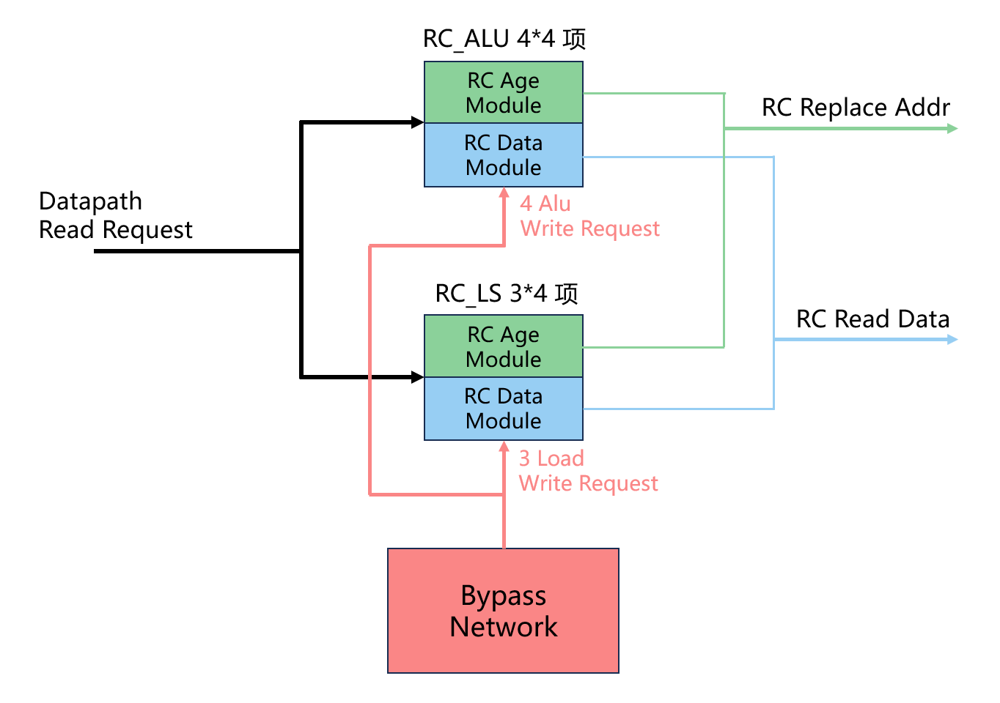

# DataPath

- 版本：V2R2
- 状态：OK
- 日期：2025/01/15
- commit：[xxx](https://github.com/OpenXiangShan/XiangShan/tree/xxx)

## 术语说明

Table: 术语说明

| 缩写  | 全称                        | 描述                      |
| ---- | --------------------------- | ------------------------- |
| og   | operand generation          | 源操作数生成阶段           |
| v0   | vector register #0          | 向量0号逻辑寄存器          |
| vl   | vector length csr register  | 向量长度 csr 寄存器          |
| rc/reg cache | register file cache | 寄存器堆缓存               |


## 总体设计

### 整体框图


### 子模块列表

Table: 子模块列表

| 子模块                | 描述                                                      |
| --------------------- | --------------------------------------------------------- |
| IntRFWBCollideChecker | 整数寄存器堆写口仲裁器                                      |
| FpRFWBCollideChecker  | 浮点寄存器堆写口仲裁器                                      |
| VfRFWBCollideChecker  | 向量通用寄存器堆写口仲裁器                                  |
| V0RFWBCollideChecker  | 向量 v0 寄存器堆写口仲裁器                                  |
| VlRFWBCollideChecker  | 整数 vl 寄存器堆写口仲裁器                                  |
| IntRFReadArbiter      | 整数寄存器堆读口仲裁器                                      |
| FpRFReadArbiter       | 浮点寄存器堆读口仲裁器                                      |
| VfRFReadArbiter       | 向量通用寄存器堆读口仲裁器                                  |
| V0RFReadArbiter       | 向量 v0 寄存器堆读口仲裁器                                  |
| VlRFReadArbiter       | 向量 vl 寄存器堆读口仲裁器                                  |
| IntRegFile            | 整数寄存器堆                                               |
| FpRegFile             | 浮点寄存器堆                                               |
| VfRegFile             | 向量通用寄存器堆                                           |
| V0RegFile             | 向量 v0 寄存器堆                                           |
| VlRegFile             | 向量 vl 寄存器堆                                           |
| RegCache              | 整数寄存器堆缓存                                           |

### 接口列表

见接口文档


## 功能

### 整体功能

数据通路在流水线中位于发射之后，进入执行单元之前。数据通路接收来自整数、浮点、向量、访存发射队列每个出口的指令，这些每个出口会与执行单元的 ExeUnit 一一对应。数据通路负责为每条指令读取寄存器堆，构造立即数，在进入 ExeUnit 前生成最终的操作数。数据通路里含有寄存器堆的实体，也负责寄存器堆的读写仲裁，以及数据读出和写入。目前数据通路还设置了整数寄存器堆的缓存，负责一部分整数数据的读出。

DataPath 模块是数据通路的核心部分，包含整个 OG0 流水级和 OG1 流水级的前半部分。在 OG0 流水级里，会进行指令间的读口端口仲裁，只有仲裁成功的指令才读取寄存器堆，进入 OG1 流水级；仲裁失败的指令会刷掉自身，向前级发出发射失败的回应信息，以及 og0 取消信号。在 OG1 流水级，指令拿到寄存器堆返回的数据，和其他状态信息一起发往后续模块。注意在 DataPath 里不会进行指令操作数的最终生成，只会拿到从寄存器堆，Reg Cache，PcTargetMem 里读出的备选数据，最终数据会在外部的 BypassNetwork 里生成。

### 读写仲裁

由于采用发射后读寄存器堆，发射到数据通路中的指令数量会远远超过寄存器堆的读口和写口数量，因此需要进行仲裁，只让读仲裁成功的指令去读寄存器。

每个寄存器堆都有一个读仲裁器，读仲裁器接收所有指令的每个操作数的 valid 和读地址 addr，分别返回一个 ready 作为仲裁是否成功的标记。只有当指令的操作数是对应的数据类型（整数、浮点、向量通用、v0、vl），并且数据来源为 reg 类型，才会将 valid 拉高，发起仲裁请求。如果某个操作数不需要读寄存器堆，对应的 valid 为0，此时 ready 总会返回1让其通过仲裁器。对于每条指令，只有其所有的操作数都仲裁通过，才被视为读仲裁成功。读仲裁器还会输出一组读请求，数量为寄存器堆的读口数量，内容为每个读口最后仲裁成功的读地址。这组读请求会被送到寄存器堆进行实际的数据读取。

每个寄存器堆都有一个写仲裁器，写仲裁器接收所有指令的每个操作数的 valid，分别返回一个 ready 作为仲裁是否成功的标记。只有当指令的目的寄存器数据类型匹配，并且需要写寄存器，才会将 valid 拉高，发起仲裁请求。与读仲裁类似，不发起请求的指令总会收到 ready=1 让其通过仲裁。

读写仲裁器内部的仲裁逻辑放在二级模块进行具体介绍。

### 读寄存器堆

每个寄存器堆的读仲裁器会输出一组读请求，数量为寄存器堆的读口数量，内容为每个读口最后仲裁成功的读地址。这些地址在 OG0 阶段被送往寄存器堆，发起读请求。在 OG1 阶段，相应数据从寄存器堆的读数据通道送出。各个指令的操作数根据自身的数据类型，和使用的读口编号，从寄存器堆的读数据里选出自己的数据。

### 读 Reg Cache

DataPath 内设置了 Reg Cache，可以缓存整数 ExeUnit 和 Load ExeUnit 最近写回的数据。Reg Cache 不需要进行读写仲裁，其端口数与需要读写的操作数数量一一对应。如果指令操作数的数据来源为 regcache 类型，将会向 Reg Cache 发起读请求。在 OG0 阶段，将 valid 信号和指令自身携带的 RC 地址信号传给 Reg Cache，在 OG1 阶段可以从对应的数据通道中拿到数据。

### 读 PC

部分指令需要读取 PC 作为源操作数，PC 存储在 DataPath 外部的 PcTargetMem 中。在 OG 阶段，DataPath 首先筛选出需要 PC 的指令，将其 ftq 信息通过 io.fromPcTargetMem 接口向外部发起读请求。在 OG1 阶段，外部通过该接口返回读到的 PC 信息。

### 写寄存器堆

执行单元的写回结果会由外部模块 WbDataPath 进行汇总，打包为写请求的格式发到 DataPath。DataPath 会接收到 io.fromIntWb、io.fromFpWb、io.fromVfWb、io.fromV0Wb、io.fromVlWb 五个接口传回的写回信息，每个都对应各自的寄存器堆。每个接口的通道数量为寄存器堆的写口数，内容为写使能、写地址、写数据。出于时序考虑，这些信号会在 DataPath 内部打一拍，然后直接送往寄存器堆写端口。

### 写 Reg Cache

Reg Cache 的写回数据不是来自执行单元，而且来自旁路网络中执行单元写回两拍之后的数据。Reg Cache 只接受整数 ExeUnit 和 Load ExeUnit 的数据，这些数据通过 io.fromBypassNetwork 接口传入，然后直接送往 Reg Cache。

### 处理 og0 cancel

在 OG0 阶段，指令会因为多种原因被取消，其中因为自身原因的取消被称为 og0 cancel。指令被判定为 og0 cancel 有两种情况，一种是自身读或者写寄存器堆仲裁失败，另一种是 og0 cancel 传递。DataPath 中会保存前一次 og0 cancel 的信息，这是一个与发射宽度相同的向量，每位代表对应指令是否发生了取消。如果某一指令为0执行延迟的指令，且发生了取消，那么就会在向量对应位置写1。下一拍的指令会将自身操作数的唤醒来源向量和取消信息的向量进行比较，如果发现来源指令上拍被取消了，说明现在自身也要被取消。

发生了 og0 cancel 的指令会把自己刷掉，不进入 OG1 阶段。除了发生 og0 cancel，发生重定向刷新或者 load cancel 的指令也会将自己刷掉，不加入 OG1 阶段。不过只有发生 og0 cancel 的指令才向外发出 og0 cancel 信号，该信号与前面提到的 DataPath 内部保存的 og0 cancel 信息相同，通过 io.og0Cancel 接口传到外部，用于取消指令的消费者指令。

### 向发射队列发出回应

DataPath 会向发射队列发出回应信息，告诉发射队列指令是否顺利发射到执行单元。在 OG 阶段，如果指令发生了 og0 cancel，指令发射失败，需要给发射队列回应 block 状态，告诉发射队列需要重新发射指令；如果顺利通过 OG0 阶段，则不发送回应信息。在 OG1 阶段，指令不会因为自身原因被取消，只需要看后级是否能接收指令。如果不能接收，指令无法进入执行单元，需要给发射队列回应 block 状态。如果可以被接收，对于标量计算指令，指令就一定能成功执行，此时就可以向发射队列回应 success 状态，告诉发射队列可以清空对应的队列项；对于向量计算指令，在进入执行单元前还有一个 OG2 阶段，此时还不能确定一定能执行，需要向发射队列回应 uncertain 状态，让发射队列先保持不变；对于访存指令，其进入访存执行单元后才能确定能否成功指令，因此清空队列项的回应由访存部分发出，这里只向发射队列回应 uncertain 状态。


## 模块设计

### 二级模块 RFWBCollideChecker

#### 功能

各个寄存器堆都有一个写口仲裁器，负责进行写口的仲裁。写口仲裁器会收集所有可以写该寄存器堆的指令的请求（valid 信号），然后分别返回是否仲裁成功的标记（ready 信号）。

在仲裁器内部，会按照端口号分为多个端口仲裁器。每个端口仲裁器会收集写该端口的指令请求，比如如果指令使用 i 号端口写回该堆，那么其请求会被发到第 i 个端口仲裁器。

在端口仲裁器中，采用的是带保底的优先级仲裁策略。在配置功能单元时，各个单元配置寄存器堆写口时，除了端口号，也会配置一个优先级。如果某一时刻有多个指令同时发出写请求，那么端口仲裁器会让优先级更高的指令仲裁成功。

端口仲裁器保证，如果有指令没发出请求，那么其 ready=1，认为仲裁成功；如果有多个指令同时发出请求，发出请求的里面只会有一个 ready=1，仲裁成功。

端口仲裁配置了保底策略，它给每个指令分配了一个计数器，每当指令发出请求但仲裁失败，就会将计数器加1；每当指令发出请求并仲裁成功，就会将计数器清空。当计数器累积到最大值7后，会触发保底状态，保底状态下，所有非保底的指令请求会被屏蔽，然后进行优先级仲裁。当保底成功，指令得到成功仲裁，就会清空计数器，退出保底状态。

#### 整体框图

以浮点寄存器堆的写口仲裁器为例，内部结构如下图所示。


#### 接口列表

见接口文档

### 二级模块 RFReadArbiter

#### 功能

各个寄存器堆都有一个读口仲裁器，负责进行读口的仲裁。与写口仲裁器类似，读口仲裁器也会收集所有可以读该寄存器堆的操作数的请求，返回是否仲裁成功的标记。不同之处在于，读口仲裁器收集的请求中还会携带读地址，最后还会输出每个读端口最终仲裁成功的地址，这些地址后续会被送到寄存器堆进行读操作。

在仲裁器内部，同样按照端口号分为多个端口仲裁器分别仲裁。和写仲裁相同，每个端口仲裁器也同样采用带保底的优先级仲裁策略。每个端口最后输出的地址为发出请求且仲裁成功的操作数提供的地址，如果某一时刻没有读请求，最终地址是优先级最低操作数的地址。

#### 整体框图

读口仲裁器的结构与写口仲裁器基本相同，此处不再赘述，主要区别在于每个读请求会携带读地址，同时内部每个端口仲裁器还会输出一个最终地址。

#### 接口列表

见接口文档

### 二级模块 RegFile

#### 功能

DataPath 中设置有5个物理寄存器堆，其中整数和浮点都是单独的一个堆，向量则被拆分为3个堆，用于减少端口数量和面积开销。其中 VfRegFile 为通用向量寄存器堆，保存向量 #1-#31 逻辑寄存器和一些临时寄存器的值。V0RegFile 为 v0 寄存器堆，只保存向量 #0 逻辑寄存器的值。VlRegFile 为 vl 寄存器堆，只保存向量 vl CSR 寄存器的值。

寄存器堆使用了分块设计，根据具体情况会被分为 S=1、2、4 块。分块是纵向的，即容量为 N，元素大小为 M-bit 的寄存器堆会被分为 S 个 N * (M / S) 大小的寄存器堆。每个元素会被分到各个块里，在读取和写入寄存器堆时，都会同时读取和写入每个分块堆。

寄存器堆有 R 个读口，每个读口有地址 raddr 和数据 rdata 两个信号，没有读使能。在某一时刻提供读地址，寄存器堆将该地址打一拍，下一拍用地址去读取对应的数据，发送到数据接口。

寄存器堆有 W 个写口，每个写口有写使能 wen、写地址 waddr 和写数据 wdata 三个信号。在某一时刻，如果 wen 拉高，那么对应地址会被写入所给的数据，写入的数据会在下一拍被看到。整数寄存器堆有一个特殊位置，0号地址永远不会被实际写入数据，总是保持0值。

#### 规格

Table: 寄存器堆规格

| 寄存器堆    | 容量  | 位宽    | 读口数量  | 写口数量  | 分块数量  |
| ---------- | ----- | ------- | -------- | -------- | -------- |
| IntRegFile | 224   |  64-bit |  11      |   8      |   4      |
| FpRegFile  | 192   |  64-bit |  11      |   6      |   4      |
| VfRegFile  | 128   | 128-bit |  12      |   6      |   4      |
| V0RegFile  |  22   | 128-bit |   4      |   6      |   2      |
| VlRegFile  |  32   |   8-bit |   4      |   4      |   1      |


### 二级模块 RegCache

#### 整体框图



#### 功能

Reg Cache 作为 Reg File 的子集，保存部分 EXU 最近的写回结果，承担一部分原来 DataSource 为 reg 类型的读数据请求，减少 Reg File 的读口数量。

目前仅对整数寄存器堆设置 Reg Cache，只保存4个 ALU 所在的 EXU 和3个 LDU 的写回结果。

##### 数据部分（RC Data Module）

数据部分流水线位置与 Reg File 相同，都是 OG0 阶段发读请求，OG1 阶段拿到数据。

数据部分分为两部分，RC_INT 负责存放4个 ALU 所在的 EXU 的结果，RC_LS 负责存放3个 LDU 的结果。

每个部分内部都采用全相连结构，整个 Reg Cache 的寻址采用统一寻址，使用 5 bit，最高位为 0 代表 RC_INT，为 1 代表 RC_LS。

Reg Cache 的具体参数配置如下表所示。

Table: Reg Cache 规格

| Reg Cache  | 容量  | 位宽    | 读口数量  | 写口数量  |
| ---------- | ---- | ------- | -------- | -------- |
| RC_INT     | 16   |  64-bit |  23      |   4      |
| RC_LS      | 12   |  64-bit |  23      |   3      |

(1) RC data 的读取

指令读取 RC 数据与读取寄存器堆类似，在数据通路的 OG0 阶段，数据来源为 RC 类型的操作数向 RC 发起读数据请求，将对应的 RC 地址发送出去。

在数据通路的 OG1 阶段，得到 RC 数据结果，该结果会传送到 BypassNetwork 中，根据数据来源类型多路选择出最终数据。

读取 RC 时不设置仲裁，每个可以读整数寄存器堆的操作数都设立一个独占的读口。

(2) RC data 的写入

RC data 使用 BypassNetwork 里 bypass 阶段的数据进行写入，写入时的地址使用发出唤醒信号时携带的 RC 地址。

由于发出唤醒到写回数据到达 bypass 阶段有3拍的间隔，需要在 RC 里将选出的替换项地址打3拍后用于写入数据。

##### 年龄部分（RC Age Timer）

年龄部分分为年龄计数器和年龄矩阵两个模块。年龄计数器模块对 RC 每项设立一个 2bit 的年龄计数器，根据 RC 项的读写情况进行更新。

同时对 RC_INT 和 RC_LS 分别维护一个年龄矩阵，用于每周期分别选出4、3个待替换的项，将它们的 RC_Idx 传给4个 ALU 的 WakeUpQueue 和3个 LDU 的 WakeUpQueue。每个 WakeUpQueue 在发出快速唤醒的时刻携带对应的 RC_Idx，告知其消费者应当从该位置获取数据。

对于 N 项的 RC，其年龄矩阵是一个 N x N 的方阵，每项 Age[i][j] 表示 i 项和 j 项的相对年龄次序，为1表示 i 项比 j 项更老，i 项应当先被换出。

显然有 Age[i][j] = ~Age[j][i]（如果 i != j），同时我们规定如果 i == j，Age[i][j] = 1。这样，实际需要存储的部分是矩阵的上三角，有 N * (N - 1) / 2 bit。

(1) 替换算法

年龄矩阵通过以下方式维护：

 - 在 T0 时刻根据各项的状态，通过一个年龄比较函数得到两两之间的年龄次序，写入年龄矩阵
 - 在 T1 时刻根据每行中1的数量，超过阈值的项认为被选中替换

如果要选出 M 项替换，那么1的数量 >= N - M + 1 的项则被选中。根据1的数量 = N - M + 1 到 N 选出这 M 项的位置，即可得到 RC_Idx。

(2) 年龄更新

RC 每项维护一个 AgeTimer，更新规则如下：

 - 当该项被更新时，清零计数器
 - 当前有读请求，保持不变（包括发了读请求但指令被取消的情况）
 - 计数器已达到最大值，维持不变
 - 其余情况，计数器+1

``` c
if (wen):
    AgeTimerNext = 0
else if (hasReadReq):
    AgeTimerNext = AgeTimer
else if (AgeTimer == 3):
    AgeTimerNext = 3
else:
    AgeTimerNext = AgeTimer + 1
```

(3) 年龄比较

年龄比较函数根据 AgeTimerNext 进行比较，计数器越大认为越老，如果两项计数器值相同，认为序号越小的越老。

``` c
for(i = 0; i < N ; i++)
    for(j = 0; j < N; j++)
        if (i == j)
            AgeNext[i][j] = 1
        else if (i < j)
            if (AgeTimerNext[i] >= AgeTimerNext[j])
                AgeNext[i][j] = 1
            else
                AgeNext[i][j] = 0
        else
            AgeNext[i][j] = ~AgeNext[j][i]
```

#### 接口列表

见接口文档
