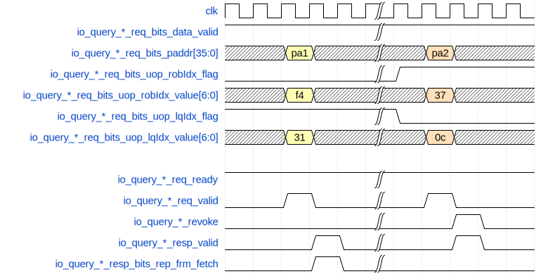

\newpage
# 读后读违例检查 LoadQueueRAR

## 功能描述

多核环境下会出现load to load违例。单核环境下相同地址的load乱序执行本来是不关心的，但是如果两个load之间有另外一个核做了相同地址的store，并且本身这个核的两个load做了乱序调度，就有可能导致新的load没有看到store更新的结果，但是旧的load看到了，出现了顺序错误。

多核环境下的load-load违例有一个特征，当前DCache一定会收到L2 cache发来的Probe请求，使得DCache主动释放掉这个数据副本，这时DCache会通知load queue，将相同地址的load queue中已经完成访存的项做一个release标记。后续发往流水线的load指令会查询load queue中在它之后相同地址的load指令，如果存在release标记，就发生了load-load违例。

LoadQueueRAR用于保存已经完成的load指令的用于load to load违例检测的信息。当load指令处于load流水线s2栈时，查询并分配空闲项将信息保存入LQRAR，在流水线s3栈时得到load to load违例检查的结果 ，如果出现违例则需要刷新流水线，给RedirectGenerator部件发送重定向请求, 冲刷违例的load之后的所有指令。

LoadQueueRAR中需要标记以下信息：

* Allocated：表示entry是否有效。
* Uop：MicroOp相关信息。
* Paddr：进入LoadQueueRAR指令的物理地址压缩后的地址，一共16bits。
* Released：表示该指令所访问的cacheline是否被release，多核环境下 L1 cache会接收到L2cache的probe请求。需要注意的是如果该指令是nc指令，在入队时就会被标记release。

### 特性 1：请求入队

当query到达load流水线的s2时，判断是否满足入队条件，如果在当前load指令之前有未完成的load指令,且当前指令没有被flush时，当前load可以入队。

在freelist中得到可以分配的entry以及index。

在PaddrModule中保存入队信息，包含query压缩后的物理地址（16bits），分配entry的index。

### 特性 2：load to load 违例检查

当 load 到达流水线的 s2 时，会检查RAR队列中是否存在与当前load指令物理地址相同且比当前指令年轻的load指令，如果这些 load 已经拿到了数据，并且被标记了release，说明发生 load-load 违例，需要刷新当前发生违例load之后的所有指令。

一共分两拍：

* 第一拍进行条件匹配，得到mask。
* 第二拍生成是否发生违例的响应信号。

### 特性 3：Release 条件

LoadQueueRAR中的load指令被标记为release有四种情况：

* missQueue模块的replace_req在mainpipe流水线的s3栈发起release释放dcache块，release信号在下一拍进入loadQueue。
* probeQueue模块的probe_req在mainpipe流水线的s3栈发起release释放dcache块，release信号在下一拍进入loadQueue。
* atomicsUnit模块的请求在mainpipe流水线的s3栈发生miss时需要释放dcache块，release信号在下一拍进入loadQueue。
* 如果入队请求是nc，在入队时被标记release。

## 整体框图
<!-- 请使用 svg -->
{#fig:LoadQueueRAR width=80%}

\newpage
## 接口时序

### LoadQueueRAR请求入队时序实例

{#fig:LoadQueueRAR-enqueue width=70%}

当io_query_ * _req_valid和io_query_ * _req_ready都为高时，表示握手成功，needEnqueue和io_canAllocate_* 都为高时，将io_doAllocate_* 置为高，表示query需要需要入队且FreeList可以分配， io_allocateSlot_* 为接收query入队的entry， 写入entry的信息为io_w*。

### load-load 违例检查时序实例

{#fig:RAR-load-to-load width=70%}

当io_query_* _req_valid和io_query_* _req_ready都为高时，表示握手成功，LoadQueueRAR接收ld-ld违例查询请求，当拍得到mask结果，在下一拍将io_query_*_resp_valid置为高，给出响应。

图中第3拍接收到第一个违例查询请求，在第4拍得到违例查询请求的响应。请求的信息为io_query_* _req_bits_，响应的信息为io_query_* _resp_bits_。当io_query_* _resp_valid和io_query_* _resp_bits_rep_frm_fetch都为高时，表示发生ld-ld违例，刷新当前违例load之后的所有指令。