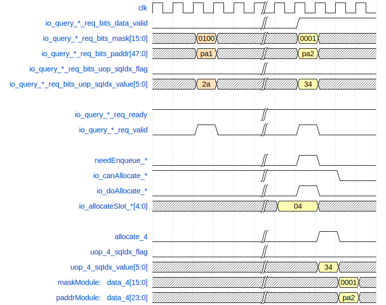
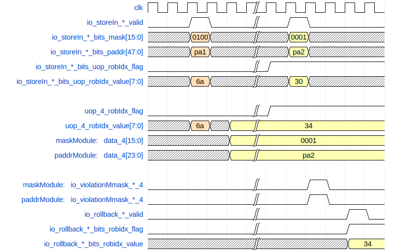

\newpage
# 写后读违例检查 LoadQueueRAW

## 功能描述

LoadQueueRAW是用于处理store-load违例的。由于load和store在流水线中都是乱序执行，会经常出现load越过了更老的相同地址的store，即这条load本应该前递store的数据，但是由于store地址或者数据没有准备好，导致这条load没有前递到store的数据就已经提交，后续使用这条load结果的指令也都发生了错误，于是产生store to load forwarding违例。

当store address通过STA保留站发射出来进入store流水线时，会去查询LQRAW中在这条store后面的所有已经完成访存的相同地址的load，以及load流水线中正在进行的在该条store之后的相同地址的load，一旦发现有，就发生了store to load forwarding违例，可能有多个load发生了违例，需要找到离store最近的load，也就是最老的违例的load，然后给RedirectGenerator部件发送重定向请求，冲刷最老的违例的load及之后的所有指令。

当store流水线执行cbo zero指令时，也需要进行store-load违例检查。

### 特性 1：load query入队

当query到达load流水线的s2时，判断是否满足入队条件，如果在当前load指令之前有地址未准备好的store指令，且当前指令没有被flush时，当前load可以入队。

在freelist中得到可以分配的entry以及index。

将入队query的物理地址压缩为24-bit保存到PaddrModule中对应的entry。

将入队query的mask保存到maskModule中对应的entry。

### 特性 2：store-load违例检查

store指令到达store流水线的 s1 时会进行store-load检查，此时store需要与LoadQueueRAW中已经完成访存的 load，以及 load 流水线中s1和 s2 阶段正在访存的 load 作比较，这些 load 可能没有 forward 到 store 的数据。如果检查时发现 load 和 store 访问的物理地址有重叠的地方，且load比store年轻，就发生了违例，需要找到最老的 load，重发这条 load 以及之后的所有指令（重新取指执行），在store流水线的s4阶段得到store-load违例检查的结果。

一共分四拍:

* 第一拍进行物理地址匹配，条件匹配，得到 mask，匹配的是那些在这条 store 之后的新的 load，如果它们已经拿到了数据（datavalid）或者 dcache miss 了，正在等待 refill（miss），就一定没有 forward 到这个 store 的数据。
* 第二拍store流水线中的store根据mask在LoadQueueRAW里面找到所有匹配的load，LoadQueueRAW一共有32项，将这32项平分为八组，从每组的4项里面各选出一个oldest，最多可能得到4个oldest。
* 第三拍从4个oldest里面选出一个最老的oldest。
* 第四拍如果两条store流水线中的store都发生了store-to-load违例，从两条store流水线各自在loadQueue匹配的oldest load中选出一个更老的oldest，产生回滚请求发给redirect。

## 整体框图
<!-- 请使用 svg -->
{#fig:LoadQueueRAW width=80%}

## 接口时序

### LoadQueueRAW请求入队时序实例

{#fig:RAW-enqueue width=70%}

当io_query_* _req_valid和io_query_* _req_ready都为高时，表示握手成功，needEnqueue和io_canAllocate_* 都为高时，将io_doAllocate_* 置为高，表示query需要入队且FreeList可以分配，io_allocateSlot_* 为接收query入队的entry，下一拍对应entry的allocate拉高，sqIdx写入entry。再下一拍后mask写入LqMaskModule对应的entry，压缩后的物理地址写入到LqPAddrModule对应的entry。

### store-load违例时序实例

{#fig:RAW-store-to-load width=70%}

当io_rollback_valid为高时，表示发生了store-load违例，违例的信息为io_rollback_bits_*。