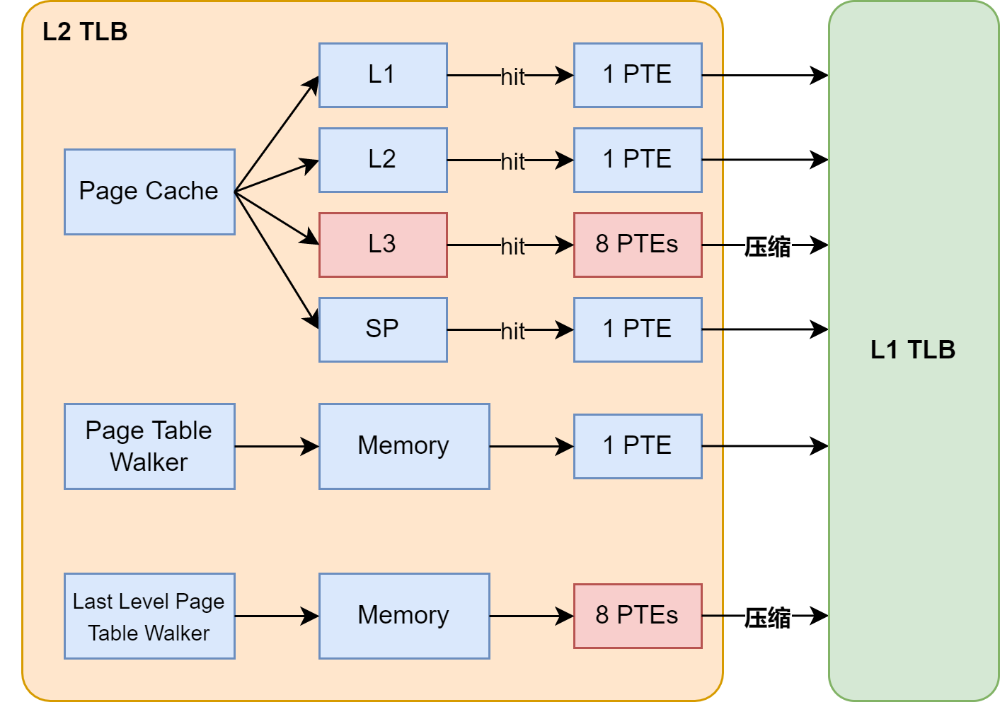
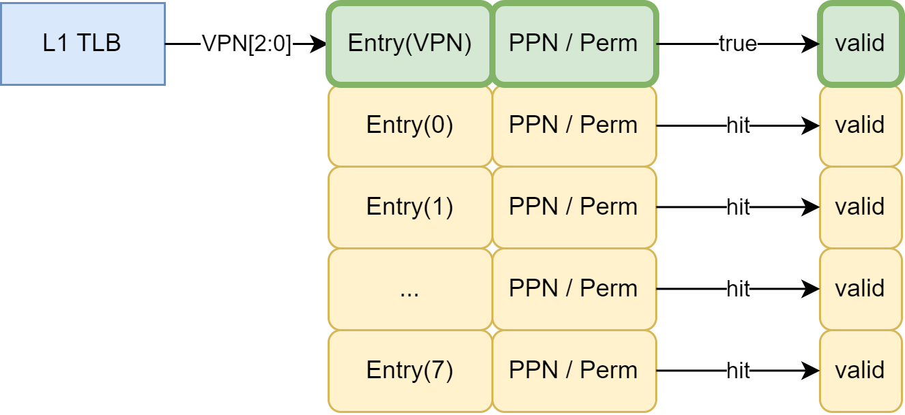
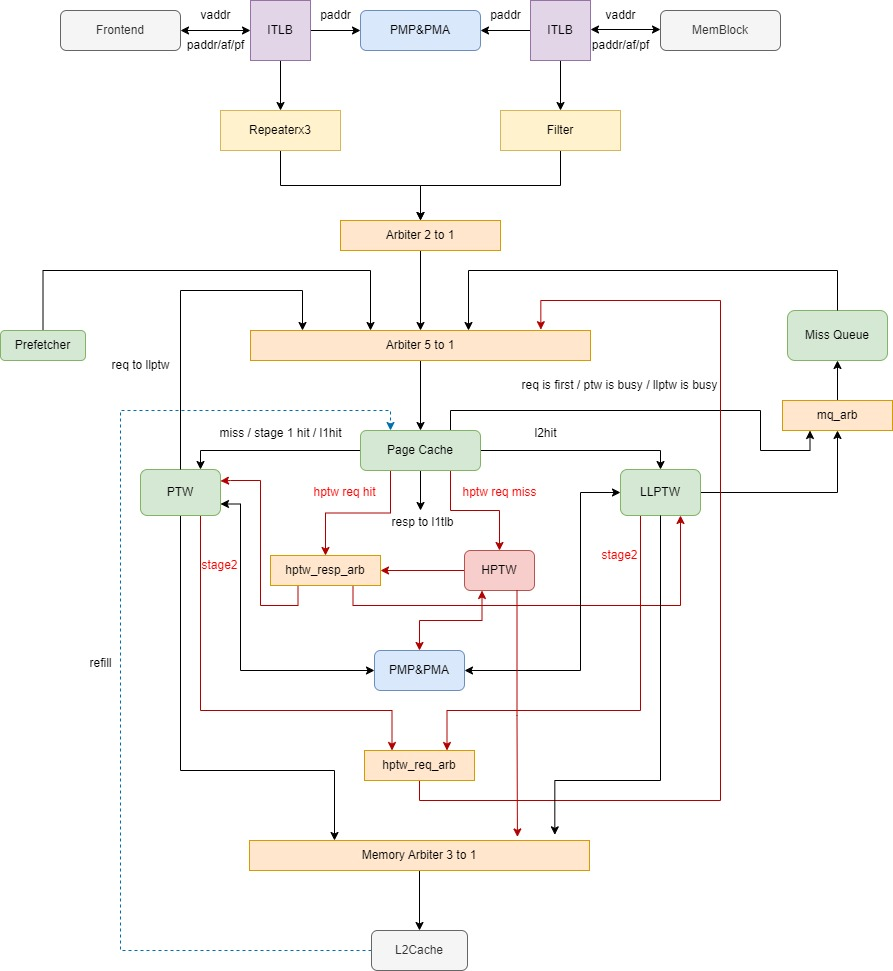
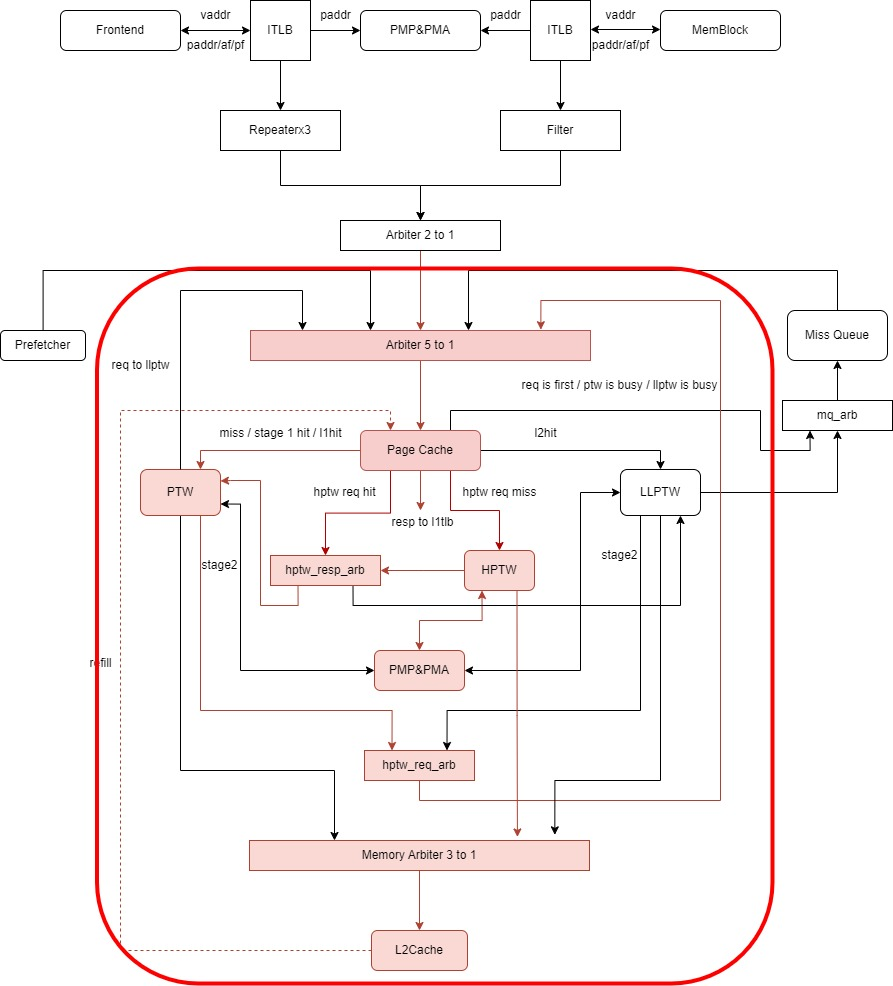

# 二级模块 L2 TLB

L2 TLBWrapper 指的是如下模块：

* L2TLBWrapper ptw，L2TLBWrapper 为 L2 TLB 做了一层抽象。

L2 TLB 指的是：

* L2TLB ptw

## 设计规格

该小节描述了 L2 TLB 模块的整体设计规格，L2 TLB 模块包含子模块的设计规格参见本文档三级模块部分的内容。

1. 支持接收 L1 TLB 的 PTW 请求
2. 支持向 L1 TLB 返回 PTW 回复
3. 支持复制信号和寄存器
4. 支持异常处理机制
5. 支持 TLB 压缩
6. 支持两阶段地址翻译

## 功能

L2 TLB 是更大的页表缓存，由 ITLB 和 DTLB 共享，当 L1 TLB 发生 miss 时，会向 L2 TLB 发送 Page Table Walk 请求。L2 TLB 分为 Page Cache（参见 5.3.7 节），Page Table Walker（参见 5.3.8 节），Last Level Page Table Walker（参见 5.3.9 节）、Hypervisor Page Table Walker（参加 5.3.10）、Miss Queue（参见 5.3.11 节）和 Prefetcher（参见 5.3.12 节）五部分。

来自 L1 TLB 的请求将首先访问 Page Cache，对于非两阶段地址翻译的请求，若命中叶子节点则直接返回给 L1 TLB，否则根据 Page Cache 命中的页表等级以及 Page Table Walker 和 Last Level Page Table Walker 的空闲情况进入 Page Table Walker、Last Level Page Table Walker 或 Miss Queue（参见 5.3.7 节）。而对于两阶段地址翻译请求，如果该请求是 onlyStage1 的，则处理方式与非两阶段地址翻译请求一致；如果该请求是 onlyStage2 的，命中叶子页表，则直接返回，没有命中，则发送给 Page Table Walker 进行翻译；如果该请求是 allStage 的，由于 Page Cache 一次只能查询一次页表，所以首先查询第一阶段页表，分两种情况，如果第一阶段页表命中，则发送给 Page Table Walker，由其进行接下来的翻译过程，如果第一阶段页表没有命中叶子节点，则根据命中页表等级以及 Page Table Walker 和 Last Level Page Table Walker 的空闲情况进入 Page Table Walker、Last Level Page Table Walker 或 Miss Queue。为了加快页表访问，Page Cache 将三级页表都分开做了缓存，可以同时查询三级页表（参见 5.3.7 节）。Page Cache 支持 ecc 校验，如果 ecc 校验出错，则刷新此项，并重新进行 Page Walk。

Page Table Walker 接收 Page Cache 的请求，进行 Hardware Page Table Walk。对于非两阶段地址翻译的请求，Page Table Walker 只访问前两级（1GB 和 2MB）页表，不访问 4KB 页表，对 4KB 页表的访问会由 Last Level Page Table Walker 承担。如果 Page Table Walker 访问到叶子节点（大页），则返回给 L1 TLB，否则需要返回给 Last Level Page Table Walker，由 Last Level Page Table Walker 进行最后一级页表的访问。Page Table Walker 只能同时处理一个请求，无法并行访问前两级页表。对于两阶段地址翻译的请求，第一种情况，如果是 allStage 的请求并且第一阶段翻译的页表 hit，PTW 会发送第二阶段请求进入 Page Cache 查询，如果没有命中，则会发送给 Hypervisor Page Table Walker，第二阶段翻译结果会返回给 PTW；第二种情况，如果是 allStage 请求并且第一阶段翻译的叶子节点没有命中，则 PTW 翻译过程与非虚拟化请求翻译类似，区别在于 PTW 翻译过程中出现的物理地址为客户机物理地址，需要进行一次第二阶段地址翻译后才能访存，具体可见 Page Table Walker 的模块介绍；第三种情况，如果是 onlyStage2 请求，则 PTW 会向外发送第二阶段翻译的请求，接收到 resp 后，返回给 L1TLB；第四种请求是 onlyStage1 的请求，该请求在 PTW 内部的处理过程与非虚拟化请求的处理过程一致。

Miss Queue 接收来自 Page Cache 和 Last Level Page Table Walker 的请求，等待下次访问 Page Cache。Prefetcher 采用 Next-Line 预取算法，当 miss 或者 hit 但命中项为预取项时，产生下一个预取请求。

### 接收 L1 TLB 的请求并返回回复

L2 TLB 作为整体，接收 L1 TLB 的 PTW 请求。L1 TLB 发送的 PTW 请求通过两级 Repeater 传入 L2 TLB 中，L2 TLB 根据请求来自 itlbRepeater 或 dtlbRepeater，分别向 itlbRepeater 或 dtlbRepeater 返回回复。L2 TLB 接收 L1 TLB 发送的虚拟页号，返回给 L1 TLB 的信息包括：第一阶段的页表、第二阶段的页表等。L2 TLB 的行为对 L1 TLB 透明，L1 TLB 与 L2 TLB 之间只需要通过部分信号接口交互。

### 向 L2 Cache 发送 PTW 请求

L2 TLB 通过 TileLink 总线向 L2 Cache 发送 PTW 请求，和 L2 Cache 之间通过 ptw_to_l2_buffer 相连，向 ptw_to_l2_buffer 提供和接收 TileLink A 通道和 D 通道的相关信号。

### 复制信号和寄存器

由于 L2 TLB 模块较大，例如 sfence 信号、csr 寄存器等需要驱动较多部分，因此需要将 sfence 信号、csr 寄存器复制多份。复制寄存器可以便于时序优化和物理实现，与功能实现无关，复制的内容完全相同。可以使用复制的信号和寄存器驱动不同位置的部件。

复制情况以及分别驱动的部分如 [@tbl:L2TLB-signal-replication-drive] 所示：

Table: 信号复制情况以及驱动部件 {#tbl:L2TLB-signal-replication-drive}

| **复制信号** |   **序号**    |         **驱动部件**         |
|:------------:|:-------------:|:----------------------------:|
|    sfence    |               |                              |
|              | sfence_dup(0) |           Prefetch           |
|              | sfence_dup(1) | Last Level Page Table Walker |
|              | sfence_dup(2) |           cache(0)           |
|              | sfence_dup(3) |           cache(1)           |
|              | sfence_dup(4) |           cache(2)           |
|              | sfence_dup(5) |           cache(3)           |
|              | sfence_dup(6) |          Miss Queue          |
|              | sfence_dup(7) |      Page Table Walker       |
|              | sfence_dup(8) | Hypervisor Page Table Walker |
|     csr      |               |                              |
|              |  csr_dup(0)   |           Prefetch           |
|              |  csr_dup(1)   | Last Level Page Table Walker |
|              |  csr_dup(2)   |           cache(0)           |
|              |  csr_dup(3)   |           cache(1)           |
|              |  csr_dup(4)   |           cache(2)           |
|              |  csr_dup(5)   |          Miss Queue          |
|              |  csr_dup(6)   |      Page Table Walker       |
|              |  csr_dup(7)   | Hypervisor Page Table Walker |

### 异常处理机制

L2 TLB 可能产生的异常包括：guest page fault、page fault、access fault、ecc 校验出错。对于 guest page fault、page fault 和 access fault，会交付给 L1 TLB，L1 TLB 根据请求来源交付处理；对于 ecc 校验出错，会在 L2 TLB 内部处理，将当前项无效掉，返回 miss 结果并重新进行 Page Walk。参见本文档的第 6 部分：异常处理机制。

### TLB 压缩

在添加虚拟化拓展的内容后，L2TLB 中 stage1 复用了 TLB 压缩的逻辑设计，返回给 L1TLB 的结构也是 TLB 压缩的结构，但在 L1TLB 中 TLB 压缩并不启用，而 stage2 则不采用 TLB 压缩结构，resp 的时候只返回单个页表。

L2 TLB 每次访问内存的宽度为 512 bits，每次可以返回 8 项页表。Page Cache 的 l3 项由 SRAM 组成，在回填时可以保存连续的 8 个页表项；Page Cache 的 sp 项由寄存器堆组成，回填时只保存单个页表项。因此，在 Page Cache 命中，返回 L1 TLB 时（非两阶段地址翻译的情况，如果是两阶段地址翻译，第一阶段命中会发送给 PTW 进行后续处理），如果命中的是 4KB 页表，可以将 Page Cache 中存储的连续 8 项页表进行压缩；如果命中的是大页，则不进行压缩，直接回填入 L1 TLB。（事实上，1GB 或 2MB 的大页缺失情况很少，因此只考虑为 4KB 页面进行压缩。而 4KB 页面的 ppn 为 24 位，连续 8 项压缩后，需要满足这些页表的高 21 位 ppn 相同才能进行压缩。对于 1GB 或 2MB 的大页，ppn 的低 9 位并不会用于生成物理地址，因此在当前的设计下无意义）

在 Page Cache 缺失，通过 Page Table Walker 或 Last Level Page Table Walker 访问内存中的页表后，会将内存中的页表返回给 L1 TLB，同时回填入 Page Cache 中，如果需要第二阶段的地址翻译，在 Hypervisor Page Table Walker 中访问到的页表也会重填到 Page Cache，HPTW 会将最终的翻译结果返回给 PTW 或者 LLPTW，PTW 或 LLPTW 会把两阶段的页表都返回给 L1TLB。非两阶段翻译请求在返回至 L1 TLB 时，同样可以将连续的 8 项页表进行压缩。由于 Page Table Walker 只有在访问到叶子节点时才会直接返回给 L1 TLB，因此 Page Table Walker 返回给 L1 TLB 的页表均为大页。由于大页对性能的影响很小，考虑到优化方案的实现简单性，以及复用 Page Cache 中 sp 项的数据通路，Page Table Walker 返回的大页并不会压缩。

L2 TLB 只对 4KB 页表进行压缩，根据 RISC-V 特权级手册中的 Sv39 分页机制，4KB 页表所在物理地址的低 3 位即为虚拟页号的低 3 位。因此，Page Cache 或 Last Level Page Table Walker 返回的连续 8 项页表可以通过虚拟页号的低 3 位进行索引。其中，valid 位表示压缩后的页表项是否有效。根据 L1 TLB 发送的页表查找请求虚拟页号的低三位，索引到该虚拟页号对应的页表项，该页表项的 valid 一定为 1。对于和该页表项连续的其余 7 个页表项，通过比较它们的物理页号高位，以及页表属性位是否相同。如果物理页号高位以及页表属性位都和通过虚拟页号的低三位索引到的页表项相等，则 valid 位为 1，否则为 0。同时，L2 TLB 还会返回 pteidx，即表示这 8 项连续的页表中，哪一项才是 L1 TLB 发送 vpn 对应的页表。L2 TLB 压缩如 [@fig:L2TLB-compress-1;@fig:L2TLB-compress-2] 所示。

{#fig:L2TLB-compress-1}

{#fig:L2TLB-compress-2}

实现 TLB 压缩后，L1 TLB 的每项都是一个压缩的 TLB 项，通过虚拟页号的高位查找。TLB 项命中的条件除虚拟页号高位相同外，还需要满足虚拟页号低位对应的 valid 位为 1，表示查找的页表项在压缩后的 TLB 项中有效。TLB 压缩和 L1 TLB 相关的部分详见 L1TLB 模块的介绍。

## 整体框图

{#fig:L2TLB-overall}

如 [@fig:L2TLB-overall] 所示，L2 TLB 分为 Page Cache，Page Table Walker，Last Level Page Table Walker、Hypervisor Page Table Walker、Miss Queue 和 Prefetcher 六部分。

来自 L1 TLB 的请求将首先访问 Page Cache，对于非两阶段地址翻译的请求，若命中叶子节点则直接返回给 L1 TLB，否则根据 Page Cache 命中的页表等级以及 Page Table Walker 和 Last Level Page Table Walker 的空闲情况进入 Page Table Walker、Last Level Page Table Walker 或 Miss Queue（参见 5.3.7 节）。而对于两阶段地址翻译请求，如果该请求是 onlyStage1 的，则处理方式与非两阶段地址翻译请求一致；如果该请求是 onlyStage2 的，命中叶子页表，则直接返回，没有命中，则发送给 Page Table Walker 进行翻译；如果该请求是 allStage 的，由于 Page Cache 一次只能查询一次页表，所以首先查询第一阶段页表，分两种情况，如果第一阶段页表命中，则发送给 Page Table Walker，由其进行接下来的翻译过程，如果第一阶段页表没有命中叶子节点，则根据命中页表等级以及 Page Table Walker 和 Last Level Page Table Walker 的空闲情况进入 Page Table Walker、Last Level Page Table Walker 或 Miss Queue。为了加快页表访问，Page Cache 将三级页表都分开做了缓存，可以同时查询三级页表（参见 5.3.7 节）。Page Cache 支持 ecc 校验，如果 ecc 校验出错，则刷新此项，并重新进行 Page Walk。

Page Table Walker 接收 Page Cache 的请求，进行 Hardware Page Table Walk。对于非两阶段地址翻译的请求，Page Table Walker 只访问前两级（1GB 和 2MB）页表，不访问 4KB 页表，对 4KB 页表的访问会由 Last Level Page Table Walker 承担。如果 Page Table Walker 访问到叶子节点（大页），则返回给 L1 TLB，否则需要返回给 Last Level Page Table Walker，由 Last Level Page Table Walker 进行最后一级页表的访问。Page Table Walker 只能同时处理一个请求，无法并行访问前两级页表。对于两阶段地址翻译的请求，第一种情况，如果是 allStage 的请求并且第一阶段翻译的页表 hit，PTW 会发送第二阶段请求进入 Page Cache 查询，如果没有命中，则会发送给 Hypervisor Page Table Walker，第二阶段翻译结果会返回给 PTW；第二种情况，如果是 allStage 请求并且第一阶段翻译的叶子节点没有命中，则 PTW 翻译过程与非虚拟化请求翻译类似，区别在于 PTW 翻译过程中出现的物理地址为客户机物理地址，需要进行一次第二阶段地址翻译后才能访存，具体可见 Page Table Walker 的模块介绍；第三种情况，如果是 onlyStage2 请求，则 PTW 会向外发送第二阶段翻译的请求，接收到 resp 后，返回给 L1TLB；第四种请求是 onlyStage1 的请求，该请求在 PTW 内部的处理过程与非虚拟化请求的处理过程一致。

Miss Queue 接收来自 Page Cache 和 Last Level Page Table Walker 的请求，等待下次访问 Page Cache。Prefetcher 采用 Next-Line 预取算法，当 miss 或者 hit 但命中项为预取项时，产生下一个预取请求。

图中涉及到如下的仲裁器，名称为 chisel 代码中的名称：

* arb1:2 to 1 的仲裁器，图中的 Arbiter 2 to 1，输入为 ITLB（itlbRepeater2）和 DTLB（dtlbRepeater2）；输出到 Arbiter 5 to 1
* arb2:5 to 1 的仲裁器，图中的 Arbiter 5 to 1，输入为 Miss Queue、Page Table Walker、arb1、hptw_req_arb 和 Prefetcher；输出到 Page Cache
* hptw_req_arb：2 to 1 的仲裁器，输入为 Page Table Walker 和 Last Level Page Table Walker，输出到 Page Cache
* hptw_resp_arb：2 to 1 的仲裁器，输入为 Page Cache 和 Hypervisor Page Table Walker，输出到 PTW 或者 LLPTW
* outArb：1 to 1 的仲裁器，输入为 mergeArb，输出到 L1TLB 的 resp
* mergeArb：3 to 1 的仲裁器，输入为 Page Cache、Page Table Walker 和 Last Level Page Table Walker，输出到 outArb
* mq_arb：2 to 1 的仲裁器，输入为 Page Cache 和 Last Level Page Table Walker；输出为 Miss Queue
* mem_arb：3 to 1 的仲裁器，输入为 Page Table Walker、Last Level Page Table Walker 和 Last Level Page Table Walker；输出为 L2 Cache（Last Level Page Table Walker 内部也有一个 mem_arb，把所有 Last Level Page Table Walker 向 L2 Cache 发送的 PTW 项做仲裁，之后传到这个 mem_arb 里）

{#fig:L2TLB-hit-passthrough}

L2 TLB 模块的 hit 通路如 [@fig:L2TLB-hit-passthrough] 所示。来自 ITLB 和 DTLB 的请求会首先通过仲裁，之后送往 Page Cache 进行查询。对于非两阶段地址翻译、只有第二阶段翻译或者只有第一阶段翻译的请求，如果 Page Cache 命中，则直接将 Page Cache 命中的页表项以及物理地址等信息返回给 L1 TLB。对于 allStage，Page Cache 中首先查询第一阶段页表，第一阶段 hit，则会发送给 PTW，由 PTW 发送 hptw 请求，hptw 请求会进入 Page Cache 查询，如果 hit 则发送给 PTW，如果没有 hit，则发送给 HPTW，HPTW 查询结束后将结果发送给 PTW，HPTW 访存得到的页表也会回填到 Page Cache。对于 ITLB 和 DTLB 发送的所有 PTW 请求以及 PTW 或者 LLPTW 发送的 hptw 请求，一定会首先进行 Page Cache 的查询。

而对于 miss 的情况，所有模块均可能参与。来自 ITLB 和 DTLB 的请求会首先通过仲裁，之后送往 Page Cache 进行查询。如果 Page Cache 未命中，则可能分情况进入 MissQueue 中（对于 PTW 或者 LLPTW 发送给 Page Cache 的 hptw 请求或者是 prefetch 的请求，则不进入 MissQueue），miss 的请求进入 MissQueue 的情况有出现 bypass 的请求，L1TLB 发送给 PageCache（isFirst）且要进入 PTW 的请求，MissQueue 发送给 PTW 且 PTW 忙的请求，发送给 LLPTW 且 LLPTW 忙的请求。Page Cache 需要根据 Page Cache 命中的页表等级决定进入 Page Table Walker 或 Last Level Page Table Walker 进行查询（如果是 hptw 请求，则会发送给 HPTW）。Page Table Walker 同时只能够处理一个请求，可以访问内存中前两级页表的内容；Last Level Page Table Walker 负责访问最后一级 4KB 页表，Hypervisor Page Table Walker 同时只能处理一个请求。

Page Table Walker、Last Level Page Table Walker 和 Hypervisor Page Table Walker 均可以向内存发送请求，访问内存中的页表内容。在通过物理地址访问内存中的页表内容之前，需要通过 PMP 和 PMA 模块对物理地址进行检查，如果 PMP 和 PMA 检查失败则不会向内存发送请求。来自 Page Table Walker、Last Level Page Table Walker 和 Hypervisor Page Table Walker 的请求在经过仲裁后，通过 TileLink 总线向 L2 Cache 发送请求。

Page Table Walker 与 Last Level Page Table Walker 均可能向 L1 TLB 返回 PTW 回复。Page Table Walker 可能在以下几种情况下产生回复：

* 非两阶段翻译请求和只有第一阶段翻译的请求，访问到叶子节点（是 1GB 或 2MB 的大页），直接返回给 L1 TLB
* 只有第二阶段翻译的请求，收到第二阶段翻译结果后
* 两阶段翻译都有的请求，第一阶段的叶子页表与第二阶段的叶子页表都得到后
* 第二阶段翻译返回的结果出现 Page fault 或 Access fault
* PMP 或 PMA 检查出现 Page fault 或 Access fault，同样需要返回给 L1 TLB

Last Level Page Table Walker 一定会向 L1 TLB 返回回复，包括如下几种可能：

* 非两阶段翻译请求和只有第一阶段翻译的请求，访问到叶子节点（4KB 页）
* 两阶段翻译都有的请求，第一阶段的叶子页表与第二阶段的叶子页表都得到后
* PMP 或 PMA 检查出现 Access fault

## 接口时序

### L2 TLB 与 Repeater 的接口时序

L2 TLB 与 Repeater 的接口时序如 [@fig:L2TLB-repeater-time] 所示。L2 TLB 与 Repeater 之间通过 valid-ready 信号进行握手，Repeater 将 L1 TLB 发出的 PTW 请求以及请求的虚拟地址发送给 L2 TLB；L2 TLB 查询得到结果后将物理地址以及对应的页表返回给 Repeater。

{#fig:L2TLB-repeater-time}

### L2 TLB 与 L2 Cache 的接口时序

L2 TLB 与 L2 Cache 的接口时序遵循 TileLink 总线协议。

