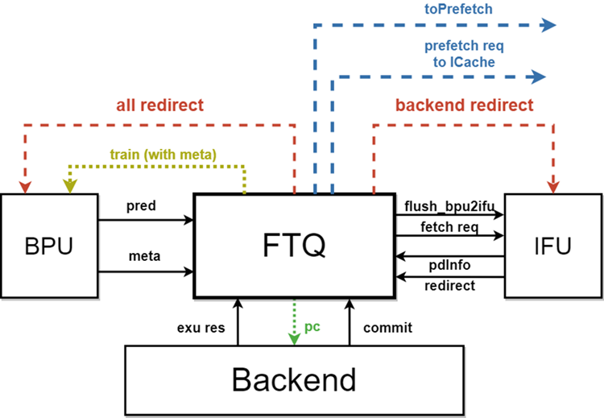
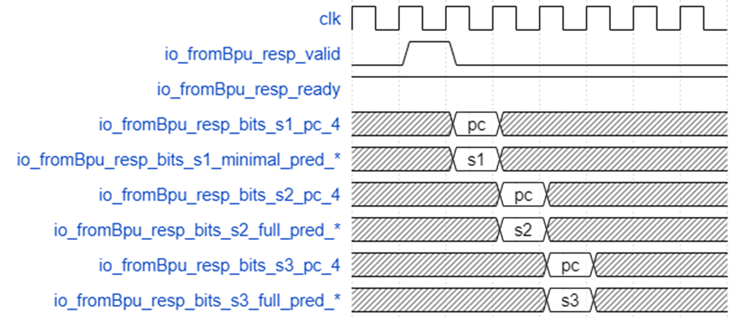

# 昆明湖FTQ模块文档

## 术语说明

表1.1 术语说明

| **缩写** | **全称**            | **描述**     |
| -------- | ------------------- | ------------ |
| CRU      | Clock Reset Unit    | 时钟复位单元 |
| FTQ      | Fetch Target Queue  | 取指目标队列 |
| FTB      | Fetch Target Buffer | 取指目标缓冲 |

## 功能描述
### 功能概述
FTQ是分支预测和取指单元之间的缓冲队列，它的主要职能是暂存BPU预测的取指目标，并根据这些取指目标给IFU发送取指请求。它的另一重要职能是暂存BPU各个预测器的预测信息，在指令提交后把这些信息送回BPU用作预测器的训练，因此它需要维护指令从预测到提交的完整的生命周期。

- 支持暂存BPU预测的取指目标，并向IFU发送取指请求
- 支持暂存BPU的预测信息，并送回BPU训练
- 支持后端读取指令PC
- 支持重定向恢复
- 支持向ICache发送预取请求

### 功能详述
#### 暂存BPU预测的取指目标，并向IFU发送取指请求

#### 暂存BPU预测的取指目标
##### 存储PC的结构
BPU的一次预测会经历三个流水级，每一个流水级都会产生新的预测内容。FTQ接收来自BPU每个流水级的预测结果，并且后面的流水级的结果会覆盖前面流水级的结果。

指令以预测块为单位，从BPU发出，进入FTQ，同时bpuPtr指针加一，初始化对应FTQ项的各种状态，把各种预测信息写入存储结构；如果预测块来自BPU覆盖预测逻辑，则恢复bpuPtr和ifuPtr。

BPU预测的取值目标被FTQ暂存于ftq\_pc\_mem中：

- ftq\_pc\_mem:寄存器堆实现，为存储与指令地址相关的信息，包括如下的域：
  - startAddr预测块起始地址。
  - nextLineAddr预测块下一个缓存行的起始地址。
  - isNextMask预测块每一条可能的指令起始位置是否在按预测宽度对齐的下一个区域内。isNextMask有16bit，每个bit表示相对起始地址的2byte\*n位置是否跨cacheline，表示的是每个位置的性质。
  - fallThruError预测出的下一个顺序取指地址是否存在错误。

每一个域都各自存在自己的寄存器（例如data\_0\_startAddr）里，并没有拼接后存进同一个Reg里。

##### 计算PC的方式
每次从ICache取指都会取一个或两个CacheLineSize（64Bytes）长度的缓存行指令数据，是否取两个由预测块是否跨缓存行决定。

而每个预测块的长度为PredictWidth（16）个压缩指令的长度（32Bytes）。每个缓存行的长度为每个预测块长度的两倍，所以每个预测块的startAddr要么在当前缓存行的前半部分（startAddr[5]=0），要么在当前缓存行的后半部分（startAddr[5]=1）。

如果startAddr[5]=0，那么当前预测块必然不会跨缓存行，那么此时预测指令pc={startAddr[38,6],startAddr[5,1]+offset,1'b0}。

如果startAddr[5]=1，那么当前预测块可能会出现跨缓存行的情况。此时：

- 如果isNextMask(offset)=0，表示当前预测指令pc未跨缓存行，那么此时预测指令pc={startAddr[38,6],startAddr[5,1]+offset,1'b0}。
- 如果isNextMask(offset)=1，表示当前预测指令pc跨越了缓存行，那么此时预测指令pc={nextLineAddr[38,6],startAddr[5,1]+offset,1'b0}。

#### 向IFU发送取指请求

FTQ向IFU发出取指请求，ifuPtr指针加一，等待预译码信息写回。

IFU写回的预译码信息被FTQ暂存于ftq\_pd\_mem中：

  - ftq\_pd\_mem:寄存器堆实现，存储取指单元返回的预测块内的各条指令的译码信息，包括如下的域：
    - brMask每条指令是否是条件分支指令。
    - jmpInfo预测块末尾无条件跳转指令的信息，包括它是否存在、是jal还是jalr、是否是call或ret指令。
    - jmpOffset预测块末尾无条件跳转指令的位置。
    - jalTarget预测块末尾jal的跳转地址。
    - rvcMask每条指令是否是压缩指令。

### 暂存BPU的预测信息，并送回BPU训练

#### 暂存BPU的预测信息

BPU传给FTQ的预测信息除了会暂存到上文提到的ftq\_pc\_mem中，还有部分信息会存储到ftq\_redirect\_sram、ftq\_pc\_mem和ftb\_entry\_mem中。

- ftq\_redirect\_sram:SRAM实现，存储那些在重定向时需要恢复的预测信息，主要包括和RAS和分支历史相关的信息。分为3个bank，每个bank的深度×宽度为64×236。
- ftq\_meta\_1r\_sram:SRAM实现，存储其余的BPU预测信息。SRAM的深度×宽度为64×256。
- ftb\_entry\_mem:寄存器堆实现，存储预测时FTB项的必要信息，用于提交后训练新的FTB项。为什么要存ftb\_entry呢？因为更新的时候ftb\_entry需要在原来的基础上继续修改，为了不重新读一遍ftb，所以这里将ftb\_entry存在ftb\_entry\_mem中。

FTQ中的各个sram/mem的具体实现机制见下表：

|                  | 写入时机（正向写入）                            | 更新时机（反向更新，比如重定向等）                                                                                                                                                                                    | 读出时机                                                                                          | 写入的数据内容                                                                                                                                                                                                                                                                                                                                                                                                                                                                                    | 更新的数据内容 |
| ---------------- | ----------------------------------------------- | --------------------------------------------------------------------------------------------------------------------------------------------------------------------------------------------------------------------- | ------------------------------------------------------------------------------------------------- | ------------------------------------------------------------------------------------------------------------------------------------------------------------------------------------------------------------------------------------------------------------------------------------------------------------------------------------------------------------------------------------------------------------------------------------------------------------------------------------------------- | -------------- |
| ftq_pc_mem       | BPU 流水级的 S1 阶段，创建新的预测 entry 时写入 | 不存在（目前的设计是 FTQ 汇总重定向发到 BPU 和 IFU，等 bpu 再把重定向到新地址的预测块重新入队的时候在 ftq_pc_mem 写入新的块，ftq_pc_mem 的项是表示当前预测块的地址，而不包括 target，所以不需要更新预测出错的那个块） | 读数据每个时钟周期都会存进 Reg。如果 IFU 不需要从 bypass 中读取数据，Reg 数据直连给 Icache 和 IFU | startAddr：预测块起始地址 nextLineAddr：预测块下一个缓存行的起始地址 isNextMask：预测块每一条可能的指令起始位置是否在按 预测宽度对齐的下一个区域内（① 如果 isNextMask(offset) = 0，表示当前预测指令 pc 未跨缓存行，那么此时预测指令 pc = {startAddr[38, 6], startAddr[5, 1] + offset, 1'b0}。② 如果 isNextMask(offset) = 1，表示当前预测指令 pc 跨越了缓存行，那么此时预测指令 pc = {nextLineAddr[38,6], startAddr[5, 1] + offset, 1'b0}。）fallThruError：预测出的下一个顺序取指地址是否存在错误 | 无             |
| ftq_meta_1r_sram | BPU 流水级的 S3 阶段                            |                                                                                                                                                                                                                       | FTQ 项中的指令能够 commit 的时候，将 meta 数据读出，发送给 bpu 训练                               | 写入的数据包 含了 4 个预测器的预测信息                                                                                                                                                                                                                                                                                                                                                                                                                                                            |
| ftb_entry_mem    | BPU 流水级的 S3 阶段                            |                                                                                                                                                                                                                       | 1.backend 重定向 2.ifu 写回预译码信息 3.ifu 预译码检测出错误发送重定向                            | BrSlot: brSlot_offset/lower/tarStat/sharing/validTailSlot: tailSlot_offset/lower/tarStat/sharing/validpftAddr,carry,isCall,isRet,isJalr…                                                                                                                                                                                                                                                                                                                                                          |
| ftq_pd_mem       | IFU 阶段 F3 流水的下一拍                        |                                                                                                                                                                                                                       | 一直在读 commPtr 作为地址对应的数据，赋值给 ftbEntryGen                                           | rvcMaskbrMaskjmpInfojmpOffsetjalTarget                                                                                                                                                                                                                                                                                                                                                                                                                                                            |

#### 送回BPU训练

指令在后端提交时会通知FTQ此指令已经提交。当FTQ项中所有的有效指令都已在后端提交，commPtr指针加一，从存储结构中读出相应的信息，送给BPU进行训练。

### 后端读取指令PC

由于后端存储PC的开销较大，当后端需要指令PC的时候，会到FTQ读取。

### 重定向恢复

每次预测后，RAS的栈顶项和栈指针都会存入FTQ的ftq\_redirect\_sram，同时使用的BPU全局历史会存入FTQ，用于误预测恢复。

#### 预译码检测出预测错误

FTQ向IFU发出取指请求后，IFU会向FTQ写回预译码信息，ifuWbPtr指针加一。如果预译码检测出了预测错误，则向BPU发送相应的重定向请求。FTQ根据重定向信号中的ftqIdx恢复bpuPtr和ifuPtr。

#### 后端检测出误预测

如果指令在后端执行时检测出误预测，则通知FTQ，FTQ给IFU和BPU发送对应的重定向请求，同时FTQ根据重定向信号中的ftqIdx恢复bpuPtr、ifuPtr和ifuWbPtr。

为了实现提前一拍读出在ftq中存储的重定向数据，减少redirect损失，后端会向ftq提前一拍（相对正式的后端redirect信号）传送ftqIdxAhead信号和ftqIdxSelOH信号。但是提前一拍后端无法及时得到准确的ftqIdx，需要在4个Alu通路中进行仲裁，但是仲裁结果在正式的后端redirect信号有效时才能得到，所以FTQ得到的提前一拍redirect的ftqIdx信号需要四个通路都读。

- io.fromBackend.ftqIdxAhead：7个FtqIdx。表示需要重定向的预测块在ftq中存储的索引。有7个是因为后端在最终仲裁前有7个可能产生redirect信号的通路，分别是Jump\*1、Alu\*4、LdReplay\*1、Exception\*1，但是其中只有Alu\*4产生的redirect信号我们会提前读，所以ftqIdxAhead实际用到的只有4个FtqIdx。
- Io.fromBackend.ftqIdxSelOH：4位独热码+valid，表示4条通路的ftqIdxAhead有效与否，高有效。

### 向ICache发送预取请求

由于BPU基本无阻塞，它经常能走到IFU的前面，于是FTQ中实现了将BPU提供的还没发到IFU的取指请求用作指令预取，直接向指令缓存发送预取请求。

## 整体框图

## 接口时序

1. BPU到FTQ接口时序

上图示意了BPU到FTQ的预测结果接口时序。当对应的握手信号io\_fromBpu\_resp\_valid和io\_fromBpu\_resp\_ready同时为高时，BPU三个流水级的预测结果在流水线内1、2、3阶段分别输入至FTQ。

若BPU后面流水级的预测结果与之前流水级不一致，则对应的redirect信号io\_fromBpu\_resp\_bits\_s2\_hasRedirect\_4或io\_fromBpu\_resp\_bits\_s3\_hasRedirect\_4会被拉高，表明需要刷新预测流水线。
