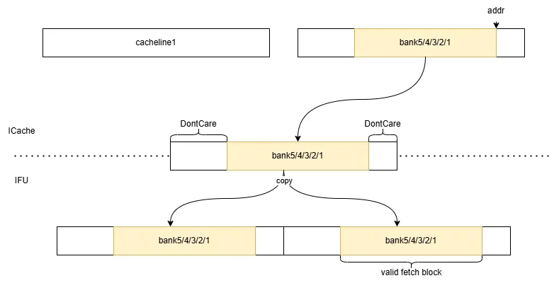

# XiangShan ICache 设计文档

- 版本：V2R2
- 状态：WIP
- 日期：2024/12/24
- commit：[fad7803d97ed4a987a743036cec42d1c07b48e2e](https://github.com/OpenXiangShan/XiangShan/tree/fad7803d97ed4a987a743036cec42d1c07b48e2e)

## 术语说明

| 缩写 | 全称 | 描述 |
| --- | --- | --- |
| ICache/I$ | Instruction Cache | L1 指令缓存 |
| DCache/D$ | Data Cache | L1 数据缓存 |
| L2 Cache/L2$ | Level Two Cache | L2 缓存 |
| IFU | Instruction Fetch Unit | 取指单元 |
| ITLB | Instruction Translation Lookaside Buffer | 地址翻译缓冲 |
| PMP | Physical Memory Protection | 物理内存保护模块 |
| PMA | Physical Memory Attribute | 物理内存属性模块（是 PMP 的一部分） |
| BEU | Bus Error Unit | 总线错误单元 |
| FDIP | Fetch-directed Instruction Prefetch | 取指导向指令预取 |
| MSHR | Miss Status Holding Register | 缺失状态保持寄存器 |
| a/(g)pf | Access / (Guest) Page Fault | 访问错误 / （客户机）页错误 |
| v/(g)paddr | Virtual / (Guest) Physical Address | 虚拟地址 / （客户机）物理地址 |

## 子模块列表

| 子模块 | 描述 |
| --- | --- |
| [MainPipe](MainPipe.md) | 主流水线 |
| [IPrefetchPipe](IPrefetchPipe.md) | 预取流水线 |
| [WayLookup](WayLookup.md) | 元数据缓冲队列 |
| MetaArray | 元数据 SRAM |
| DataArray | 数据 SRAM |
| [MissUnit](MissUnit.md) | 缺失处理单元 |
| [Replacer](Replacer.md) | 替换策略单元 |
| [CtrlUnit](CtrlUnit.md) | 控制单元，目前仅用于控制 ECC 功能 |

## 设计规格

- 缓存指令数据
- 缺失时通过 tilelink 总线向 L2 请求数据
- 软件维护 L1 I/D Cache 一致性（`fence.i`）
- 支持跨 cacheline （预）取指请求
- 支持冲刷（bpu redirect、backend redirect、`fence.i`）
- 支持预取指请求
  - 硬件预取为 FDIP 预取算法
  - 软件预取为 Zicbop 扩展`prefetch.i`指令
- 支持可配置的替换算法
- 支持可配置的缺失状态寄存器数量
- 支持检查地址翻译错误、物理内存保护错误
- 支持 ECC 检查 & 自动恢复
- DataArray 支持分 bank 存储，细存储粒度实现低功耗

## 参数列表

| 参数 | 默认值 | 描述 | 要求 |
| --- | --- | --- | --- |
| nSets | 256 | SRAM set 数量 | 2 的幂次 |
| nWays | 4 | SRAM way 数量 | |
| nFetchMshr | 4 | 取指 MSHR 的数量 | |
| nPrefetchMshr | 10 | 预取 MSHR 的数量 | |
| nWayLookupSize | 32 | WayLookup 深度，同时可以反压限制预取最大距离 | |
| DataCodeUnit | 64 | 校验单元大小，单位为 bit，每 64bit 对应 1bit 的校验位 | |
| ICacheDataBanks | 8 | cacheline 划分 bank 数量 | |
| ICacheDataSRAMWidth | 66 | DataArray 基本 SRAM 的宽度 | 大于 data 和 code 宽度之和 |

## 功能概述

FTQ 中存储着 BPU 生成的预测块，fetchPtr 指向取指预测块，prefetchPtr 指向预取预测块，当复位时 prefetchPtr 与 fetchPtr 相同，每成功发送一次取指请求时 fetchPtr++，每成功发送一次预取请求时 prefetchPtr++。详细说明见[FTQ 设计文档](../FTQ/FTQ.md)。

ICache 结构如下图所示。有 MainPipe 和 IPrefetchPipe 两个流水线，MainPipe 接收来自 FTQ 的取指请求，IPrefetchPipe 接收来自 FTQ/MemBlock 的硬/软件预取请求。对于预取请求，IPrefetch 对 MetaArray 进行查询，将元数据（在哪一路命中、ECC 校验码、是否发生异常等）存储到 WayLookup 中，如果该请求缺失，就发送至 MissUnit 进行预取。对于取指请求，MainPipe 首先从 WayLookup 中读取命中信息，如果 WayLookup 中没有可用信息，MainPipe 就会阻塞，直至 IPrefetchPipe 将信息写入 WayLookup 中，该方案将 MetaArray 和 DataArray 的访问分离，一次只访问 DataArray 单路，实现了较低的功耗，代价是产生了一个周期的重定向延迟。

MissUnit 处理来自 MainPipe 的取指请求和来自 IPrefetchPipe 的预取请求，通过 MSHR 进行管理，所有 MSHR 公用一组数据寄存器以减少面积。

Replacer 为替换器，默认采用 PLRU 替换策略，接收来自 MainPipe 的命中更新，向 MissUnit 提供待替换的 waymask。

MetaArray 分为奇偶两个 bank，用于支持跨 cacheline 的双行访问。

DataArray 中的 cacheline 默认分为 8 个 bank 存储，每个 bank 中存储的有效数据为 64bit，另外对于每 64bit 还需要 1bit 的校验位，由于 65bit 宽度的 SRAM 表现不好，所以选用 256*66bit 的 SRAM 作为基本单元，一共有 32 个这样的基本单元。一次访问需要 34Byte 的指令数据，每次需要访问 5 个 bank（$8\times5>34$），根据起始地址进行选择。

## 功能详述

### （预）取指请求

见[MainPipe 子模块文档](MainPipe.md)和[IPrefetchPipe 子模块文档](IPrefetchPipe.md)。

### DataArray 分 bank 的低功耗设计

目前，ICache 中每个 cacheline 分为 8 个 bank，bank0-7。一个取指块需要 34B 指令数据，故一次访问连续的 5 个 bank。存在两种情况：

1. 这 5 个 bank 位于单个 cacheline 中（起始地址位于 bank0-3）。假设起始地址位于 bank2，则所需数据位于 bank2-6。如下图 a。
2. 跨 cacheline（起始地址位于 bank4-7）。假设起始地址位于 bank6，则数据位于 cacheline0 的 bank6-7、cacheline1 的 bank0-2。有些类似于环形缓冲区。如下图 b。

当从 SRAM 或 MSHR 中获取 cacheline 时，根据地址将数据放入对应的 bank。

由于每次访问只需要 5 个 bank 的数据，因此 ICache 到 IFU 的端口实际上只需要一个 64B 的端口，将两个 cacheline 各自的 bank 选择出来并拼接在一起返回给 IFU（在 DataArray 模块内完成）；IFU 将这一个 64B 的数据复制一份拼接在一起，即可直接根据取指块起始地址选择出取指块的数据。不跨行/跨行两种情况的示意图如下：

亦可参考 [IFU.scala 中的注释](https://github.com/OpenXiangShan/XiangShan/blob/fad7803d97ed4a987a743036cec42d1c07b48e2e/src/main/scala/xiangshan/frontend/IFU.scala#L474-L502)。

### 冲刷

在后端/IFU 重定向、BPU 重定向、`fence.i` 指令执行时，需要视情况对 ICache 内的存储结构和流水级进行冲刷。可能的冲刷目标/动作有：

1. MainPipe、IPrefetchPipe 所有流水级
    - 冲刷时直接将 `s0/1/2_valid` 置为 `false.B` 即可
2. MetaArray 中的 valid
    - 冲刷时直接将 `valid` 置为 `false.B` 即可
    - `tag`、`code`不需要冲刷，因为它们的有效性由 `valid` 控制
    - DataArray 中的数据不需要冲刷，因为它们的有效性由 MetaArray 中的 `valid` 控制
3. WayLookup
    - 读写指针复位
    - `gpf_entry.valid` 置为 `false.B`
4. MissUnit 中所有 MSHR
    - 若 MSHR 尚未向总线发出请求，直接置无效（`valid === false.B`）
    - 若 MSHR 已经向总线发出请求，记录待冲刷（`flush === true.B` 或 `fencei === true.B`），等到 d 通道收到 grant 响应时再置无效，同时不把 grant 的数据回复给 MainPipe/IPrefetchPipe

每种冲刷原因需要执行的冲刷目标：

| 冲刷原因 | 1 | 2 | 3 | 4 |
| --- | --- | --- | --- | --- |
| 后端/IFU 重定向 | Y | | Y | Y |
| BPU 重定向\* | Y | | | |
| `fence.i` | Y | Y | Y | Y |

\* BPU 精确预测器（BPU s2/s3 给出结果）可能覆盖简单预测器（BPU s0 给出结果）的预测，显然其重定向请求最晚在预取请求  的1- 2拍之后就到达 ICache，因此仅需要：

- BPU s2 redirect：冲刷 IPrefetchPipe s0
- BPU s3 redirect：冲刷 IPrefetchPipe s0/1
- 当 IPrefetchPipe 的对应流水级中的请求来自于软件预取时 `isSoftPrefetch === true.B`，不需要进行冲刷
- 当 IprefetchPipe 的对应流水级中的请求来自于硬件预取，但 `ftqIdx` 与冲刷请求不匹配时，不需要进行冲刷

ICache 进行冲刷时不接收取指/预取请求（`io.req.ready === false.B`）

#### 对 ITLB 的冲刷

ITLB 的冲刷比较特殊，其缓存的页表项仅需要在执行 `sfence.vma` 指令时冲刷，而这条冲刷通路由后端负责，因此前端/ICache 一般不需要管理 ITLB 的冲刷。只有一个特例：目前 ITLB 为了节省资源，不会存储 `gpaddr`，而是在 `gpf` 发生时去 L2TLB 重取，重取状态由一个 `gpf` 缓存控制，这要求 ICache 在收到 `ITLB.resp.excp.gpf_instr` 时保证下面两个条件之一：

1. 重发相同的 `ITLB.req.vaddr`，直到 `ITLB.resp.miss` 拉低（此时`gpf`、`gpaddr`均有效，正常发往后端处理即可），ITLB 此时会冲刷 `gpf` 缓存。
2. 给 `ITLB.flushPipe`，ITLB 在收到该信号时会冲刷 `gpf` 缓存。

若 ITLB 的 `gpf` 缓存未被冲刷，就收到了不同 `ITLB.req.vaddr` 的请求，且再次发生 `gpf`，将导致核卡死。

因此，每当冲刷 IPrefetchPipe 的 s1 流水级时，无论冲刷原因为何，都需要同步冲刷 ITLB 的 `gpf` 缓存（即拉高 `ITLB.flushPipe`）。

### ECC 校验

TODO

## 参考文献

1. Glenn Reinman, Brad Calder, and Todd Austin. "[Fetch directed instruction prefetching.](https://doi.org/10.1109/MICRO.1999.809439)" 32nd Annual ACM/IEEE International Symposium on Microarchitecture (MICRO). 1999.
