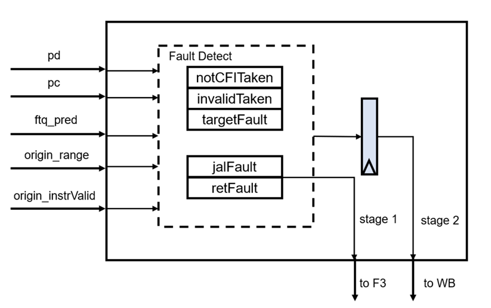

# IFU 子模块 PreDecoder

## 功能描述

### 功能概述

预译码器 PreDeocoder 接受初始指令码并进行指令码生成，每个指令码查询预译码表产生预译码信息，预译码信息包括该位置是否是有效指令开始、CFI 指令类型、是否是 RVC 指令、是否是 Call 指令以及是否是 Ret 指令。预译码器会产生两种有效指令开始的向量，一种是默认第 1 个二字节必为有效指令开始，另一种是默认第 2 个二字节必为有效指令的开始，最终的选择在 IFU 端做。

### 分特性描述

#### 特性 1：指令码生成(instr\_gen)

预译码器产生接受来自 IFU 完成指令切分的 17×2 字节的初始指令码，并以 4 字节为窗口，2 字节为步进长度，从第 1 个 2 字节开始，直到第 16 个 2 字节，选出总共 16 个 4 字节的指令码。

#### 特性 2：有效指令开始向量生成(vec\_gen)

预译码器在生成初始指令码的同时，生成 16bit 有效指令开始向量，这个向量每 bit 标识此位置的指令是一条有效指令的开始。生成逻辑为：

- 正常模式：默认第一个 2 字节为第一条指令开始。如果第 n-1 个 2 字节是有效指令开始且是 RVC 指令，或者第 n-1 个 2 字节不是有效指令开始（肯定是一条 4 字节指令的结尾 2 字节），那么第 n 个 2 字节即为有效指令开始。
- 非正常模式：默认第一个 2 字节为一条 4 字节指令的后半段，第一条有效指令从第二个 2 字节开始，后续生成逻辑和正常模式一样。

两种模式并行生成，最终由 IFU 内部是否有跨缓存行的 RVI 指令进行结果的选择。

#### 特性 3：预译码信息生成(decoder)

预译码器根据指令码产生预译码信息，主要包括：是否是 RVC 指令、是否是 CFI 指令、CFI 指令类型（branch/jal/jalr/call/ret）、CFI 指令的目标地址计算偏移。CFI 指令类型如表 1.2 所示。

## 整体框图

## 接口时序

由于 PreDecode 模块均为组合逻辑，因此输入和输出都在同一个时钟周期内

# IFU 子模块 PredChecker

## 功能描述

### 功能概述

分支预测检查器 PredChecker 接收来自 IFU 的预测块信息（包括预测跳转指令在预测块的位置、预测的跳转目标、预译码得到的指令信息、指令 PC 以及预译码得到的跳转目标偏移等），在模块内部检查五种类型的分支预测错误。模块内部分为两个流水线 stage，分别输出信息，第一个 stage 输出给 f3 阶段，用于修正预测块的指令范围和预测结果。第二个 stage 输出给 wb 阶段，用于在发现分支预测错误时产生前端重定向以及写回给 FTQ 正确的预测信息。

### 分特性描述

#### 特性 1：Jal 指令预测错误检查

jal 指令预测错误的条件是，预测块中有一条 jal 指令（由预译码信息给出），但是要么这个预测块没有预测跳转，要么找个预测块预测跳转的指令在这条 jal 指令之后（即这条 jal 指令没有被预测跳转）。

#### 特性 2：Ret 指令预测错误检查

ret 指令预测错误的条件是，预测块中有一条 ret 指令（由预译码信息给出），但是要么这个预测块没有预测跳转，要么找个预测块预测跳转的指令在这条 ret 指令之后（即这条 ret 指令没有被预测跳转）。

#### 特性 6：重新生成指令有效范围向量

PredChecker 在检查出 Jal/Ret 指令预测错误时，需要重新生成指令有效范围向量，有效范围截取到 Jal/Ret 指令的位置，之后的 bit 全部置为 0。需要注意的是，jal 和 ret 指令的错误检查都会导致指令有效范围的缩短，所以需要重新生成指令有效范伟 fixedRange，同时修复预测结果（即将原来的预测结果取消，把找个指令块的预测结果根据 jal 指令的位置重新生成）

#### 特性 3：非 CFI 预测错误检查

非 CFI 预测错误的条件是被预测跳转的指令根据预译码信息显示不是一条 CFI 指令。

#### 特性 4：无效指令预测错误检查

无效指令预测错误的条件是被预测的指令的位置根据预译码信息中的指令有效向量显示不是一条有效指令的开始。

#### 特性 5：目标地址预测错误检查

目标地址预测错误的条件是，被预测的是一条有效的 jal 或者 branch 指令，同时预测的跳转目标地址和由指令码计算得到的跳转目标不一致。

#### 特性 5：分级输出检查结果

以上 PredChecker 检查结果会分为两级分别输出，前面已经提到，Jal/Ret 指令由于需要重新生成指令有效范围向量和重新指定预测位置，所以需要在错误产生的当拍（F3）直接输出结果到 Ibuffer 用于及时更正进入后端的指令。而由于时序的考虑，其他错误信息（比如五种错误的错误位置、正确的跳转地址等）则是等到下一拍（WB）阶段才返回给 IFU 做前端重定向。

#### 整体框图

#### 接口时序

如图，黄色代表同一个预测块在 PredChecker 里的检查过程，这个预测块的第 6 个字节位置被预测为跳转，改预测块原本的有效指令范围为 h7f（即 0000000001111111），指令有效向量为 hbfeb（即 1011111111101011），但是检查器发现该预测块第 1 个字节的位置（从 0 开始计数）是一条 jal 指令（brType 值为 b10），所以检查器首先在 stage1 将有效指令范围修改为 h3，预测字节位置为 1 给 F3 来进行 Ibuffer 指令入队选择，同时在 WB 阶段将目标地址修正为 h80002120，同时标记误预测位置为 6，通知 WB 阶段做重定向
